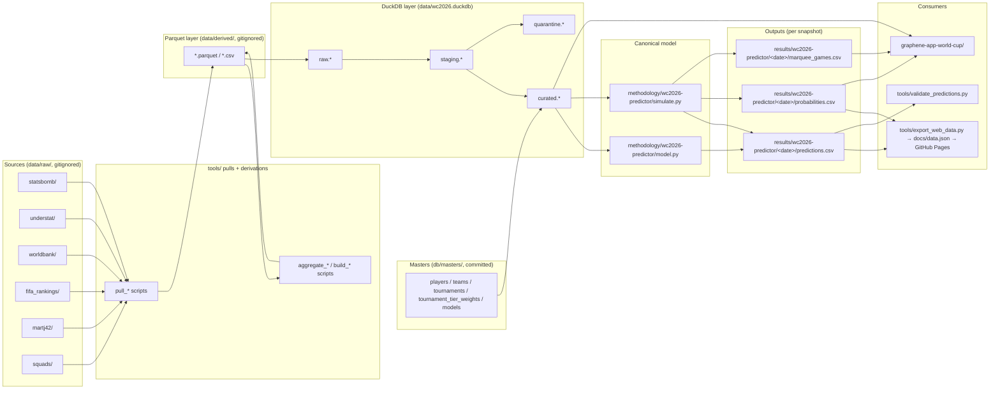

# ARCHITECTURE

> Single canonical structural reference for `fulbol-mundial-26`. Describes the
> repo **as it is today** after the 2026-05-17 single-model cleanup. For
> contribution workflow, see [`DEVELOPMENT.md`](DEVELOPMENT.md). For the role
> catalog, see [`AGENTS.md`](AGENTS.md). For the DuckDB contract, see
> [`db/SCHEMA.md`](db/SCHEMA.md).

## Purpose

`fulbol-mundial-26` builds a single probability model that predicts every
match of the 2026 FIFA World Cup. The canonical model is
[`methodology/wc2026-predictor/`](methodology/wc2026-predictor/) — a
Poisson-with-luck goals model wrapped in a 10k-iteration Monte Carlo
tournament simulator. It reads **only** from the `curated.*` namespace in
[`data/wc2026.duckdb`](data/wc2026.duckdb); no parquet, CSV, or HTTP reads at
runtime.

The repo also publishes a static report at
<https://lnoguera171.github.io/fulbol-mundial-26/> via GitHub Pages and a
Graphene viz app pointed at the same DuckDB file.

## Tech stack

| Layer | Tech | Notes |
|---|---|---|
| Modeling + tools | Python 3 (no pinned version; `requirements.txt` / `pyproject.toml` absent) | Active imports: `duckdb`, `pandas`, `numpy`. Some legacy scripts also use `scipy` / `sklearn`. |
| Analytics DB | DuckDB single file `data/wc2026.duckdb` | Built end-to-end (~10s) from `data/derived/*.parquet` + `db/masters/*.csv` via [`tools/build_duckdb.py`](tools/build_duckdb.py). Contract: [`db/SCHEMA.md`](db/SCHEMA.md). |
| Viz app | Node + [`@graphenedata/cli`](https://www.npmjs.com/package/@graphenedata/cli) `0.0.18`, [`@duckdb/node-api`](https://www.npmjs.com/package/@duckdb/node-api) `1.3.2-alpha.26`, `npm@11.5.2` | See [`graphene-app-world-cup/package.json`](graphene-app-world-cup/package.json). Points at `../data/wc2026.duckdb`. |
| Public report | Static HTML + JSON in [`docs/`](docs/) | `docs/data.json` (regenerated by [`tools/export_web_data.py`](tools/export_web_data.py)) + `docs/index.html` served by GitHub Pages. |

## Directory map

| Path | Status | One-liner |
|---|---|---|
| [`README.md`](README.md) | active | Elevator pitch + how to run + single-model table. |
| [`AGENTS.md`](AGENTS.md) | active | Role catalog entry-point (5 active roles). |
| [`CLAUDE.md`](CLAUDE.md) | stub | 5-line redirect to `AGENTS.md`. |
| [`DEVELOPMENT.md`](DEVELOPMENT.md) | active | Contribution workflow + model guardrails + priority stack. |
| `data/raw/` | active, **gitignored** | Immutable per-source/per-date pulls (`statsbomb/`, `understat/`, `martj42/`, `worldbank/`, `fifa_rankings/`, `squads/`, `kalshi/`, `polymarket/`). |
| `data/derived/` | active, **gitignored** | Normalized parquet/CSV outputs of pulls + aggregators. Bridge between pulls and DuckDB. |
| `data/wc2026/` | active, committed | `tournament.json` — bracket structure + group fixtures consumed by `methodology/wc2026-predictor/simulate.py`. |
| `data/wc2026.duckdb` | active, gitignored | The analytics DB. Single file. Rebuilt end-to-end in ~10s. |
| [`db/`](db/) | active | DuckDB layer: [`SCHEMA.md`](db/SCHEMA.md), [`NAMING.md`](db/NAMING.md), [`README.md`](db/README.md). |
| [`db/masters/`](db/masters/) | active, **committed** | Master CSVs: `players.csv`, `teams.csv`, `tournaments.csv`, `models.csv`, `tournament_tier_weights.csv`. Hand-maintained + refresh scripts. |
| [`db/sql/curated/`](db/sql/curated/) | active | SQL files defining every `curated.dim_*` / `curated.fact_*` / `curated.view_*` table. Single source of truth DDL. |
| [`db/sql/staging/`](db/sql/staging/) / `db/sql/quarantine/` | active | Intermediate staging + unmatched-row quarantine queues. |
| [`db/queries/examples/`](db/queries/examples/) | active | ~13 example queries: model-feature reads (`team_features_for_modeling.sql`, `team_xg_for_modeling.sql`, `wc2026_predictor_per_team_features.sql`) + analysis (`squad_coverage_gaps.sql`, `inspect_quarantine.sql`). |
| [`methodology/wc2026-predictor/`](methodology/wc2026-predictor/) | active — canonical model | `model.py` (closed-form group-stage 1X2) + `simulate.py` (10k-iter MC + per-match knockout + marquee selection). DuckDB-only at runtime. |
| `methodology/_template/` | active | Starter scaffold for any future model contribution. |
| `results/wc2026-predictor/` | active | Per-snapshot outputs: `predictions.csv`, `probabilities.csv`, `probabilities.json`, `marquee_games.csv`. Latest: `2026-05-16/`. Plus `MODEL.md` model card. |
| `results/_template/` | active | Starter `MODEL.md` and a blank `predictions.csv` schema. |
| `results/comparisons/` | active, history | WC2022 cross-model backtest tables preserved as historical validation artifact. |
| `tools/` | active | Pulls (`pull_*.py`), aggregators (`aggregate_*.py`, `build_*.py`), DuckDB build/verify (`build_duckdb.py`, `verify_duckdb.py`), validators (`validate_predictions.py`), web export (`export_web_data.py`), cost gating (`estimate_run_cost.py`), MDM (`match_sources_to_masters.py`), weekly market pull (`weekly_pull.py` — market-edge work is out of scope; kept for raw snapshots). |
| `tools/lib/` | active | `player_normalize.py` — Unicode/ASCII normalization for the matching layer. |
| `tests/` | active | pytest suite: `test_country_features_parquets.py`, `test_wc2026_predictor_model.py`, `test_duckdb_country_facts.py`. |
| [`docs/agents/`](docs/agents/) | active | 5-role functional catalog (01, 02, 03, 05, 06) + per-source / per-model implementation specs + `storytelling-report-writer.md`. Roles 04, 07, 08 were retired; 08's spec lives in `docs/ideation/`. |
| [`docs/plans/`](docs/plans/) | active | Plans dated 2026-04-28 → 2026-05-16. Every file carries `status:` frontmatter (active / completed / superseded). |
| [`docs/brainstorms/`](docs/brainstorms/) | active | Requirements / brainstorming docs that feed plans. |
| [`docs/ideation/`](docs/ideation/) | active | Aspirational specs (role 08 orchestration, UCL event-data pipeline, etc.). |
| [`docs/solutions/best-practices/`](docs/solutions/best-practices/) | active, history | YAML-frontmatter learning notes (MDM pattern, etc.). Read-only history. |
| `docs/data.json`, `docs/index.html` | active | Static GitHub Pages report. |
| [`graphene-app-world-cup/`](graphene-app-world-cup/) | active | Graphene CLI viz app on top of `data/wc2026.duckdb`. Notebooks in `index.md`, `wc2026_tournament_report.md`, `top_contenders.md`, etc. Semantic layer in `tables.gsql`. |
| `event-data/raw/` | minimal | Two scratch files (`match_stats.json`, `match_summary.json`). No active pipeline consumes them. |
| `wc2022_xg_backtest.py` (root) | active, history | WC2022 walk-forward backtest harness — multi-model era. Kept as historical artifact alongside `tools/build_wc2022_player_xg.py` and `tools/build_wc2022_ratings.py`. |
| [`.github/`](.github/) | active | `CODEOWNERS`, `pull_request_template.md`, `workflows/`. |

## Data flow

```
data/raw/<source>/<date>/   ──tools/pull_*.py──▶  (immutable; gitignored)
        │
        ▼
data/derived/*.parquet      ──tools/aggregate_*.py / build_*.py──▶  (gitignored)
        │
        ▼
data/wc2026.duckdb          ──tools/build_duckdb.py──▶  raw.* / staging.* / curated.* / quarantine.*
        │                         ▲
        │                         │
        │                   db/masters/*.csv  (committed surrogate-key state)
        ▼
methodology/wc2026-predictor/   ──model.py / simulate.py──▶  reads curated.* only
        │
        ▼
results/wc2026-predictor/<date>/   predictions.csv + probabilities.csv + marquee_games.csv
        │
        ▼
tools/export_web_data.py    →  docs/data.json  →  GitHub Pages
graphene-app-world-cup/     →  reads data/wc2026.duckdb directly (parallel viz consumer)
```



## DuckDB schema

The analytics DB has four namespaces (`raw`, `staging`, `curated`, `quarantine`).
The `curated.*` namespace is the **only** surface models should read from.

See [`db/SCHEMA.md`](db/SCHEMA.md) — the **Curated Schema Quick Reference** table
near the top is the contract: dim/fact/view name, grain, PK, purpose, and
canonical read query for every curated table (`dim_team`, `dim_team_current`,
`dim_team_recent_form`, `dim_player`, `dim_tournament`, `dim_model`,
`dim_tournament_tier_weight`, `fact_international_match`, `fact_team_economics`,
`fact_team_fifa_ranking`, `fact_team_rating`, `fact_player_xg`,
`fact_player_xg_per_90`, `fact_team_xg`, `fact_team_xg_against`,
`fact_team_xg_against_wc2022`). Column-level details and the master-data-management
discipline (player IDs `P######`, FIFA3 team codes, one-way fact-to-master
matching, quarantine of unmatched rows) are in the same file.

## Models in the repo

| Model | Methodology path | Results path | Latest snapshot | Reads | Status |
|---|---|---|---|---|---|
| `wc2026-predictor` | [`methodology/wc2026-predictor/`](methodology/wc2026-predictor/) | `results/wc2026-predictor/2026-05-16/` | 2026-05-16 | `data/wc2026.duckdb` `curated.*` only | **active — canonical** (WC2022 backtest pending) |

`wc2026-predictor` is currently `pending_backtest` — see
[`results/wc2026-predictor/MODEL.md`](results/wc2026-predictor/MODEL.md). The
WC2022 held-out backtest is tracked separately and not yet run.

## How to run

```bash
# 1. Build the analytics DB end-to-end (~10s)
python3 tools/build_duckdb.py

# 2. Verify it
python3 tools/verify_duckdb.py

# 3. Run the canonical model — group-stage 1X2
python3 methodology/wc2026-predictor/model.py

# 4. Run the tournament Monte Carlo (10k iters, seed=42 by default)
#    Emits probabilities.csv (per-team stage reach + p_top2_in_group),
#    appends per-match knockout rows to predictions.csv, and writes
#    marquee_games.csv.
python3 methodology/wc2026-predictor/simulate.py

# All four steps land in results/wc2026-predictor/<today>/.
```

Other entry points:

```bash
# Regenerate the public web report from the latest snapshot.
python3 tools/export_web_data.py

# Per-snapshot prediction schema validator.
python3 tools/validate_predictions.py --all

# Graphene viz app — local dev server against data/wc2026.duckdb.
cd graphene-app-world-cup
npm install
npx graphene serve        # interactive
npx graphene serve --bg   # background

# WC2022 walk-forward backtest harness (historical, multi-model era).
python3 wc2022_xg_backtest.py
```

## Canonical home of every doc type

| Artifact type | Canonical home |
|---|---|
| Project elevator pitch + how to run | [`README.md`](README.md) |
| As-is structure + tech stack | `ARCHITECTURE.md` (this file) |
| Contribution workflow + model guardrails | [`DEVELOPMENT.md`](DEVELOPMENT.md) |
| Active functional roles | [`AGENTS.md`](AGENTS.md) + [`docs/agents/0X-*.md`](docs/agents/) |
| DuckDB schema contract | [`db/SCHEMA.md`](db/SCHEMA.md) |
| SQL naming convention | [`db/NAMING.md`](db/NAMING.md) |
| Per-model card | `results/<model>/MODEL.md` |
| Past decisions / failed experiments | [`docs/solutions/best-practices/`](docs/solutions/best-practices/) (read-only history) |
| Active work / open plans | [`docs/plans/`](docs/plans/) with `status: active` frontmatter |
| Completed work | `docs/plans/` with `status: completed` frontmatter |
| Ideation / not-yet-scoped | [`docs/ideation/`](docs/ideation/) |

## Active roles

The 5-role functional catalog lives in [`docs/agents/README.md`](docs/agents/README.md):

| # | Role | Single job | Spec |
|---|---|---|---|
| 01 | Data Engineering | Fetch external data into `data/raw/<source>/<date>/`. | [`docs/agents/01-data-engineering.md`](docs/agents/01-data-engineering.md) |
| 02 | Data Coverage | Read-only. Detect gaps + staleness. Writes `player_coverage_report.csv`. | [`docs/agents/02-data-coverage.md`](docs/agents/02-data-coverage.md) |
| 03 | Data Cleaning & Feature Engineering | `data/raw/**` → `data/derived/*.parquet`. The only role that owns transformations. | [`docs/agents/03-data-cleaning.md`](docs/agents/03-data-cleaning.md) |
| 05 | Modeling / Data Science | Fit the WC2026 predictor against `curated.*`. Write `predictions.csv`. | [`docs/agents/05-modeling.md`](docs/agents/05-modeling.md) |
| 06 | Backtest / Validation | Schema gate per PR + held-out backtest per methodology change. Only promotion gate. | [`docs/agents/06-validation.md`](docs/agents/06-validation.md) |

Plus one cross-cutting role:

| Role | Single job | Spec |
|---|---|---|
| Storytelling / Public Output | Produces the < 2-page Graphene-rendered tournament report. | [`docs/agents/storytelling-report-writer.md`](docs/agents/storytelling-report-writer.md) |

Roles 04 (Market Normalization), 07 (Edge / Comparison), and 08 (Orchestration)
are out of scope or aspirational. Role 08's spec is preserved in
[`docs/ideation/`](docs/ideation/) if anyone wants to revive an automated cron
later.
