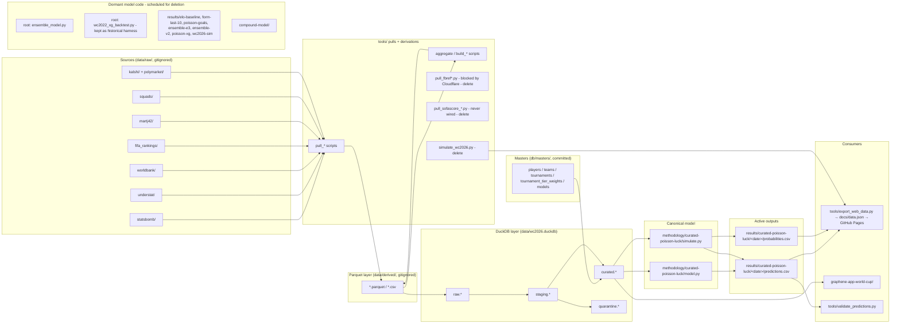

> **Cleanup in progress.** A large refactor is underway — see
> [`docs/plans/2026-05-15-004-refactor-project-cleanup-plan.md`](docs/plans/2026-05-15-004-refactor-project-cleanup-plan.md).
> It will collapse the multi-model workbench down to a single DuckDB-native predictor
> (`methodology/curated-poisson-luck/` → `methodology/wc2026-predictor/`), delete dead
> pulls and stale model folders, and trim `docs/agents/`. This document describes the
> repo **as it is today**, before that work lands; it will be rewritten as the cleanup
> merges.

# ARCHITECTURE

## Purpose

`fulbol-mundial-26` is a workbench for building probability models that predict the
2026 FIFA World Cup. The current production-grade model is
[`methodology/curated-poisson-luck/`](methodology/curated-poisson-luck/) — a
Poisson-with-luck goals model that reads **only** from the `curated.*` namespace in
[`data/wc2026.duckdb`](data/wc2026.duckdb) (no parquet, CSV, or HTTP reads at runtime).
Older multi-model code (`ensemble_model.py`, `tools/simulate_wc2026.py`, the
`elo-baseline` / `form-last-10` / `poisson-goals` / `ensemble-e3` / `ensemble-v2` /
`poisson-xg` folders) is still in the tree but scheduled for deletion by the cleanup
plan above.

## Tech stack

| Layer | Tech | Notes |
|---|---|---|
| Modeling + tools | Python 3 (no pinned version; `requirements.txt` and `pyproject.toml` are absent) | Stack imports observed in [`tools/build_duckdb.py`](tools/build_duckdb.py), [`tools/verify_duckdb.py`](tools/verify_duckdb.py), [`methodology/curated-poisson-luck/model.py`](methodology/curated-poisson-luck/model.py): `duckdb`, `pandas`, `numpy`. Scipy/sklearn not present in the active model. |
| Analytics DB | DuckDB (single file `data/wc2026.duckdb`) | Built from `data/derived/*.parquet` + `db/masters/*.csv` via [`tools/build_duckdb.py`](tools/build_duckdb.py). Contract: [`db/SCHEMA.md`](db/SCHEMA.md). |
| Viz app | Node + [`@graphenedata/cli`](https://www.npmjs.com/package/@graphenedata/cli) `0.0.18`, [`@duckdb/node-api`](https://www.npmjs.com/package/@duckdb/node-api) `1.3.2-alpha.26`, `npm@11.5.2` | See [`graphene-app-world-cup/package.json`](graphene-app-world-cup/package.json). Points at `../data/wc2026.duckdb`. |
| Public report | Static HTML + JSON in [`docs/`](docs/) served via GitHub Pages | `docs/data.json` + `docs/index.html`. |

## Directory map

| Path | Status | One-liner |
|---|---|---|
| [`README.md`](README.md) | active | Elevator pitch + model table + how to contribute a model. |
| [`AGENTS.md`](AGENTS.md) / [`CLAUDE.md`](CLAUDE.md) | active, duplicated | "Identical in substance — kept aligned by convention." Both link the 8-role catalog. Cleanup will collapse to `AGENTS.md` only. |
| [`DEVELOPMENT.md`](DEVELOPMENT.md) | active | Contributor tracks, model guardrails, contribution workflow, priority stack. |
| `data/raw/` | active, **gitignored** | Immutable per-source/per-date pulls (`statsbomb/`, `understat/`, `martj42/`, `kalshi/`, `polymarket/`, `worldbank/`, `fifa_rankings/`, `squads/`, `elo/`, `sofascore/`). |
| `data/derived/` | active, **gitignored** | Normalized parquet/CSV outputs of pulls + aggregators (~31 files). Bridge between pulls and DuckDB. |
| `data/wc2026/` | active | `tournament.json` — bracket structure and group fixtures consumed by `methodology/curated-poisson-luck/simulate.py`. |
| `data/wc2026.duckdb` | active | The analytics DB. Single file. Rebuilt end-to-end in ~10s. |
| [`db/`](db/) | active | DuckDB layer: [`SCHEMA.md`](db/SCHEMA.md), [`NAMING.md`](db/NAMING.md), [`README.md`](db/README.md). Also contains an orphan `db/wc.duckdb` flagged for deletion. |
| [`db/masters/`](db/masters/) | active, **committed** | The four+ master CSVs: `players.csv`, `teams.csv`, `tournaments.csv`, `models.csv`, `tournament_tier_weights.csv`. Hand-maintained + refresh scripts. |
| [`db/sql/curated/`](db/sql/curated/) | active | 16 SQL files defining every `curated.dim_*` / `curated.fact_*` / `curated.view_*` table. Single-source-of-truth DDL. |
| [`db/queries/examples/`](db/queries/examples/) | active | 12 example queries: model-feature reads (`team_features_for_modeling.sql`, `team_xg_for_modeling.sql`) + analysis (`model_agreement_matrix.sql`, `inspect_quarantine.sql`). |
| [`methodology/curated-poisson-luck/`](methodology/curated-poisson-luck/) | active — canonical model | `model.py` (closed-form group-stage 1X2) + `simulate.py` (10k-iter MC). DuckDB-only at runtime. Cleanup renames this to `methodology/wc2026-predictor/`. |
| `methodology/_template/` | active | Starter scaffold for new model contributors. |
| `results/curated-poisson-luck/` | active | Latest snapshot at `2026-05-15/` (`predictions.csv`, `probabilities.csv`, `probabilities.json`) + `MODEL.md` model card. |
| `results/elo-baseline/` | dormant — scheduled for deletion | 2026-04-28 snapshot + `MODEL.md`. |
| `results/form-last-10/` | dormant — scheduled for deletion | 2026-04-28 snapshot + `MODEL.md`. |
| `results/poisson-goals/` | dormant — scheduled for deletion | 2026-04-28 snapshot + `MODEL.md`. |
| `results/ensemble-e3/` | dormant — scheduled for deletion | 2026-04-28 snapshot + WC2022 backtest output. |
| `results/ensemble-v2/` | dormant — scheduled for deletion | WC2022 backtest only; no live snapshot. |
| `results/poisson-xg/` | dormant — scheduled for deletion | WC2022 backtest only. |
| `results/wc2026-sim/` | orphan — scheduled for deletion | Output of `tools/simulate_wc2026.py`; no `MODEL.md`, no methodology folder. |
| `results/comparisons/` | active (kept across cleanup) | Cross-model comparison artifacts; the post-cleanup plan preserves historical baselines. |
| [`compound-model/`](compound-model/) | aspirational — scheduled for deletion | Never implemented. `MODEL.md` describes a planned production wrapper; `docs/plans/` inside preserves the original vision. |
| `tools/` | active — mixed | 27 scripts. Pulls (`pull_*.py`), aggregators (`aggregate_*.py`, `build_*.py`), DuckDB build/verify, validators, the legacy `simulate_wc2026.py`, the broken `pull_fbref*.py` (Cloudflare-blocked) and `pull_sofascore_*.py` (never wired in) — those four flagged for deletion. |
| `tools/lib/` | active | `player_normalize.py` — Unicode/ASCII normalization used by the matching layer. |
| `tests/` | active | `pytest` tests: `test_country_features_parquets.py`, `test_curated_poisson_luck_model.py`, `test_duckdb_country_facts.py`. |
| `docs/agents/` | active — partly aspirational | 8-role catalog + per-source / per-model implementation specs. Roles 04 (Market Normalization) and 07 (Edge Comparison) were just removed; their files are gone. Role 08 (Orchestration) stays as a spec; no cron exists. |
| `docs/plans/` | active | 14 plans dated 2026-04-28 → 2026-05-16. Cleanup adds `status:` frontmatter (completed / superseded / active). |
| `docs/brainstorms/` | active | Single requirements doc (`2026-05-05-wc2026-prediction-report-requirements.md`). |
| `docs/ideation/` | active | Single doc (`2026-04-29-ucl-event-data-pipeline.md`). |
| `docs/solutions/best-practices/` | active — history | YAML-frontmatter learning notes (MDM pattern, Golden Zone betting rule, etc.). Read-only history per the cleanup plan. |
| `docs/data.json`, `docs/index.html` | active | Static report bundle for GitHub Pages. |
| [`graphene-app-world-cup/`](graphene-app-world-cup/) | active (lightly used) | Graphene CLI viz app on top of `data/wc2026.duckdb`. `index.md`, `tables.gsql`, several per-page `.md`s (`top_contenders.md`, `teams_and_players.md`, `cumulative_goal_diff.md`, etc.). |
| `event-data/raw/` | minimal | Two scratch files (`match_stats.json`, `match_summary.json`). No active pipeline consumes them. |
| [`.github/`](.github/) | active | `CODEOWNERS`, `pull_request_template.md`, `workflows/`. |
| `.context/` | local-only | `compound-engineering/ce-review` — agent harness state, not a code dir. |
| `ensemble_model.py` (root) | dormant — scheduled for deletion | Original multi-model blender. Superseded by `methodology/curated-poisson-luck/`. |
| `wc2022_xg_backtest.py` (root) | active (kept) | Historical WC2022 walk-forward backtest harness. Multi-model-era code; the renamed predictor will get its own `backtest.py` in a future plan. |

## Data flow

```
data/raw/<source>/<date>/   ──tools/pull_*.py──▶  (immutable; gitignored)
        │
        ▼
data/derived/*.parquet      ──tools/aggregate_*.py / build_*.py──▶  (gitignored)
        │
        ▼
data/wc2026.duckdb          ──tools/build_duckdb.py──▶  raw.* / staging.* / curated.* / quarantine.*
        │                         ▲
        │                         │
        │                   db/masters/*.csv  (committed, surrogate-key state)
        ▼
methodology/curated-poisson-luck/  ──model.py / simulate.py──▶  reads curated.* only
        │
        ▼
results/curated-poisson-luck/<date>/  predictions.csv + probabilities.csv
        │
        ▼
tools/export_web_data.py → docs/data.json → GitHub Pages
graphene-app-world-cup/  →  reads data/wc2026.duckdb directly  (parallel viz consumer)
```

Mermaid view of the **as-is** state (items marked *scheduled for deletion* will go in the cleanup):



## DuckDB schema

The analytics DB has four namespaces (`raw`, `staging`, `curated`, `quarantine`).
The `curated.*` namespace is the **only** surface models should read from.
See [`db/SCHEMA.md`](db/SCHEMA.md) — the **Curated Schema Quick Reference** table near
the top is the contract: dim/fact/view name, grain, PK, purpose, and canonical read
query for every curated table (`dim_team`, `dim_team_current`, `dim_team_recent_form`,
`dim_player`, `dim_tournament`, `dim_model`, `dim_tournament_tier_weight`,
`fact_international_match`, `fact_team_economics`, `fact_team_fifa_ranking`,
`fact_team_rating`, `fact_player_xg`, `fact_player_xg_per_90`, `fact_team_xg`,
`fact_team_xg_against`, `fact_team_xg_against_wc2022`). Column-level details and the
master-data-management discipline (player IDs `P######`, FIFA3 team codes, one-way
fact-to-master matching, quarantine of unmatched rows) are in the same file.

## Models currently in the repo

| Model | Methodology path | Results path | Last snapshot | Reads | Status |
|---|---|---|---|---|---|
| `elo-baseline` | none | `results/elo-baseline/` | 2026-04-28 | World Football Elo (legacy) | dormant — scheduled for deletion |
| `form-last-10` | none | `results/form-last-10/` | 2026-04-28 | `data/derived/` parquets (legacy) | dormant — scheduled for deletion |
| `poisson-goals` | none | `results/poisson-goals/` | 2026-04-28 | `data/derived/` parquets (legacy) | dormant — scheduled for deletion |
| `ensemble-e3` | `ensemble_model.py` (root) | `results/ensemble-e3/` | 2026-04-28 + WC2022 backtest | `data/derived/` parquets | dormant — scheduled for deletion |
| `ensemble-v2` | `wc2022_xg_backtest.py` (root) | `results/ensemble-v2/` | WC2022 backtest only | `data/derived/` parquets | dormant — scheduled for deletion |
| `poisson-xg` | `wc2022_xg_backtest.py` (root) | `results/poisson-xg/` | WC2022 backtest only | `data/derived/` parquets | dormant — scheduled for deletion |
| `curated-poisson-luck` | `methodology/curated-poisson-luck/` | `results/curated-poisson-luck/2026-05-15/` | 2026-05-15 | **`data/wc2026.duckdb` curated.* only** | **active — canonical** (will be renamed `wc2026-predictor`) |
| `wc2026-sim` | `tools/simulate_wc2026.py` (orphan) | `results/wc2026-sim/` | recent | `data/derived/` parquets directly | orphan — scheduled for deletion (consumed by `tools/export_web_data.py`; cleanup migrates that exporter to read the canonical model output instead) |
| `compound-model` | `compound-model/` | n/a | never implemented | n/a | aspirational — scheduled for deletion (vision plan preserved in `docs/plans/`) |

`curated-poisson-luck` is currently `pending_backtest` — see
[`results/curated-poisson-luck/MODEL.md`](results/curated-poisson-luck/MODEL.md). The
WC2022 held-out backtest is tracked separately and not yet run.

## How to run

```bash
# 1. Build the analytics DB end-to-end (~10s)
python3 tools/build_duckdb.py

# 2. Verify it (27 sanity assertions)
python3 tools/verify_duckdb.py

# 3. Run the canonical model — group-stage 1X2
python3 methodology/curated-poisson-luck/model.py

# 4. Run the tournament Monte Carlo (10k iters, seed=42 by default)
python3 methodology/curated-poisson-luck/simulate.py

# Both write to results/curated-poisson-luck/<today>/.
```

Other entry points that still exist today:

```bash
# Weekly market pull + Elo baseline + comparison (legacy, manual; markets
# 17 days stale as of cleanup-plan inventory)
python3 tools/weekly_pull.py
python3 tools/weekly_pull.py 2026-06-15   # specific date

# Historical multi-model WC2022 walk-forward backtest harness (~30s).
# Kept after cleanup as historical artifact.
python3 wc2022_xg_backtest.py

# Graphene viz app — serves a local dev site reading data/wc2026.duckdb
cd graphene-app-world-cup
npm install
npx graphene serve        # interactive
npx graphene serve --bg   # background

# Per-snapshot prediction schema validator
python3 tools/validate_predictions.py --all
```

## Canonical home of every doc type

(From Unit 1 of the cleanup plan — this table is the target. A few entries describe
post-cleanup state where the file does not yet exist or `AGENTS.md`/`CLAUDE.md` are
still duplicates.)

| Artifact type | Canonical home |
|---|---|
| Project elevator pitch + how to run | [`README.md`](README.md) |
| As-is structure + tech stack | `ARCHITECTURE.md` (this file) |
| Contribution workflow + model guardrails | [`DEVELOPMENT.md`](DEVELOPMENT.md) |
| Active functional roles | [`AGENTS.md`](AGENTS.md) + [`docs/agents/0X-*.md`](docs/agents/) |
| DuckDB schema contract | [`db/SCHEMA.md`](db/SCHEMA.md) |
| SQL naming convention | [`db/NAMING.md`](db/NAMING.md) |
| Per-model card | `results/<model>/MODEL.md` |
| Past decisions / failed experiments | [`docs/solutions/best-practices/`](docs/solutions/best-practices/) (read-only history) |
| Active work / open plans | [`docs/plans/`](docs/plans/) with `status: active` frontmatter |
| Completed work | `docs/plans/` with `status: completed` frontmatter |
| Ideation / not-yet-scoped | [`docs/ideation/`](docs/ideation/) |

## Active roles

The 8-role catalog lives in [`docs/agents/README.md`](docs/agents/README.md). After
the recent removal of roles 04 (Market Normalization) and 07 (Edge Comparison), the
files on disk are:

| # | Role | Single job | Spec |
|---|---|---|---|
| 01 | Data Engineering | Fetch external data into `data/raw/<source>/<date>/`. | [`docs/agents/01-data-engineering.md`](docs/agents/01-data-engineering.md) |
| 02 | Data Coverage | Read-only. Detect gaps + staleness. Writes `player_coverage_report.csv`. | [`docs/agents/02-data-coverage.md`](docs/agents/02-data-coverage.md) |
| 03 | Data Cleaning & Feature Engineering | `data/raw/**` → `data/derived/*.parquet`. The only role that owns transformations. | [`docs/agents/03-data-cleaning.md`](docs/agents/03-data-cleaning.md) |
| 05 | Modeling / Data Science | Fit models. Write `predictions.csv`. | [`docs/agents/05-modeling.md`](docs/agents/05-modeling.md) |
| 06 | Backtest / Validation | Schema gate per PR + held-out backtest per methodology change. Only promotion gate. | [`docs/agents/06-validation.md`](docs/agents/06-validation.md) |
| 08 | Orchestration | Aspirational daily 09:00 UTC cron. **No cron exists today.** | [`docs/agents/08-orchestration.md`](docs/agents/08-orchestration.md) |

`AGENTS.md` and `CLAUDE.md` still list 8 roles (including 04 and 07). They are
out-of-sync with the on-disk specs until the cleanup PR rewrites them.
