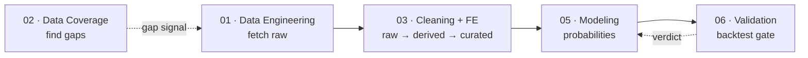

# Agent Catalog

This directory is the canonical map of who does what on `fulbol-mundial-26`. Every contributor — human or AI — picks a **role** from this catalog before touching the repo. The role spec tells you what you can read, what you can write, what you must verify, and when to escalate.

Roles are *responsibilities*, not people. One person or one agent may fill several roles. A role can be held by a human one week and a Claude/Cursor/Codex/Gemini agent the next. The catalog stays the same.

This catalog operationalizes the rules in [`../../DEVELOPMENT.md`](../../DEVELOPMENT.md). When a role spec and `DEVELOPMENT.md` disagree, **`DEVELOPMENT.md` wins** — open a PR to fix the role spec.

## The 5 functional roles

The active catalog. Pick one of these. Each spec is tight: what it reads, what it writes, what it must not do, when it runs, and how it knows it's done.

| # | Role | Single job |
|---|---|---|
| 01 | [Data Engineering](01-data-engineering.md) | Fetch external data into `data/raw/<source>/<date>/`. Nothing else. |
| 02 | [Data Coverage](02-data-coverage.md) | Read-only. Detect gaps + staleness. Write `player_coverage_report.csv`. |
| 03 | [Data Cleaning & Feature Engineering](03-data-cleaning.md) | `data/raw/**` → `data/derived/*.parquet`. The only role that owns transformations. |
| 05 | [Modeling / Data Science](05-modeling.md) | Fit the WC2026 predictor against the curated layer. Write `predictions.csv`. |
| 06 | [Backtest / Validation](06-validation.md) | Schema gate per PR + held-out backtest per methodology change. The only promotion gate. |

> **Note:** Roles 04 (Market Normalization), 07 (Edge / Comparison), and 08 (Orchestration) are not in the active catalog. 04 and 07 are out of scope — the project's scope is producing match probabilities, not devig or market-edge work. 08 is aspirational and preserved at [`../ideation/2026-05-15-role-08-orchestration.md`](../ideation/2026-05-15-role-08-orchestration.md) — no automated cron exists today; the pipeline is run manually.

## Org chart

DE and DC are both entry points: DE fetches, DC reads-only and feeds its gap signal back into DE's worklist. Everything downstream of DE flows linearly: derived parquets, then the curated DuckDB layer, then the model, then validation.

## Cadence at a glance

| Role | Schedule | Where |
|---|---|---|
| 01 Data Engineering | On-demand; some sources are daily-capable | `tools/pull_*.py` |
| 02 Data Coverage | Per-PR on `data/derived/` changes + on-demand sweeps | `tools/audit_player_coverage.py` |
| 03 Cleaning + FE | After 01; followed by `tools/build_duckdb.py` to refresh `curated.*` | `tools/aggregate_*.py`, `tools/build_*.py`, `tools/build_duckdb.py` |
| 05 Modeling | On methodology change or material curated-layer change | `methodology/<model>/`, `results/<model>/<date>/` |
| 06 Validation | Per-PR (schema) + per-refinement (backtest) | `.github/workflows/validate-predictions.yml`, `wc2022_xg_backtest.py` |

**Net: there is no scheduled cron today.** The orchestration spec for a future daily cycle is preserved at [`../ideation/2026-05-15-role-08-orchestration.md`](../ideation/2026-05-15-role-08-orchestration.md). For now, contributors run `tools/weekly_pull.py` (and downstream steps) manually.

## Implementation specs (per source / per model)

The 5 functional roles above are the contract. Each one has concrete *implementations* — one per data source, one per quality gate. Browse these when picking up a specific deliverable; the parent role spec dictates the rules.

### Implementations of 01 · Data Engineering

- [International Results (martj42)](acquisition-international-results.md)
- [StatsBomb xG](acquisition-statsbomb.md)
- [Understat club xG](acquisition-understat.md)
- [WC2026 squads](acquisition-wc2026-squads.md)
- [Elite-club form (UCL / UEL)](acquisition-elite-club-form.md)

### Implementations of 05 · Modeling

Today's implementation: [wc2026-predictor](../../methodology/curated-poisson-luck/) *(directory still named `curated-poisson-luck` pending the Phase C rename to `wc2026-predictor/`)*.

### Implementations of 02 · Coverage and 06 · Validation

- [Coverage Audit](quality-coverage-audit.md)
- [Validation / Backtest](quality-validation-backtest.md)
- [Review](quality-review.md)

### Synthesis

- [Documentation / Learnings](synthesis-documentation-learnings.md)

### Storytelling / Public output

- [Storytelling Report Writer](storytelling-report-writer.md) — produces the < 2-page Graphene-rendered narrative report (`graphene-app-world-cup/wc2026_tournament_report.md`) summarizing the predictor's view of the tournament. Tone: funny, smart, structurally humble.

## Cross-cutting documents

- [Role template](_role-template.md) — copy this when adding a new role.
- [Data gaps roadmap](data-gaps-roadmap.md) — what 01 should chase next.
- [Refinement loop](refinement-loop.md) — how 05 changes parameters without violating no-post-hoc-fitting.

## How a role gets added

1. Copy [`_role-template.md`](_role-template.md) to a new file under this directory.
2. Fill in every section. No empty sections — if something doesn't apply, say so explicitly.
3. Add the role to the "5 functional roles" table above (or as an implementation of an existing role).
4. Update [`../../AGENTS.md`](../../AGENTS.md) and [`../../CLAUDE.md`](../../CLAUDE.md) so the new role is reachable from the entry point.
5. Open a PR. The Validation Agent enforces schema; the human reviewer checks scope.
