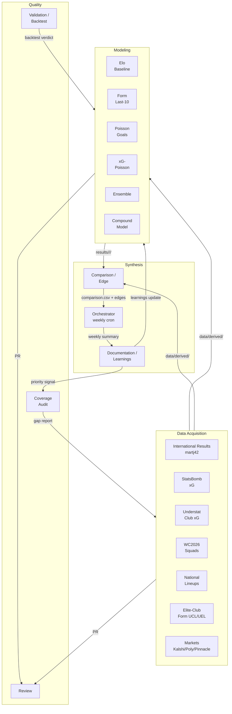

# Agent Catalog

This directory is the canonical map of who does what on `fulbol-mundial-26`. Every contributor — human or AI — picks a **role** from this catalog before touching the repo. The role spec tells you what you can read, what you can write, what you must verify, and when to escalate.

Roles are *responsibilities*, not people. One person or one agent may fill several roles. A role can be held by a human one week and a Claude/Cursor/Codex/Gemini agent the next. The catalog stays the same.

This catalog operationalizes the rules in [`../../DEVELOPMENT.md`](../../DEVELOPMENT.md). When a role spec and `DEVELOPMENT.md` disagree, **`DEVELOPMENT.md` wins** — open a PR to fix the role spec.

## Org chart

## The three loops

Every action this project takes belongs to exactly one of these loops.

| Loop | Trigger | Roles | Output |
|---|---|---|---|
| **Weekly cadence** | Sunday 14:00 UTC cron, or manual `workflow_dispatch` | Orchestrator → Markets + Results + Squad acquisition → Elo + Form + Poisson modeling → Comparison → Review | Dated snapshots in `results/<model>/<date>/` and `results/comparisons/<date>/` |
| **Gap-fill** | Coverage Audit detects regression or new uncovered nation/player | Coverage Audit → priority signal → relevant Acquisition role → Validation | Updated `data/derived/player_coverage_report.csv`; new derived data layer |
| **Refinement** | Backtest delta on a held-out tournament > threshold, or new data layer wired in | Modeling Maintainer → Validation/Backtest → Documentation → Review | New `model_version`, methodology change recorded in `methodology/<model>/CHANGELOG.md`, `MODEL.md` updated |

## Roles

Pick a role. Click through to its spec. If you fill a role, you are accountable for the contracts in that file.

### Data Acquisition

- [International Results (martj42)](acquisition-international-results.md)
- [StatsBomb xG](acquisition-statsbomb.md)
- [Understat club xG](acquisition-understat.md)
- [WC2026 squads](acquisition-wc2026-squads.md)
- [National lineups (FIFA / UEFA / federation)](acquisition-national-lineups.md)
- [Elite-club form (UCL / UEL)](acquisition-elite-club-form.md)
- [Markets (Kalshi / Polymarket / Pinnacle)](acquisition-markets.md)

### Modeling

- [Elo baseline](modeling-elo-baseline.md)
- [Form-last-10](modeling-form-last-10.md)
- [Poisson-goals](modeling-poisson-goals.md)
- [xG-Poisson](modeling-poisson-xg.md)
- [Ensemble](modeling-ensemble.md)
- [Compound-model](modeling-compound-model.md)

### Quality

- [Coverage Audit](quality-coverage-audit.md)
- [Validation / Backtest](quality-validation-backtest.md)
- [Review](quality-review.md)

### Synthesis

- [Comparison / Edge](synthesis-comparison-edge.md)
- [Documentation / Learnings](synthesis-documentation-learnings.md)
- [Orchestrator](synthesis-orchestrator.md) — weekly cadence, the only role authorized to *trigger* the cycle

## Cross-cutting documents

- [Role template](_role-template.md) — copy this when adding a new role
- [Data gaps roadmap](data-gaps-roadmap.md) — what each Acquisition role should chase next
- [Refinement loop](refinement-loop.md) — how Modeling roles change parameters without violating the no-post-hoc-fitting rule

## How a role gets added

1. Copy [`_role-template.md`](_role-template.md) to a new file under this directory.
2. Fill in every section. No empty sections — if something doesn't apply, say so explicitly.
3. Add the role to this README's role list, in the right group.
4. Update [`../../AGENTS.md`](../../AGENTS.md) so the new role is reachable from the entry point.
5. Open a PR. The Review role will check that the new spec doesn't duplicate `DEVELOPMENT.md`, doesn't grant write paths outside the role's domain, and has non-empty escalation and verification sections.
