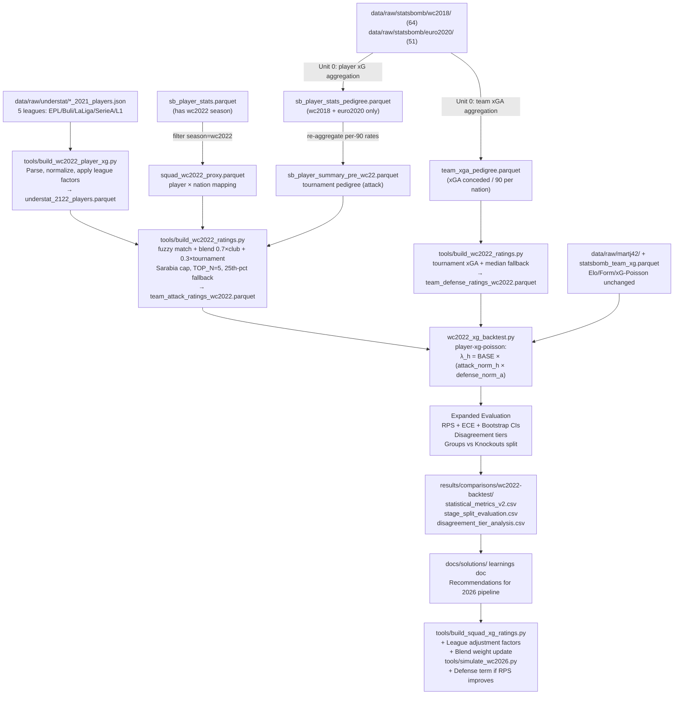

# feat: WC2022 player-level xG backtest with expanded statistical evaluation

## Overview

The first iteration of the WC2022 backtest (completed) patched the Poisson model with team-level StatsBomb xG (WC2018 + Euro2020) and showed the ensemble reaching 1.054 log-loss — within the academic range but ~0.07 behind Pinnacle. The root cause diagnosis is clear: xG coverage is sparse (115 matches only) and there is no player-level lineup signal.

This plan adds the missing player layer: build pre-tournament club xG ratings per player from Understat 2021/22 season data, blend with WC2018 tournament pedigree, wire them into a new "player-xg-poisson" model variant, and evaluate with a proper statistical suite (RPS, ECE, bootstrap CIs, disagreement taxonomy, stage-split evaluation). Learnings then drive targeted updates to the 2026 pipeline.

## Problem Frame

The existing `wc2022_xg_backtest.py` uses team-level historical xG fitted via Dixon-Coles MLE, which is undertrained (115 xG matches vs 9,837 goals-fallback matches). The result is that the xG-Poisson model is the *weakest* of the three components — a backwards result. The hypothesis is that a **player-aggregated attack rating** built from the most recent complete club season (Understat 2021/22) would produce better team λ estimates than Dixon-Coles fit on sparse StatsBomb data alone.

Additionally, the evaluation suite only reports log-loss, argmax accuracy, and home-win Brier score. Home-win Brier discards the Draw and Away probability columns entirely. The standard metric for ordered 3-class predictions is Ranked Probability Score (RPS). Without RPS, ECE, and confidence intervals, the comparison between models and against Pinnacle is incomplete.

(see origin: `compound-model/docs/brainstorms/2026-04-28-wc2022-backtest-xg-ensemble-requirements.md`)

## Requirements Trace

- R1. Build pre-WC2022 player xG ratings using Understat 2021 season data (2021/22 club season), mirroring the structure of the 2026 pipeline
- R2. Produce `sb_player_summary_pre_wc22.parquet` — tournament pedigree filtered to seasons before WC2022 (WC2018, Euro2020 only) to eliminate data leakage
- R3. Add a "player-xg-poisson" model variant to the backtest that uses both player-aggregated team attack ratings and opponent defense ratings (xGA conceded) as Poisson λ inputs — λ is a function of home attack × away defensive vulnerability, not attack alone
- R4. Expand statistical evaluation to include: RPS (primary), ECE, 95% bootstrap CIs on log-loss and RPS, paired t-test model comparison, and per-stage split (groups vs knockouts)
- R5. Classify each match by model disagreement tier (golden_zone / two_agree / split / false_consensus) and report tier-conditional accuracy
- R6. Document learnings in `docs/solutions/` with specific recommendations for the 2026 pipeline
- R7. Apply validated recommendations to `tools/build_squad_xg_ratings.py` (league adjustment factors, blend weight update if player-xg model outperforms)
- R8. No data leakage: WC2022 match outcomes and player xG from WC2022 events must not touch any model input

## Scope Boundaries

- No LightGBM or ML classifiers (overfitting risk on 64-match test set — from origin doc)
- No hyperparameter tuning of existing xi decay or importance weights
- No re-training ensemble-v2 (load from existing CSV per origin doc)
- No live market comparison for WC2022 betting simulation — historical Pinnacle WC2022 odds are not in the repo and require a paid API ($30/mo); Kelly methodology is documented and forward-applied to 2026 only
- No RFPL league data for 2021 season (RFPL data first appears in Understat 2022 key; Eastern European players in Russian clubs at WC2022 cutoff get club-xg=NaN and fall back to tournament pedigree or floor)
- Betting ROI simulation against real WC2022 odds is deferred (see below)

### Deferred to Separate Tasks

- Historical Pinnacle WC2022 odds pull and ROI backtest: separate task if odds API is approved
- Meta-model / stacking on model outputs: from origin doc — revisit after this plan's findings
- Copa2021 xG in tournament pedigree: StatsBomb Copa 2021 data is not in local raw data; use Copa2024 as the available proxy only if it can be confirmed as pre-WC2022 (it cannot — Copa2024 is after WC2022). Tournament pedigree for WC2022 backtest uses WC2018 + Euro2020 only.

## Context & Research

### Relevant Code and Patterns

- `wc2022_xg_backtest.py` — existing backtest; the new model variant and metrics expand this file
- `tools/build_squad_xg_ratings.py` — canonical player xG pipeline to mirror for WC2022; uses `sb_player_summary.parquet` + `understat_player_xg_raw.parquet`, fuzzy name match via `rapidfuzz`, blend formula `0.4×national + 0.6×club`
- `tools/build_2026_ratings.py` — alternative builder; blend `0.7×form + 0.3×tournament`, Sarabia rule (`xg_per_90 > 6.0` capped), 25th percentile fallback, `TOP_N=5`
- `tools/aggregate_statsbomb_players.py` — produces `sb_player_stats.parquet` and `sb_player_summary.parquet` from StatsBomb event data; processes wc2022/euro2024/copa2024 together (COMPS list)
- `tools/pull_understat_players.py` — async Understat pull pattern; raw JSON cached at `data/raw/understat/<league>_<year>_players.json`
- `data/raw/understat/` — EPL/Bundesliga/La_liga/Serie_A/Ligue_1 all have 2021 and 2022 season keys; RFPL has 2022 but not 2021
- `data/derived/sb_player_summary.parquet` — 1,275 rows; seasons: wc2022/euro2024/copa2024 — **this file leaks WC2022 data**; must be filtered before any WC2022 rating build
- `data/derived/statsbomb_team_xg.parquet` — has wc2022 rows (test set) and wc2018/euro2020 rows (training) — the existing backtest correctly filters to `["wc2018", "euro2020"]`; the new pipeline must apply the same filter
- `strip_accents()` + `simplify_name()` name normalization pattern in `build_squad_xg_ratings.py` — follow this for all player matching
- `FALLBACK_Q = 0.25` — 25th percentile team rating for zero-match nations; use the same fallback in WC2022 builder

### Institutional Learnings

- `docs/solutions/best-practices/wc2022-backtest-ensemble-disagreement-betting-strategy-2026-04-28.md` — golden zone taxonomy, 15/15 correct when all 3 models agree, form model is strongest individual predictor (46.9%)
- `docs/solutions/best-practices/model-roles-and-best-use-2026-04-28.md` — model role guidance
- Memory: xG-Poisson underperformed in backtest v1 due to sparse training (115 matches only); form model dominated

### External References

- Dixon & Coles (1997) — foundation of the Poisson model in this codebase
- Groll, Schauberger & Tutz (2018) — WC prediction benchmark; log-loss ~0.99–1.02 on WC2018; our target ceiling
- Epstein (1969) — RPS definition for ordered categorical forecasts
- Best-practices research: RPS formula `(1/(K-1)) × Σ(F_k − O_k)²` where F_k, O_k are cumulative predicted and actual CDFs; pure Python, no extra deps
- ECE formula: bin-weighted mean absolute calibration error across outcome classes
- Benchmark: Pinnacle WC2022 ≈ log-loss 0.97, accuracy 47%, RPS ≈ 0.185; uniform baseline log-loss = 1.099

## Key Technical Decisions

- **Squad proxy via StatsBomb appearances, not pre-announced roster**: The pre-tournament WC2022 declared squads are not cached locally. Using `sb_player_stats.parquet` filtered to `season='wc2022'` gives every player who appeared in a WC2022 match — a pragmatic approximation. Leakage is bounded: we use who played, not their WC2022 xG performance. Document as explicit assumption.

- **Tournament pedigree uses WC2018 + Euro2020 only**: These are the only pre-WC2022 StatsBomb competitions with event data available locally (`data/raw/statsbomb/wc2018/` and `data/raw/statsbomb/euro2020/`). Copa2021 and Euro2024 are excluded because either data is absent or the competition is after WC2022.

- **`sb_player_summary_pre_wc22.parquet` must be created**: The existing `sb_player_summary.parquet` includes wc2022 season data. The WC2022 rating builder must filter the source `sb_player_stats.parquet` to `season IN ['wc2018', 'euro2020']` and re-aggregate into a new file. This is the critical leakage fix.

- **Blend ratio 0.7×club + 0.3×tournament**: Matches the `build_2026_ratings.py` default (not the `build_squad_xg_ratings.py` 0.4/0.6 split). This makes the WC2022 backtest a direct controlled test of the same blend formula used for 2026, enabling apples-to-apples comparison of findings.

- **Player-xg-poisson model design**: Rather than re-fitting Dixon-Coles attack/defence params from historical data, the new model variant combines player-aggregated attack strength with opponent defensive vulnerability. Both components come from pre-WC2022 data only (no leakage). The formula: `λ_h = LAMBDA_BASE × (home_attack_norm × away_defense_vuln_norm)`, where `home_attack_norm = home_attack_rating / mean_attack` across all 32 WC2022 nations, `away_defense_vuln_norm = away_defense_rating / mean_defense` (defense_rating is xGA conceded per 90 from `team_defense_ratings_wc2022.parquet` — higher = more goals allowed = weaker = higher opponent λ), and `LAMBDA_BASE ≈ 1.15` (historical average WC goals per game). The product is then clamped to `[LAMBDA_MIN=0.70, LAMBDA_MAX=1.90]`. This multiplicative formulation mirrors Dixon-Coles' attack × opponent-defense product without requiring L-BFGS-B fitting. The normalization is mean-based (not min-max) to preserve relative magnitudes across teams. `simulate_wc2026.py` currently uses attack-only min-max scaling — the WC2022 backtest directly tests whether adding the defense term improves RPS, and Unit 7 wires the winning formula into the 2026 simulation.

- **RPS replaces home-win-only Brier as the headline metric**: RPS correctly scores ordered 3-class predictions and is the proper comparison to Pinnacle's RPS ≈ 0.185.

- **Stage-split evaluation is required**: Knockout matches cannot draw (extra time resolves to a winner), so a model assigning ~25% draw probability to knockouts is structurally penalized. Report metrics for group stage (48 matches) and knockout stage (16 matches) separately, and add a 2-class (win/loss) metric for knockouts only.

- **Betting simulation scoped to forward-2026**: Historical Pinnacle WC2022 odds are unavailable in-repo. The Kelly methodology is documented in Unit 6's solutions document only — no code is produced that wires it to the 2026 live predictions flow in this plan.

- **League xG adjustment factors**: Apply approximate quality multipliers (EPL=1.00, La Liga=0.98, Bundesliga=0.97, Serie A=0.94, Ligue 1=0.91, RFPL=0.82) when building team ratings from multi-league Understat data. These are additive refinements to the existing pipeline; document the factors in `build_squad_xg_ratings.py` and carry them forward to 2026 ratings.

## Open Questions

### Resolved During Planning

- **Should WC2022 squad proxy be post-hoc appearances or pre-announced?** Resolved: use appearances from `sb_player_stats.parquet` (season='wc2022') as the pragmatic proxy. Note leakage assumption explicitly in script docstring.
- **Which seasons for tournament pedigree?** Resolved: WC2018 + Euro2020 only (the two StatsBomb competitions with local event data that pre-date WC2022).
- **Should groups and knockouts be evaluated together?** Resolved: evaluate separately. Knockout draw probability creates structural metric inflation in 3-way evaluation.
- **Betting simulation in scope for WC2022?** Resolved: no — historical Pinnacle odds are not in-repo. Kelly methodology is documented and applied forward to 2026.

### Known Limitations (explicit assumptions)

- **Squad proxy selection bias**: The squad proxy uses post-hoc WC2022 match appearances (who played) rather than the pre-announced 26-man squads (who was expected to play). Late withdrawals (e.g., Benzema's pre-tournament injury) mean the proxy replaces the withdrawn player with whoever actually played — whose club xG may be weaker. This is bounded and unavoidable without a manually curated pre-announcement squad dataset. Document explicitly in `tools/build_wc2022_player_xg.py` docstring.
- **Defense ratings are tournament-pedigree-only**: The WC2022 defense ratings use only wc2018/euro2020 xGA; no club-level defensive data for 2021/22 is available in-repo (Understat player files are offensive stats only). This differs from the 2026 defense pipeline which blends tournament + club xGA. Acknowledged in solutions document.

### Deferred to Implementation

- **Exact fuzzy match threshold for WC2022 player names**: The existing 75-score threshold in `build_squad_xg_ratings.py` was tuned for 2026 Sofascore→Understat matching. Whether it transfers cleanly to StatsBomb WC2022→Understat 2021 will only be known at runtime. Emit a match audit CSV and tune if match rate for top-10 WC2022 nations is below 50%.
- **Exact attack_rating scale for player-xg-poisson λ**: Whether raw `attack_rating` from the WC2022 builder maps directly to the `LAMBDA_MIN/MAX` range needs verification against the distribution of fitted Dixon-Coles attack params; handle in implementation.
- **Copa2021 StatsBomb availability**: The repo has `copa2024` events but Copa America 2021 (held in summer 2021) is not confirmed locally. Verify; if available, add to pedigree. If not, WC2018 + Euro2020 is sufficient.

## Output Structure

```
data/derived/
  squad_wc2022_proxy.parquet          (players × nations from WC2022 events)
  sb_player_summary_pre_wc22.parquet  (WC2018 + Euro2020 tournament pedigree)
  understat_2122_players.parquet      (Understat 2021/22 season club xG)
  team_attack_ratings_wc2022.parquet  (32 nations × attack_rating)
  team_defense_ratings_wc2022.parquet (32 nations × defensive_rating from tournament xGA)
tools/
  build_wc2022_player_xg.py           (new script: Understat 2021 processing)
  build_wc2022_ratings.py             (new script: WC2022 team ratings builder)
results/comparisons/wc2022-backtest/
  all_models_v2_comparison.csv        (per-match, all models + new player-xg model)
  statistical_metrics_v2.csv          (RPS, ECE, bootstrap CIs, t-test results)
  stage_split_evaluation.csv          (groups vs knockouts separately)
  disagreement_tier_analysis.csv      (golden_zone / two_agree / split / false_consensus)
docs/solutions/best-practices/
  wc2022-player-xg-statistical-evaluation-2026-05-05.md
```

## High-Level Technical Design

> *This illustrates the intended approach and is directional guidance for review, not implementation specification. The implementing agent should treat it as context, not code to reproduce.*



## Implementation Units

---

- [ ] **Unit 0: Aggregate StatsBomb wc2018 and euro2020 event data into pedigree parquets**

**Goal:** Process the raw StatsBomb event JSON files for WC2018 (64 matches) and Euro2020 (51 matches) into two pre-WC2022 pedigree files: (a) player-level xG/shots/minutes, and (b) team-level xGA conceded per 90 per nation. These feed Unit 1 (attack pedigree) and Unit 3 (defense ratings) respectively.

**Requirements:** R2, R8

**Dependencies:** None — reads from `data/raw/statsbomb/wc2018/` and `data/raw/statsbomb/euro2020/` which exist on disk

**Files:**
- Create: `tools/aggregate_statsbomb_pedigree.py` (separate from canonical `tools/aggregate_statsbomb_players.py` — does NOT modify the canonical `sb_player_stats.parquet`)
- Create: `data/derived/sb_player_stats_pedigree.parquet` (player-level, wc2018+euro2020 only)
- Create: `data/derived/team_xga_pedigree.parquet` (team-level xGA conceded per 90, wc2018+euro2020)

**Approach:**
- Follow the same aggregation logic as `tools/aggregate_statsbomb_players.py` (StatsBomb event loop, shot xg extraction, minutes calculation) but iterate only over `COMPS = ['wc2018', 'euro2020']`.
- Player-level aggregation: sum `xg`, `shots`, `minutes_played` per `(player_id, player_name, team)`. Compute `xg_per_90`. Add `season` column with the competition key. Output to `sb_player_stats_pedigree.parquet`.
- Team-level xGA aggregation: for each match, extract shots faced by each team (shots where `possession_team != team`), sum xG faced, divide by minutes. Group by nation across all matches in both competitions. Output `(nation, matches, total_xg_conceded, total_minutes, tournament_xga_per_90)` to `team_xga_pedigree.parquet`. Mirror the schema of `data/derived/defensive_ratings_tournament.parquet`.

**Patterns to follow:**
- `tools/aggregate_statsbomb_players.py` — event loop, competition path resolution, player xG extraction
- `data/derived/defensive_ratings_tournament.parquet` schema — output schema for team-level xGA

**Test scenarios:**
- Happy path: `sb_player_stats_pedigree.parquet` has rows for wc2018 and euro2020 seasons only; zero rows for wc2022/euro2024/copa2024
- Happy path: `team_xga_pedigree.parquet` covers the nations that appeared in wc2018 or euro2020; 32 WC2018 nations + Euro2020 nations = ~52 unique teams
- Edge case: a player appearing in both competitions gets one aggregated row per competition (season keeps them separate); no cross-competition double counting
- Leakage: assert `df[df.season == 'wc2022'].empty` before writing `sb_player_stats_pedigree.parquet`

**Verification:**
- `sb_player_stats_pedigree.parquet` row count is comparable to the two competitions' combined squad sizes (~640–900 players)
- `team_xga_pedigree.parquet`: top defensive nations (France 2018, Italy Euro2020) have low `tournament_xga_per_90`; high-scoring-conceding nations are at the bottom
- Both files written and readable; canonical `sb_player_stats.parquet` unchanged

---

- [ ] **Unit 1: Build pre-WC2022 squad proxy and clean tournament pedigree parquet**

**Goal:** Produce two clean, leakage-free inputs for the WC2022 rating builder: (a) a player×nation mapping from WC2022 match appearances, and (b) a tournament pedigree parquet covering WC2018 and Euro2020 only.

**Requirements:** R2, R8

**Dependencies:** Unit 0 (`sb_player_stats_pedigree.parquet` for pedigree; squad proxy reads from canonical `sb_player_stats.parquet` which already has wc2022 data)

**Files:**
- Create: `tools/build_wc2022_player_xg.py` (squad proxy extraction function lives here as a first section, or as a standalone helper)
- Create: `data/derived/squad_wc2022_proxy.parquet`
- Create: `data/derived/sb_player_summary_pre_wc22.parquet`
- Test: `results/comparisons/wc2022-backtest/unit1_audit.txt` (counts per nation, leakage check)

**Approach:**
- Read `data/derived/sb_player_stats.parquet`, filter to `season == 'wc2022'`, group by `(player, team)`, aggregate `minutes_played` sum → deduplicated player×nation table. Filter to `minutes_played > 0`. Save to `squad_wc2022_proxy.parquet`.
- Read `data/derived/sb_player_stats_pedigree.parquet` (from Unit 0), re-aggregate per-player career totals (sum minutes, sum xg, sum shots; compute per-90 rates). Save to `sb_player_summary_pre_wc22.parquet`.
- Print audit: nations covered, avg squad size, top/bottom nations by player count.

**Patterns to follow:**
- `tools/aggregate_statsbomb_players.py` — aggregation logic and column names
- `data/derived/sb_player_summary.parquet` schema — output must match exactly (same columns, same types) so the downstream builder needs no code changes for the pedigree join

**Test scenarios:**
- Happy path: 32 WC2022 nations each have 18–26 players in the proxy (verified from sb_player_stats.parquet: Morocco=25, Brazil=26; minimum is 18)
- Edge case: nations with only 1 appearance (early eliminations) still produce a valid 1-row squad entry; no nation returns 0 players
- Leakage check: assert `df_pedigree[df_pedigree.season == 'wc2022'].empty` on the `sb_player_stats_pedigree.parquet` source **before** the groupby-aggregate step — the pedigree file should never contain wc2022 rows (Unit 0 guarantees this, but assert defensively)
- Integration: column schema of `sb_player_summary_pre_wc22.parquet` matches `sb_player_summary.parquet` column-for-column; downstream `build_wc2022_ratings.py` can read it without schema changes

**Verification:**
- 32 nations present in `squad_wc2022_proxy.parquet`
- `sb_player_summary_pre_wc22.parquet` has only wc2018/euro2020 seasons; row count is less than the full `sb_player_summary.parquet`
- Audit output printed to stdout with nation coverage

---

- [ ] **Unit 2: Process Understat 2021 season into pre-tournament club xG parquet**

**Goal:** Parse the five cached Understat 2021/22 season JSON files and produce `understat_2122_players.parquet` — a player-level club xG table for the season immediately preceding WC2022, with league quality adjustment factors applied.

**Requirements:** R1, R8

**Dependencies:** Unit 1 (conceptually parallel, but the output of this unit feeds Unit 3)

**Files:**
- Create: `tools/build_wc2022_player_xg.py` (primary script for this unit)
- Create: `data/derived/understat_2122_players.parquet`
- Test: `results/comparisons/wc2022-backtest/unit2_audit.txt` (player count by league, xG/90 distribution)

**Approach:**
- Read `data/raw/understat/EPL_2021_players.json`, `Bundesliga_2021_players.json`, `La_liga_2021_players.json`, `Serie_A_2021_players.json`, `Ligue_1_2021_players.json`. Note: RFPL_2021 does not exist — log this gap and skip gracefully.
- Parse each JSON (list of player dicts with keys: `id, player_name, games, time, goals, xG, assists, xA, shots, key_passes, position, team_title, npxG`).
- Normalize player names using `strip_accents()` pattern from `build_squad_xg_ratings.py`.
- Apply league xG quality factors: `EPL=1.00, La_liga=0.98, Bundesliga=0.97, Serie_A=0.94, Ligue_1=0.91`. Multiply raw `xG` by the factor before computing per-90.
- Filter: minimum 200 minutes (`time >= 200`). Apply Sarabia cap: `xg_per_90 > 6.0` → set to 6.0.
- Compute `xg_per_90 = adjusted_xG / (time / 90)`.
- Output schema: `player, player_name_raw, league, team, minutes, xg_raw, xg_adjusted, xg_per_90, shots, position, season=2021`.
- Save to `data/derived/understat_2122_players.parquet`.

**Patterns to follow:**
- `tools/pull_understat_players.py` — JSON field names and parsing pattern
- `tools/build_squad_xg_ratings.py` lines `strip_accents()`, `simplify_name()` — exact same normalization
- `data/derived/understat_player_xg_raw.parquet` schema — mirror for compatibility

**Test scenarios:**
- Happy path: ~3,500–5,000 rows total across 5 leagues (expect ~700 per league after 200-min filter)
- Edge case: players who appear in multiple leagues in the same season (e.g., winter transfers) — keep only the higher-minutes row; use Understat `id` as deduplication key before name normalization
- Edge case: RFPL_2021 file absent → log warning, continue without error; RFPL players in WC2022 squad proxy will get club_xg=NaN and fall back to tournament pedigree or floor
- Leakage check: all data is from the 2021 key (2021/22 season ending May 2022) — no 2022 key data included
- Integration: `xg_per_90` column present with no NaN for rows that passed the minutes filter

**Verification:**
- Player count per league printed and within expected range (600–1,200 per league)
- No `xg_per_90` above 6.0 after Sarabia cap
- `data/derived/understat_2122_players.parquet` written and readable

---

- [ ] **Unit 3: Build WC2022 team attack ratings from player xG**

**Goal:** Mirror `tools/build_2026_ratings.py` for WC2022: fuzzy-match Understat 2021/22 club xG to StatsBomb WC2022 squad proxy, blend with WC2018/Euro2020 tournament pedigree for attack ratings; build defense ratings from tournament xGA pedigree. Produce both `team_attack_ratings_wc2022.parquet` and `team_defense_ratings_wc2022.parquet` for 32 nations.

**Requirements:** R1, R8

**Dependencies:** Unit 0 (`team_xga_pedigree.parquet` for defense), Unit 1 (squad proxy + pre_wc22 pedigree), Unit 2 (club xG parquet)

**Files:**
- Create: `tools/build_wc2022_ratings.py`
- Create: `data/derived/team_attack_ratings_wc2022.parquet`
- Create: `data/derived/team_defense_ratings_wc2022.parquet`
- Create: `results/comparisons/wc2022-backtest/name_match_audit_wc2022.csv` (fuzzy match pairs + scores)

**Approach:**

*Attack ratings (same as before):*
- Load: `data/derived/squad_wc2022_proxy.parquet`, `data/derived/understat_2122_players.parquet`, `data/derived/sb_player_summary_pre_wc22.parquet`.
- For each player in the squad proxy, attempt fuzzy name match to Understat players using `rapidfuzz.fuzz.token_sort_ratio` on `simplify_name()`-normalized strings. Threshold 75. Emit all matches (including failed ones with score=0) to `name_match_audit_wc2022.csv`.
- Blend: `blended_xg90 = 0.7 × club_xg90 + 0.3 × tournament_xg90`. Where only club xG exists (no tournament pedigree), use club only. Where neither exists, use `blended_xg90 = NaN`.
- Team rating = mean of top-5 players by `blended_xg90` per nation. Fallback: `FALLBACK_Q=0.25` for nations with fewer than 3 rated players.
- Output: 32 nations × `(nation, attack_rating, players_rated, players_total)`.

*Defense ratings (new):*
- Load `data/derived/team_xga_pedigree.parquet` from Unit 0 (nations × `tournament_xga_per_90` from wc2018/euro2020).
- For WC2022 nations that did NOT appear in wc2018 or euro2020, apply fallback: `defensive_rating = median(tournament_xga_per_90)` across the nations that did appear.
- Note: unlike the 2026 defense pipeline which blends tournament xGA + club xGA, the WC2022 version uses tournament pedigree only (Understat 2021 player files contain offensive stats only; club-level xGA for 2021/22 is not available in-repo). Document this as a simplification.
- Output: 32 nations × `(nation, defensive_rating, tournament_xga, used_fallback)`. Mirror schema of `data/derived/team_defensive_ratings.parquet`.

**Patterns to follow:**
- `tools/build_2026_ratings.py` — exact same blend logic, MIN_MINS, MAX_XG90, TOP_N, FALLBACK_Q constants
- `tools/build_squad_xg_ratings.py` — `simplify_name()`, fuzzy match loop, `und_lookup` dict construction
- `data/derived/team_attack_ratings.parquet` schema — output must share `nation, attack_rating` columns for drop-in compatibility with the Poisson model

**Test scenarios:**
- Happy path: all 32 WC2022 nations present in output with non-zero attack_rating
- Edge case: nations with primarily non-top5-league players (e.g., Cameroon, Ghana) — at least some players matched via tournament pedigree; fallback applied for full-miss nations
- Edge case: England, France, Brazil — top WC2022 teams should have attack_rating in upper quartile; rank-order sanity check
- Error path: fuzzy match duplicates (two Understat players mapping to same squad player) — lower-minutes one should be discarded; no double-counting
- Integration: `name_match_audit_wc2022.csv` is saved with columns `(squad_player, nation, und_player_matched, match_score, club_xg90, threshold_passed)`; allows manual spot-check of top-10 nations
- Edge case: attack_rating distribution for WC2022 nations is plausible (min ~0.7, max ~1.8 after λ scaling in Unit 4)
- Defense: WC2022 nations that didn't appear in wc2018/euro2020 (e.g., Qatar, Canada, Wales — first-time qualifiers) get median fallback; `used_fallback=True` flag set; at least 5 such nations expected
- Defense sanity: France (2018 winner), Italy-proxy nations (Euro2020 winner) should have lower `defensive_rating` than early group-stage exits

**Verification:**
- 32 nations in both `team_attack_ratings_wc2022.parquet` and `team_defense_ratings_wc2022.parquet`; 0 nations with `attack_rating = 0`
- Match audit CSV written; match rate for big-5-league nations (England, Spain, Germany, France, Brazil, Argentina) is above 70%
- Attack sort order plausible: France, Brazil, England near top; Saudi Arabia, Australia, Cameroon near bottom
- Defense sort order plausible: nations with WC2018/Euro2020 tournament experience have data; first-time qualifiers have `used_fallback=True`

---

- [ ] **Unit 4: Add player-xg-poisson model variant to the backtest**

**Goal:** Add a 4th model ("player-xg-poisson") to `wc2022_xg_backtest.py` that uses `team_attack_ratings_wc2022.parquet` attack ratings as Poisson λ priors instead of Dixon-Coles fitted parameters. Compare all 6 models (Elo, Form, xG-Poisson-fit, Player-xG-Poisson, Ensemble-v2, Ensemble-backtest-v3).

**Requirements:** R3

**Dependencies:** Unit 3 (`team_attack_ratings_wc2022.parquet`)

**Files:**
- Modify: `wc2022_xg_backtest.py`
- Modify: `results/comparisons/wc2022-backtest/all_models_v2_comparison.csv` (new output file, don't overwrite existing)

**Approach:**
- Add `load_player_ratings()` function: reads both `team_attack_ratings_wc2022.parquet` and `team_defense_ratings_wc2022.parquet`, returns `{nation: {'attack': ..., 'defense': ...}}` dict.
- Add `player_xg_probs(home_nation, away_nation, ratings)` function: compute Poisson λ using the multiplicative attack × opponent-defense formula: `λ_h = LAMBDA_BASE × (home_attack_norm × away_defense_norm)`, where norms are mean-divided (not min-max) across all 32 WC2022 nations, and `LAMBDA_BASE = 1.15` (approx WC goals/game). Clamp result to `[LAMBDA_MIN=0.70, LAMBDA_MAX=1.90]`. No home advantage (neutral venue). Call existing `poisson_probs(lam_h, lam_a)`.
- Add ensemble-backtest-v3: equal weight (1/4 each) across Elo + Form + xG-Poisson-fit + Player-xG-Poisson.
- Print separate comparison column for `player-xg-poisson` and `ensemble-backtest-v3` alongside existing output table.
- Save `all_models_v2_comparison.csv` with all 6 model columns (new file, preserve existing `all_models_comparison.csv`).

**Patterns to follow:**
- `predict_match()` function structure — add the new model as a 4th key in the returned dict
- `simulate_wc2026.py` `load_ratings()` — template for `load_player_ratings()`; note the 2026 sim is attack-only; this unit's formula intentionally extends it with the defense term
- `data/derived/team_defensive_ratings.parquet` schema — reference for the defensive_rating value scale (expect ~0.9–1.5 xGA/game range)
- Existing `main()` structure — extend the metrics loop, not replace it

**Test scenarios:**
- Happy path: all 64 WC2022 matches produce a valid player-xg-poisson probability triple summing to 1.0
- Edge case: teams not in `team_attack_ratings_wc2022.parquet` (should be none for WC2022 nations, but handle gracefully with fallback to xG-Poisson-fit)
- Integration: `ensemble-backtest-v3` probabilities are the mean of four model triples; verify sum to 1.0 and no NaN for any match
- Sanity: player-xg-poisson assigns France/Brazil higher λ vs defensive Morocco/Cameroon; and assigns lower λ to those same nations when facing France/Brazil's strong defense — spot-check 3 fixtures in both directions
- Edge case: λ_h ≠ λ_a even when home_attack == away_attack if defenses differ (the formula is asymmetric per opponent defense)

**Verification:**
- `all_models_v2_comparison.csv` saved with 6 model columns
- Player-xg-poisson metrics printed in the summary table
- No NaN in any probability column for any of the 64 matches

---

- [ ] **Unit 5: Expand statistical evaluation suite**

**Goal:** Replace the existing limited metrics (log-loss, argmax accuracy, home-only Brier) with a complete evaluation suite: RPS as primary metric, ECE, 95% bootstrap CIs, paired t-test model comparison, stage-split evaluation (groups vs knockouts), and model disagreement tier analysis.

**Requirements:** R4, R5

**Dependencies:** Unit 4 (all model predictions available)

**Files:**
- Modify: `wc2022_xg_backtest.py`
- Create: `results/comparisons/wc2022-backtest/statistical_metrics_v2.csv`
- Create: `results/comparisons/wc2022-backtest/stage_split_evaluation.csv`
- Create: `results/comparisons/wc2022-backtest/disagreement_tier_analysis.csv`

**Approach:**

**RPS:** `rps(probs, actual_idx) = 0.5 × [(cum_pred[0] − cum_act[0])² + (cum_pred[1] − cum_act[1])²]` where `cum_pred` and `cum_act` are 2-element cumulative probability vectors (prefix sums of H, H+D). Pure numpy, no new deps. Report mean RPS per model. Benchmark: Pinnacle ≈ 0.185, uniform baseline = 0.333.

**ECE:** For each of 3 outcome classes (H/D/A), bin predictions into 5 equal-width bins, compute `mean_abs(avg_conf − avg_actual_rate)` weighted by bin size. Mean ECE across 3 classes. Report per-class ECE and overall. Good model: ECE < 0.06.

**Bootstrap CIs:** For each model, resample with replacement 10,000 times (n=64); compute log-loss and RPS for each resample. Report `[2.5%, 97.5%]` percentile interval. Use `np.random.default_rng(42)`. Expected width: ±0.07–0.10 for log-loss on N=64.

**Paired t-test:** For every model pair, compute per-match log-loss differential, run `scipy.stats.ttest_rel`. Report t-statistic and one-tailed p-value. Print p-value matrix. Note: at N=64, differences < 0.05 log-loss are unlikely to reach p < 0.05.

**Stage split:** Separate 48 group matches (through 2022-12-02) and 16 knockout matches. Report all metrics for each stage. For knockouts, add a 2-class win/loss metric (exclude draws from label set; treat as "predict the team that advanced"). Report separately — do not mix into headline numbers.

**Disagreement tiers:** For each match, classify by model agreement pattern across Elo + Form + xG-Poisson-fit (the 3 v2 components, consistent with existing golden zone analysis):
- `golden_zone`: all 3 agree on argmax outcome
- `two_agree`: exactly 2 of 3 agree
- `split`: no plurality (all three predict different outcomes)
- `false_consensus`: all 3 agree but all wrong

Report tier-conditional accuracy, RPS, and match count. Save to `disagreement_tier_analysis.csv`. Compare to the existing golden zone finding (15/15 correct in v1) — check if this holds with the expanded model set.

**Patterns to follow:**
- Existing `metrics()` helper function in `wc2022_xg_backtest.py` — extend, don't replace
- Existing 5-bin calibration table — keep, add ECE score below it
- Results CSV schema — add new metric columns to existing format

**Test scenarios:**
- Happy path: RPS for ensemble-v2 falls between 0.21–0.24 (consistent with log-loss of 1.054)
- Edge case: bootstrap with n=64 produces stable CI estimates after 10,000 resamples; seed fixed for reproducibility
- Edge case: disagreement tier `split` has 0 matches (or very few) — this can happen with 3-model ensembles on 64 matches; handle gracefully in display
- Integration: group stage has 48 matches, knockout has 16 — verify counts sum to 64
- Statistical: paired t-test p-values are reported honestly even when non-significant; add a note "N=64 is insufficient for significance on differences < 0.07 log-loss"
- Sanity: ECE for ensemble-v2 home-win is consistent with the existing 5-bin calibration table (both should show similar under/over-confidence patterns)

**Verification:**
- Three new CSV files written
- RPS, ECE, and 95% CI reported in printed summary table for all 6 models
- Disagreement tier analysis matches or extends the golden zone finding documented in `docs/solutions/`
- Stage split confirms whether model performance differs between group stage and knockouts

---

- [ ] **Unit 6: Document learnings in docs/solutions/**

**Goal:** Write a new solutions document synthesizing the player-xg backtest findings: whether player-level xG improved model accuracy, what RPS reveals vs Brier, calibration patterns, disagreement tier updates, and specific recommendations for the 2026 pipeline.

**Requirements:** R6

**Dependencies:** Unit 5 (all metrics available)

**Files:**
- Create: `docs/solutions/best-practices/wc2022-player-xg-statistical-evaluation-2026-05-05.md`

**Approach:**
- Structure: Problem recap → player-xg model accuracy vs baseline → RPS/ECE/bootstrap CI findings → disagreement tier update → calibration analysis → specific 2026 recommendations.
- Lead with the key finding: did the player-xg-poisson model improve over the Dixon-Coles-fit xG-Poisson? By how much? Did ensemble-backtest-v3 (4-model) beat ensemble-v2 (3-model)?
- Document the league adjustment factor values and their effect on ratings.
- Document whether the 0.7/0.3 blend ratio produced better results than alternatives.
- Provide a table: all 6 models × all 5 metrics (log-loss, RPS, ECE, accuracy, bootstrap CI).
- End with 3–5 numbered recommendations for changes to `tools/build_squad_xg_ratings.py` and the 2026 pipeline.
- Cross-reference to `docs/solutions/best-practices/wc2022-backtest-ensemble-disagreement-betting-strategy-2026-04-28.md`.

**Patterns to follow:**
- `docs/solutions/best-practices/wc2022-backtest-ensemble-disagreement-betting-strategy-2026-04-28.md` — format and level of detail
- `docs/solutions/best-practices/model-roles-and-best-use-2026-04-28.md` — recommendation framing

**Test scenarios:**
- Test expectation: none — this is a documentation unit. The document is reviewed manually for accuracy against `statistical_metrics_v2.csv`.

**Verification:**
- Document written to `docs/solutions/best-practices/` with today's date
- All numeric claims in the document are traceable to a CSV in `results/comparisons/wc2022-backtest/`
- At least 3 numbered recommendations for 2026 pipeline changes are included

---

- [ ] **Unit 7: Apply findings to 2026 pipeline**

**Goal:** Update `tools/build_squad_xg_ratings.py` (and/or `tools/build_2026_ratings.py`) based on learnings from the WC2022 backtest: add league xG adjustment factors, update the blend weight if the backtest recommends a change, and add RPS to the 2026 evaluation tooling.

**Requirements:** R7

**Dependencies:** Unit 6 (learnings documented; recommendations finalized)

**Files:**
- Modify: `tools/build_squad_xg_ratings.py` (add league adjustment factors)
- Modify: `tools/build_2026_ratings.py` (update blend weight comment with backtest evidence)
- Modify: `wc2022_xg_backtest.py` or create `tools/evaluate_predictions.py` (RPS utility function, importable by future evaluation scripts)
- Create: `data/derived/team_attack_ratings_wc2026_revised.parquet` (if blend weight change is warranted; otherwise skip)

**Approach:**
- Add `LEAGUE_XG_FACTOR` dict to `tools/build_squad_xg_ratings.py`: `{EPL: 1.00, La_liga: 0.98, Bundesliga: 0.97, Serie_A: 0.94, Ligue_1: 0.91, RFPL: 0.82}`. Apply factors before computing `blended_xg90`.
- Blend weight update threshold: update the blend defaults only if the player-xg-poisson model achieves a mean RPS at least **0.010 lower** than the Dixon-Coles-fit xG-Poisson model (lower = better). This threshold is larger than the expected bootstrap noise on N=64 (~0.008 RPS standard error) and represents a practically meaningful improvement. If the RPS improvement is smaller, keep the 0.7/0.3 default and document in the solutions doc that the current blend is not definitively suboptimal. League adjustment factors are applied regardless of this threshold — they are an independent, additive improvement.
- Extract `rps()` and `ece()` functions into a shared `tools/evaluate_predictions.py` helper; both backtest and future evaluation scripts import from it.
- Regenerate `data/derived/team_attack_ratings.parquet` (the live 2026 ratings) using the updated factors. Save as `_revised` variant first; replace only if the change improves ratings for top-10 nations by plausibility check.
- Update `data/derived/squad_xg_ratings.parquet` ratings similarly.

**Patterns to follow:**
- `tools/build_2026_ratings.py` argparse pattern — add `--league-adjust` flag (bool, default True) so adjustment can be toggled off for comparison
- `tools/simulate_wc2026.py` `load_ratings()` — verify it still works with the updated `team_attack_ratings.parquet` schema (same columns, possibly different values)

**Test scenarios:**
- Happy path: league-adjusted 2026 ratings differ from unadjusted by no more than ±15% for any nation; spot-check France, Brazil, England
- Edge case: nations with players only from RFPL (e.g., hypothetical scenario) get `attack_rating` floored at 25th percentile; not penalized to zero
- Integration: `simulate_wc2026.py` runs without error after `team_attack_ratings.parquet` is regenerated; output probabilities are within 5pp of pre-adjustment simulation (large deviations warrant investigation)
- Edge case: if no blend weight change is recommended by the WC2022 backtest, Unit 7 still applies the league factors and extracts the evaluation utility; blend weight update is conditionally skipped

**Verification:**
- `tools/build_squad_xg_ratings.py` has `LEAGUE_XG_FACTOR` dict and applies it
- `tools/evaluate_predictions.py` exists with `rps()` and `ece()` functions
- `simulate_wc2026.py` produces output after any updated ratings file is written
- The solutions document from Unit 6 is cross-referenced in a comment in the updated builder

---

## System-Wide Impact

- **Interaction graph:** `wc2022_xg_backtest.py` reads derived parquets; changes to the backtest outputs do not feed any other script. The 2026 `simulate_wc2026.py` reads `team_attack_ratings.parquet` — Unit 7 may update this file and must be verified not to break the simulation.
- **Error propagation:** If Unit 3 produces `attack_rating = 0` for any WC2022 nation (pre-fallback), the Poisson λ will be near zero, producing ~0% home-win probability — a silent failure. The fallback (25th-percentile floor) must be applied before saving to parquet.
- **State lifecycle risks:** Two builder scripts (`build_squad_xg_ratings.py` and `build_2026_ratings.py`) both write `team_attack_ratings.parquet`. Unit 7 must update both or the stale one will overwrite the revised one on the next run. Consider a version tag suffix (`_v2`) or guard with a `--force-rebuild` flag.
- **Unchanged invariants:** The existing three models (Elo, Form, xG-Poisson-fit) and their current ensemble-v2 output in `results/comparisons/wc2022-backtest/all_models_comparison.csv` are not modified. The new player-xg model is additive. The existing 8-column prediction CSV schema for 2026 sim outputs is not changed.
- **Integration coverage:** After Unit 7, run `tools/simulate_wc2026.py` end-to-end and verify the tournament simulation completes without error and produces plausible win probabilities for top seeds. If the WC2022 backtest shows the defense term improves RPS, Unit 7 should also wire `team_defensive_ratings.parquet` into `simulate_wc2026.py` using the same `λ = LAMBDA_BASE × (attack_norm × defense_norm)` formula — the 2026 sim is currently attack-only.

## Risks & Dependencies

| Risk | Mitigation |
|------|------------|
| Low player name match rate (<50%) for top-10 WC2022 nations between StatsBomb and Understat | Emit `name_match_audit_wc2022.csv` in Unit 3; if rate is low, try relaxing threshold to 65 or extend to use `partial_ratio`; document in solutions doc |
| `sb_player_summary.parquet` seasons list changes — leakage filter misses new seasons | Assert explicitly: after filtering, check `df['season'].unique()` contains only `['wc2018', 'euro2020']`; fail fast if unexpected season present |
| Player-xg-poisson produces worse results than Dixon-Coles-fit xG-Poisson | This is a valid finding, not a failure; document in solutions doc; still update league factors in Unit 7 as a standalone improvement |
| Two builder scripts both write `team_attack_ratings.parquet` (Unit 7 regression risk) | Add a `--rebuild` flag; the revised file is saved as `_wc2026_revised.parquet` first; only replace the canonical file after simulation sanity check passes |
| Bootstrap CI computation on N=64 gives very wide intervals (±0.10+) | Expected and correct; report honestly with note "N=64 precludes statistical significance for inter-model differences < 0.07 log-loss" |
| First-time WC2022 qualifiers (Qatar, Canada, Wales) have no tournament pedigree → median defense fallback may over/underestimate their defensive strength | Flag `used_fallback=True` in output; report in solutions doc whether fallback nations systematically differ in actual xGA conceded at WC2022 |
| Copa2021 StatsBomb data locally unavailable | Confirmed in planning: WC2018 + Euro2020 is sufficient; Copa2021 is deferred |

## Documentation / Operational Notes

- The new solutions document (`wc2022-player-xg-statistical-evaluation-2026-05-05.md`) should be linked in `docs/solutions/best-practices/` index if one exists; otherwise add a note in `DEVELOPMENT.md` pointing to it
- `tools/build_wc2022_player_xg.py` and `tools/build_wc2022_ratings.py` should have docstrings explaining they are backtest-only scripts and must not use WC2022 event data as input (leakage warning)
- The `name_match_audit_wc2022.csv` is a QA artifact: commit it to `results/comparisons/wc2022-backtest/` so the fuzzy matching decisions are transparent and reproducible

## Sources & References

- **Origin document:** [`compound-model/docs/brainstorms/2026-04-28-wc2022-backtest-xg-ensemble-requirements.md`](compound-model/docs/brainstorms/2026-04-28-wc2022-backtest-xg-ensemble-requirements.md)
- Prior solutions: [`docs/solutions/best-practices/wc2022-backtest-ensemble-disagreement-betting-strategy-2026-04-28.md`](docs/solutions/best-practices/wc2022-backtest-ensemble-disagreement-betting-strategy-2026-04-28.md)
- Related code: `wc2022_xg_backtest.py`, `tools/build_squad_xg_ratings.py`, `tools/build_2026_ratings.py`, `tools/aggregate_statsbomb_players.py`
- Data: `data/raw/understat/*_2021_players.json` (5 leagues), `data/derived/sb_player_stats.parquet`, `data/derived/team_attack_ratings.parquet`
- External: Dixon & Coles (1997); Epstein (1969) RPS; Groll et al. (2018) WC benchmark log-loss ~0.99–1.02
- Pinnacle benchmark: log-loss ≈ 0.97, accuracy ≈ 47%, RPS ≈ 0.185 (documented in `wc2022_xg_backtest.py` comments)
