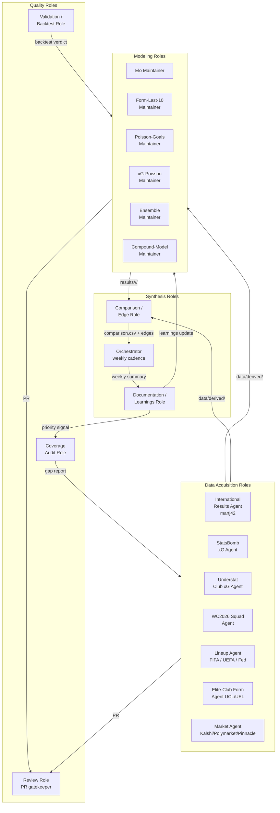
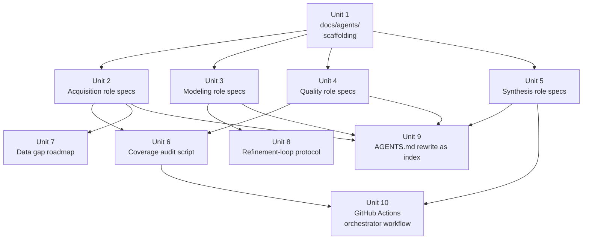

# Multi-Agent Org Chart and Collaboration Guidelines

## Overview

This plan establishes an explicit organizational structure for the human + AI agents working on `fulbol-mundial-26`. Today the repo has strong technical guardrails (`DEVELOPMENT.md`, `MODEL.md`, `tools/validate_predictions.py`), a defined data flow, and a documented priority stack — but no canonical "who does what" map. As more contributors (and more agents) join, that gap creates duplicated work, undocumented overrides, and orphaned snapshots.

The deliverable is a set of documents under `docs/agents/` that describes:

1. The **agent org chart** — the named roles, their responsibilities, and how work flows between them.
2. **Per-role specifications** — for each agent role, the inputs it consumes, outputs it produces, guardrails it enforces, and escalation paths.
3. **Collaboration protocols** — branch naming, hand-off contracts, review requirements that build on `DEVELOPMENT.md` rather than replacing it.
4. **Data gap roadmap** — concrete data layers that acquisition agents should close, prioritized against the existing `Player Data Gap Plan`.
5. A lightweight **modeling refinement loop** that connects backtests to model iteration without violating the no-post-hoc-fitting rule.

This plan is documentation-heavy by design. It does not introduce new model logic, new data sources, or new orchestration code beyond a single coverage audit script that already appears in the existing player-data plan. It exists to make the *implicit* org chart explicit so future contributors — human or agent — can self-route.

## Problem Frame

The project is genuinely multi-contributor. `DEVELOPMENT.md` already names four contributor tracks (Model, Data, Analysis, Documentation/Tooling) and the file lists eight committed snapshot-producing models. Multiple AI agents (Claude Code, Cursor, Codex, Gemini) are explicitly supported as first-class contributors. But three frictions surface repeatedly:

- **Agent ambiguity.** A new agent dropped into the repo cannot answer "what is my role and what am I allowed to write?" without reading every doc. `AGENTS.md` is currently a one-line pointer to `DEVELOPMENT.md`. There is no taxonomy of roles, no per-role brief, and no described workflow for an agent to pick up a piece of work and ship it.
- **Data gap visibility.** The `Player Data Gap Plan` and the broader `World Cup Player Data Acquisition Strategy` are excellent but live in `docs/plans/` as documents to be discovered. There is no role assigned to monitoring coverage, prioritizing the next pull, and reporting weekly. As a result, gaps known six weeks ago are still open.
- **Refinement discipline.** The `Statistical Model Roles` learning document warns explicitly against post-hoc fitting and unwired adjustments. Yet the project wants "agents that constantly refine statistical models." Reconciling those two needs a process, not just a wish — a named loop with backtest gates, snapshot diffing, and a ledger of changes per model.

Solving all three with one artifact set keeps the project's three commitments — guardrails, reproducibility, and the priority stack in `DEVELOPMENT.md` — load-bearing rather than decorative.

## Requirements Trace

- **R1.** Produce an explicit, named agent org chart that any contributor can read in under 5 minutes and understand who owns what.
- **R2.** Provide per-agent role specifications detailing inputs, outputs, allowed write paths, escalation, and verification.
- **R3.** Define hand-off contracts between agents (data → modeling → comparison → review) that respect the existing branch/PR/guardrail workflow in `DEVELOPMENT.md`.
- **R4.** Enumerate the priority data gaps that acquisition agents should close, with stable references back to the existing acquisition strategy.
- **R5.** Define a **modeling refinement loop** for "modeling agents" that explicitly forbids post-hoc fitting and requires walk-forward evidence before any parameter change reaches production.
- **R6.** Make `AGENTS.md` a real entry point — a short top-level document that points an arriving agent at the catalog and the priority stack.
- **R7.** Add no new runtime data dependencies and no new long-running services. The deliverable is documentation plus, at most, one read-only audit script.

## Scope Boundaries

**In scope:**

- Documentation under `docs/agents/`.
- A small update to `AGENTS.md` so it actually serves agents.
- The `tools/audit_player_coverage.py` script already promised by the existing `Player Data Gap Plan`, since the org chart depends on coverage being observable.

**Out of scope (explicit non-goals):**

- Building any data-pull agent itself. The org chart names the role and contract; whoever fills that role (human or AI) implements the actual pulls within the existing tooling pattern.
- New scrapers for previously-disallowed sources (FBref, automated scraping of bot-protected sites).
- Live betting integration, dashboard work, or any change to `weekly_pull.py` beyond what an audit script naturally requires.
- Changes to the `predictions.csv` 8-column schema or to the model guardrails in `DEVELOPMENT.md`.
- A meta-orchestration tool that auto-runs other agents. The "Orchestrator" role described here is a *human or agent role*, not a daemon.
- Renaming or reorganizing existing model snapshots in `results/`.

## Context & Research

### Relevant Code and Patterns

- `DEVELOPMENT.md` — canonical contributor guide: branch naming, review rules, model guardrails, priority stack. Every agent role spec must cite back to this.
- `AGENTS.md` — current one-line pointer. Will be expanded to a real entry point.
- `CLAUDE.md` — same one-line pointer; kept in sync.
- `README.md` — top-level project overview with model table and contribution flow.
- `tools/weekly_pull.py` — single source of truth for weekly cadence: pulls Kalshi/Polymarket, normalizes via `ISO2_TO_FIFA3` / `NAME_TO_FIFA3`, refreshes Elo, writes `results/comparisons/<date>/`.
- `tools/validate_predictions.py` — guardrail check; every modeling agent must run it before commit.
- `tools/build_squad_xg_ratings.py` and the `pull_*` scripts under `tools/` — the existing data acquisition pattern. Each is idempotent, writes raw JSON to `data/raw/<source>/<YYYY-MM-DD>/`, and emits a parquet/csv to `data/derived/`.
- `methodology/_template/` and `results/_template/` — the contribution scaffold every modeling agent already uses.
- `docs/plans/2026-05-06-player-data-gap-plan.md` — the existing data gap plan; the Coverage Audit role spec must reference it directly.
- `docs/plans/2026-05-06-world-cup-player-data-acquisition-strategy.md` — the four-layer data architecture; Data Acquisition role specs map onto these layers.

### Institutional Learnings

- `docs/solutions/best-practices/model-roles-and-best-use-2026-04-28.md` — defines what each *statistical model* measures and when it fails. The Modeling Agent specifications must inherit from this, not re-derive it.
- `docs/solutions/best-practices/wc2022-backtest-ensemble-disagreement-betting-strategy-2026-04-28.md` — disagreement taxonomy. The Comparison Agent role spec uses this as its evaluation rubric.
- The existing `Subjectivity and bias policy` in `DEVELOPMENT.md` is the strongest constraint on any "constantly refining" agent. The refinement loop in this plan must operationalize that policy, not relax it.

### External References

External research was deliberately skipped. The project's internal patterns are well-formed and the work is organizational/documentation in nature. No framework or vendor decision is being made.

## Key Technical Decisions

- **Decision:** Use a flat agent catalog with a single human-readable index rather than a hierarchy of agent classes. *Rationale:* The repo is small, contributor count is small, and the existing four-track contributor model already maps cleanly to roles. A class hierarchy would add ceremony without making any current task easier.
- **Decision:** Treat "agents" and "human contributors" as interchangeable role-fillers. *Rationale:* `DEVELOPMENT.md` already does this; the org chart should not invent two parallel worlds. Each role spec describes the contract the role fulfills, not whether a human or a model is fulfilling it.
- **Decision:** Place the catalog under `docs/agents/` (new directory) rather than expanding `AGENTS.md` into a single mega-file. *Rationale:* Per-role files are diff-friendly when one role's contract changes. The top-level `AGENTS.md` becomes a 30-line index that points into `docs/agents/`.
- **Decision:** The "modeling refinement loop" is a documented protocol, not a new tool. *Rationale:* The guardrails that prevent post-hoc fitting are already in `DEVELOPMENT.md`. The refinement loop just sequences existing checks (snapshot → backtest → calibration → MODEL.md change log → PR) so an agent has a deterministic playbook.
- **Decision:** Keep one new tool: `tools/audit_player_coverage.py`. *Rationale:* The Coverage Audit role spec is meaningless without an observability artifact. This tool is already promised by `2026-05-06-player-data-gap-plan.md`, so we are landing it once instead of writing the role spec on top of vapor.
- **Decision:** Host the Orchestrator's weekly cadence on **GitHub Actions** (cron + `workflow_dispatch`), not on a VM, daemon, or external scheduler. The workflow opens a PR back to `main` rather than pushing directly. *Rationale:* The project requires zero spend on orchestration ($0/mo hard constraint). The repo is public, so Actions minutes are unlimited. Opening a PR preserves the "main is protected — no one pushes directly" rule from `DEVELOPMENT.md`. This does not violate the deferred-list item "LLM/agent-driven scraping" — the Orchestrator runs deterministic Python (`weekly_pull.py`, `validate_predictions.py`, etc.), not LLM-driven anything. Modal is the documented upgrade path if Actions ever proves insufficient; a VM is explicitly *not* the upgrade path.
- **Decision:** Record manual model adjustments in a per-model `CHANGELOG.md` under `methodology/<model>/` rather than scattering them across PR descriptions. *Rationale:* The existing "Subjective adjustments" section in `MODEL.md` captures *current state*. The changelog captures the *trajectory* — what changed, when, and what backtest evidence justified it. This is what makes "constantly refining" auditable.

## Open Questions

### Resolved During Planning

- **Q: Should there be a single "Orchestrator" agent that triggers other agents on a schedule?** Resolved: No. The orchestrator role is a *human or AI on rotation* who runs `weekly_pull.py` on Sundays and triages the comparison output. Building scheduling infrastructure is out of scope and on the deferred list.
- **Q: Where do data gaps get reported?** Resolved: A new `data/derived/player_coverage_report.csv` (specified by the existing Player Data Gap Plan) is the canonical artifact. The Coverage Audit role owns refreshing it weekly.
- **Q: Should each role spec live in `AGENTS.md` or a separate file?** Resolved: Separate files under `docs/agents/<role>.md`. `AGENTS.md` becomes the index.
- **Q: How does this interact with the four contributor tracks (A/B/C/D) in `DEVELOPMENT.md`?** Resolved: Tracks are *contribution surfaces* (model/data/analysis/docs). Roles in this catalog are *responsibilities*. A single contributor can fill multiple roles; tracks tell them where their PR will land. Cross-references between the two will be added.

### Deferred to Implementation

- **Q: Exact filename for each acquisition role spec.** The list of *roles* is fixed in this plan; the per-role filenames will use kebab-case but exact wording will be decided as the files are written.
- **Q: Whether the audit script should fail CI on coverage regressions.** Defer. First land the report; gate on regressions only after baselining current coverage.
- **Q: Whether the Comparison role's "Golden Zone" rubric needs an additional disagreement bucket beyond the four documented in the WC2022 backtest learning.** Defer until WC2026 group stage data exists.

## High-Level Technical Design

> *This illustrates the intended approach and is directional guidance for review, not implementation specification. The implementing agent should treat it as context, not code to reproduce.*

### Org chart (work flow between roles)



### Process loops

The catalog defines three named loops. Every agent action belongs to exactly one loop.

| Loop | Trigger | Roles involved | Output |
|---|---|---|---|
| **Weekly cadence** | Sunday or release of new market prices | Orchestrator → Market + Results + Squad acquisition → Elo + Form + Poisson modeling → Comparison → Review | New dated snapshots in `results/<model>/<date>/` and `results/comparisons/<date>/` |
| **Gap-fill** | Coverage report shows regression or new uncovered nation/player | Coverage Audit → priority signal → relevant Acquisition role → Validation | Updated coverage report; new derived data layer |
| **Refinement** | Backtest delta on a held-out tournament > threshold or new data layer wired in | Modeling Maintainer → Validation/Backtest → Documentation → Review | New `model_version`, methodology change recorded in `methodology/<model>/CHANGELOG.md`, MODEL.md updated |

### Per-role spec contract

Each role file under `docs/agents/<role>.md` contains the same sections so an arriving agent always knows where to look:

```text
# <Role Name>

## Mission              one paragraph; the durable purpose of the role
## Inputs               files/sources the role consumes, with paths
## Outputs              files the role writes, with paths and schemas
## Allowed write paths  explicit list; everything else is forbidden
## Cadence              weekly / on-demand / continuous
## Guardrails           which DEVELOPMENT.md rules are load-bearing here
## Hand-offs            which roles consume this role's output
## Escalation           when to stop and ask a human lead
## Verification         how the role knows it is done (specific, observable)
```

Spec contract is non-prescriptive: it describes the *shape* every role doc must take so the catalog stays consistent. It is not a code template.

## Implementation Units



- [ ] **Unit 1: `docs/agents/` scaffolding and README**

**Goal:** Land the directory and the index document that defines the per-role spec contract and the org chart diagram.

**Requirements:** R1, R3, R6

**Dependencies:** None.

**Files:**
- Create: `docs/agents/README.md`
- Create: `docs/agents/_role-template.md`

**Approach:**
- `docs/agents/README.md` carries the org chart mermaid diagram from this plan, the three-loop table, and a one-line entry per role linking to the role file.
- `_role-template.md` enumerates the nine sections in the spec contract above, with one-line "what goes here" prompts. New roles copy this file.
- No code, no executable artifact.

**Patterns to follow:**
- `methodology/_template/` and `results/_template/` are good precedents for "copy this folder to start contributing." Mirror their tone.
- Reference style follows `DEVELOPMENT.md` (markdown tables, fenced code blocks, repo-relative paths only).

**Test scenarios:**
- *Happy path:* A first-time contributor can read `docs/agents/README.md` and identify which role they want to fill in under five minutes — verified by walkthrough during review.
- *Edge case:* A contributor opens `_role-template.md`, fills in all nine sections, and produces a coherent role spec with no extra context. Reviewer confirms each section's prompt is unambiguous.
- Test expectation: none beyond review walkthrough — pure documentation unit.

**Verification:**
- `docs/agents/README.md` and `_role-template.md` exist.
- README links resolve to the role files added in Units 2-5 (cross-checked at the end of the plan).
- `AGENTS.md` (post-Unit-9) points to `docs/agents/README.md`.

- [ ] **Unit 2: Data Acquisition role specs**

**Goal:** Write one role spec per data-acquisition responsibility named in the org chart.

**Requirements:** R2, R3, R4

**Dependencies:** Unit 1.

**Files:**
- Create: `docs/agents/acquisition-international-results.md` *(martj42 results pull)*
- Create: `docs/agents/acquisition-statsbomb.md` *(national-team event/xG)*
- Create: `docs/agents/acquisition-understat.md` *(club-level player xG)*
- Create: `docs/agents/acquisition-wc2026-squads.md` *(Wikipedia + FIFA preliminary lists)*
- Create: `docs/agents/acquisition-national-lineups.md` *(FIFA / UEFA / federation match reports)*
- Create: `docs/agents/acquisition-elite-club-form.md` *(UCL / UEL recent minutes)*
- Create: `docs/agents/acquisition-markets.md` *(Kalshi, Polymarket, Pinnacle/Hard Rock)*

**Approach:**
- Each spec follows `_role-template.md` exactly.
- `Inputs` cites the source URL and any rate-limit/policy notes already in `tools/` script headers.
- `Outputs` cites the exact `data/raw/<source>/<YYYY-MM-DD>/` and `data/derived/<file>` targets that exist or are planned.
- `Allowed write paths` lists only those two directory roots and the matching `tools/pull_*.py` for code.
- `Guardrails` references `DEVELOPMENT.md` Track B rules: idempotent, raw-snapshot immutability, FBref ban.
- `Hand-offs` names which Modeling and Synthesis roles consume the output.
- `Escalation` cites concrete "stop conditions" — Cloudflare blocks, schema drift, > 20% coverage drop vs prior week.

**Patterns to follow:**
- Existing `tools/pull_statsbomb.py`, `tools/pull_understat_players.py`, `tools/pull_wc2026_squads.py` are the canonical scripts; specs reference them by path.
- The four-layer model in `docs/plans/2026-05-06-world-cup-player-data-acquisition-strategy.md` (Player Registry → Candidate Pool → National Usage → Club Form) maps directly onto these specs. Cite by relative path.

**Test scenarios:**
- *Happy path:* A new contributor offered the "Understat" role can run `tools/pull_understat_players.py`, observe the documented output paths, and PR a new dated snapshot without reading any other doc. Verified by walking the spec end-to-end against the existing tool.
- *Error path:* The spec's escalation section names at least one concrete failure mode the existing tool can hit (rate limit, schema drift) and where to ask for help. Reviewer confirms each spec has a non-empty escalation section.
- *Integration:* For each spec, the named consumer (e.g. xG-Poisson maintainer for Understat output) actually exists in Unit 3 and accepts the documented schema.
- Test expectation: cross-reference check during review; no programmatic tests.

**Verification:**
- All seven files exist and conform to `_role-template.md`.
- Every `Outputs` path corresponds to an existing or scheduled file in the repo.
- No spec authorizes a write outside `data/raw/<source>/`, `data/derived/`, or `tools/pull_<source>.py`.

- [ ] **Unit 3: Modeling role specs**

**Goal:** Write one role spec per existing or planned modeling methodology, plus the Ensemble and Compound-Model maintainer specs.

**Requirements:** R2, R5

**Dependencies:** Unit 1.

**Files:**
- Create: `docs/agents/modeling-elo-baseline.md`
- Create: `docs/agents/modeling-form-last-10.md`
- Create: `docs/agents/modeling-poisson-goals.md`
- Create: `docs/agents/modeling-poisson-xg.md`
- Create: `docs/agents/modeling-ensemble.md`
- Create: `docs/agents/modeling-compound-model.md`

**Approach:**
- Inputs are paths under `data/derived/`. Outputs are `results/<model>/<YYYY-MM-DD>/predictions.csv` plus the matching `methodology/<model>/` reproducibility folder.
- `Allowed write paths` is strict: only the model's own `methodology/<model>/` and `results/<model>/` trees, never another model's folder. This is the existing rule from `DEVELOPMENT.md`'s "Do not modify another contributor's `results/<their-model>/...` files" — restated at agent scope.
- `Guardrails` cites the relevant subset of `DEVELOPMENT.md` model guardrails: 8-column schema, log-loss < 1.099, walk-forward only, subjective-adjustment policy.
- Each spec links to `docs/solutions/best-practices/model-roles-and-best-use-2026-04-28.md` for the role's measured strengths/weaknesses — no re-derivation.
- `Hand-offs` names the Comparison role and the Validation/Backtest role.

**Patterns to follow:**
- `compound-model/MODEL.md` and the existing `results/<model>/MODEL.md` files are the canonical "model card" pattern. Specs do not duplicate them; they cite them.
- `wc2022_xg_backtest.py` is the reference walk-forward backtest pattern.

**Execution note:** No new model code in this unit. Specs only.

**Test scenarios:**
- *Happy path:* A contributor picking up the `xG-Poisson` role reads the spec, runs `python3 wc2022_xg_backtest.py`, and produces a snapshot that passes `tools/validate_predictions.py`. Verified by reproducing the existing 2026-04-28 snapshot from a clean checkout.
- *Edge case — subjective adjustment:* The spec describes how a maintainer adds a parameter (e.g. a confederation tier weight) without violating the "no post-hoc fitting" rule. The described path matches `DEVELOPMENT.md`'s subjectivity policy and Unit 8's refinement-loop protocol.
- *Error path:* Spec describes what happens when validate_predictions fails (rollback the snapshot, do not commit, escalate).
- Test expectation: documentation review — no programmatic tests.

**Verification:**
- All six specs exist and conform to template.
- Each spec's `Allowed write paths` lists only the model's own subtrees.
- Each spec links to the model-roles-and-best-use learning document.

- [ ] **Unit 4: Quality role specs (Coverage Audit, Validation/Backtest, Review)**

**Goal:** Write the three quality-role specs that gate every other role's output.

**Requirements:** R2, R3, R5

**Dependencies:** Unit 1.

**Files:**
- Create: `docs/agents/quality-coverage-audit.md`
- Create: `docs/agents/quality-validation-backtest.md`
- Create: `docs/agents/quality-review.md`

**Approach:**
- `quality-coverage-audit.md` describes the role that runs `tools/audit_player_coverage.py` (Unit 6), interprets the report, opens issues against acquisition roles, and updates a priority signal in `data/derived/player_coverage_report.csv`. Cadence: weekly.
- `quality-validation-backtest.md` describes the role that runs `tools/validate_predictions.py --all` and `wc2022_xg_backtest.py`, records log-loss / Brier / accuracy, and produces a verdict that gates Refinement-loop merges. The spec explicitly names the WC2022 / Euro2024 / Copa2024 hold-outs from `DEVELOPMENT.md`.
- `quality-review.md` describes the human-or-AI reviewer who applies the "What reviewers check" list from `DEVELOPMENT.md` to PRs touching `results/`, `compound-model/`, or `tools/`. This role inherits the `@pol-i-tech/leads` ownership rule.

**Patterns to follow:**
- The "What reviewers check" list in `DEVELOPMENT.md` is the canonical review rubric — copy by reference, not by duplication.
- `docs/solutions/best-practices/wc2022-backtest-ensemble-disagreement-betting-strategy-2026-04-28.md` is the canonical disagreement taxonomy used by the Comparison role (Unit 5) but informs Validation/Backtest's interpretation too.

**Test scenarios:**
- *Happy path:* The Validation/Backtest spec, when followed against the current `ensemble-v2/wc2022-backtest/` artifacts, reproduces the documented log-loss of 1.054. Verified during review by re-running.
- *Edge case:* The Coverage Audit spec describes how to handle the first weekly run when there is no prior report to diff against. Spec must include a "first-run baseline" instruction.
- *Error path:* The Review spec describes how to handle a PR that passes `validate_predictions.py` but contains an undocumented manual override. Spec must require rejection with a pointer to the subjectivity policy.
- Test expectation: documentation review.

**Verification:**
- All three specs exist.
- Each cites the specific `DEVELOPMENT.md` section it operationalizes.
- The Coverage Audit spec references `tools/audit_player_coverage.py` (Unit 6).

- [ ] **Unit 5: Synthesis role specs (Comparison/Edge, Documentation/Learnings, Orchestrator)**

**Goal:** Write the three synthesis-role specs that close the loop from per-model output to project-wide knowledge and weekly cadence.

**Requirements:** R2, R3

**Dependencies:** Unit 1.

**Files:**
- Create: `docs/agents/synthesis-comparison-edge.md`
- Create: `docs/agents/synthesis-documentation-learnings.md`
- Create: `docs/agents/synthesis-orchestrator.md`

**Approach:**
- `synthesis-comparison-edge.md` owns `results/comparisons/<date>/` and the Golden-Zone rule from `DEVELOPMENT.md`. Inputs: every `results/<model>/<date>/predictions.csv` plus the market snapshots. Outputs: `comparison.csv`, `comparison.md`, `actionable.md`. Hand-off: surfaces edges to the Documentation role and the Orchestrator.
- `synthesis-documentation-learnings.md` owns `docs/solutions/` and the change history of `DEVELOPMENT.md`, `AGENTS.md`, `CLAUDE.md`. Cadence: continuous, but at minimum once per weekly cycle and once per merged PR that changes a model's methodology.
- `synthesis-orchestrator.md` owns `tools/weekly_pull.py` execution. The Orchestrator is the only role authorized to *trigger* the weekly cycle. They write a Sunday summary that names which roles ran, which snapshots updated, and which gaps the Coverage Audit role surfaced.

**Patterns to follow:**
- Existing `results/comparisons/2026-04-28/comparison.csv` and the comparison.md/actionable.md outputs of `weekly_pull.py` are the canonical artifacts.
- `docs/solutions/best-practices/*` files are the canonical learnings format. The Documentation role does not invent a new format.

**Test scenarios:**
- *Happy path:* The Orchestrator spec, followed against a fresh weekly cycle, produces the same artifacts `weekly_pull.py 2026-04-28` produces today. Verified by re-running the existing pull.
- *Edge case:* The Comparison/Edge spec describes how to handle a model that submits a predictions.csv without all required market_types. Must reference the validation policy, not silently drop.
- *Integration:* The Documentation role's hand-off to Modeling roles (a learning that motivates a refinement) cannot bypass the refinement-loop protocol from Unit 8.
- Test expectation: documentation review plus one walkthrough of `weekly_pull.py` against the spec.

**Verification:**
- All three specs exist.
- Comparison spec cites Golden-Zone rule and edge thresholds from `DEVELOPMENT.md` verbatim by reference.
- Orchestrator spec cites `tools/weekly_pull.py` as the only authorized trigger.

- [ ] **Unit 6: `tools/audit_player_coverage.py`**

**Goal:** Land the read-only audit script that the Coverage Audit role depends on. The Player Data Gap Plan already commits to this; we are landing it inside the org-chart deliverable so the role spec is not vapor.

**Requirements:** R4, R7

**Dependencies:** Unit 4 (the role spec that calls the script).

**Files:**
- Create: `tools/audit_player_coverage.py`
- Create: `data/derived/player_coverage_report.csv` *(generated; gitignored if existing pattern is followed)*
- Modify: `tools/__pycache__` is regenerated by Python; not committed.

**Approach:**
- Read `data/derived/squad_xg_ratings.parquet` and `data/derived/team_attack_ratings.parquet`.
- Emit per-nation rows with the columns specified in `2026-05-06-player-data-gap-plan.md`: `nation, players, matched_to_club, match_rate, national_minutes, low_minutes_players, missing_club_players, stale_players`.
- Read-only on inputs. Idempotent. No network. No new dependencies beyond `pandas` (already used by the existing tools).
- Threshold for `low_minutes_players` and `stale_players` documented in the script header and the role spec, not hard-coded magic numbers.

**Execution note:** Implement test-first. The script's correctness is observable from the output CSV against a known input parquet, and a small fixture protects against silent schema drift.

**Patterns to follow:**
- Header docstring style from `tools/weekly_pull.py` and `tools/build_squad_xg_ratings.py`.
- `pathlib`-based path resolution (also from existing tools).

**Test scenarios:**
- *Happy path:* Given the current `data/derived/squad_xg_ratings.parquet`, the script produces a `player_coverage_report.csv` with exactly one row per nation present in the input and the documented columns. Run twice — second run produces byte-identical output (idempotent).
- *Edge case — nation with zero matched club data:* Script emits a row with `match_rate=0.0` and `missing_club_players` equal to the player count, not a divide-by-zero or a dropped row.
- *Edge case — empty input parquet:* Script exits non-zero with a clear message; does not silently emit an empty report.
- *Error path:* Missing input parquet → script exits non-zero with `FileNotFoundError`-grade message and does not create a partial output.
- Test file: `tools/test_audit_player_coverage.py` (or co-located within `tools/` per existing convention; if no test convention yet, place at the repo root following `wc2022_xg_backtest.py` style).

**Verification:**
- `python3 tools/audit_player_coverage.py` exits 0 against the current `data/derived/`.
- `data/derived/player_coverage_report.csv` exists with one row per nation.
- Re-running the script produces an identical file.
- Test file passes (`python3 -m pytest tools/test_audit_player_coverage.py` or equivalent).

- [ ] **Unit 7: Data gap roadmap**

**Goal:** Translate the existing Player Data Gap Plan and World Cup Player Data Acquisition Strategy into a single, role-keyed roadmap that lives next to the agent catalog.

**Requirements:** R4

**Dependencies:** Unit 2.

**Files:**
- Create: `docs/agents/data-gaps-roadmap.md`

**Approach:**
- One section per data layer (Player Registry, Candidate Pool, National Recent Usage, Club Recent Form, Market Devigging Quality, WC2026 Squad Confirmation).
- Each section names: the gap (one paragraph), the owning Acquisition role from Unit 2, the priority bucket (P0/P1/P2 against `DEVELOPMENT.md`'s priority stack), the stop-condition that promotes the gap to P0, and the link back to `2026-05-06-world-cup-player-data-acquisition-strategy.md`.
- The roadmap is read by the Coverage Audit role (Unit 4) when it issues a priority signal.
- Document is intentionally short — not a re-derivation of the acquisition strategy. It is a routing layer.

**Patterns to follow:**
- The priority stack in `DEVELOPMENT.md` ("Guardrails → Player-data coverage → Market normalization → Model consolidation → Then advanced features") is the canonical priority frame. The roadmap inherits from it.
- The Coverage Targets table in `2026-05-06-world-cup-player-data-acquisition-strategy.md` provides numeric thresholds; the roadmap cites them.

**Test scenarios:**
- *Happy path:* Each gap has a named owning role from Unit 2. Reviewer confirms zero orphaned gaps.
- *Edge case:* Each priority is justified by a citation (a `DEVELOPMENT.md` rule, a coverage target, or a documented blind spot in `model-roles-and-best-use-2026-04-28.md`). No bare opinions.
- Test expectation: cross-reference review.

**Verification:**
- `docs/agents/data-gaps-roadmap.md` exists.
- Every named gap maps to exactly one acquisition role file.
- Every priority bucket has a citation.

- [ ] **Unit 8: Refinement-loop protocol**

**Goal:** Document the protocol that turns "constantly refining models" into a series of audited, walk-forward steps that respect the no-post-hoc-fitting rule.

**Requirements:** R3, R5

**Dependencies:** Unit 3, Unit 4.

**Files:**
- Create: `docs/agents/refinement-loop.md`
- Create: `methodology/_template/CHANGELOG.md` *(empty starter; new models inherit it via `cp -r`)*

**Approach:**
- The protocol is a numbered sequence: hypothesis → branch → snapshot baseline → change → walk-forward backtest on a held-out tournament → calibration check → MODEL.md "Subjective adjustments" diff → CHANGELOG.md entry → PR.
- Each step names which role executes it and which artifact it produces.
- The protocol explicitly forbids: (a) modifying parameters after seeing held-out results, (b) backtesting on the same tournament whose results motivated the change, (c) committing the new snapshot without the CHANGELOG entry.
- The protocol's stop-conditions: backtest log-loss regression > 0.01 vs prior version → roll back; ECE worsens on the calibration plot → roll back; `validate_predictions.py` fails → reject before backtest even runs.
- `methodology/_template/CHANGELOG.md` is a tiny starter file with the column convention `date | model_version | change | held-out evidence | reviewer`. Every new model copies it.

**Patterns to follow:**
- `DEVELOPMENT.md` "Subjectivity and bias policy" is the source of truth; the protocol operationalizes it without contradicting it.
- `methodology/_template/` is the existing scaffold; CHANGELOG.md slots in there.

**Test scenarios:**
- *Happy path:* A modeling agent walks the protocol on a hypothetical "add confederation tier weight" change. Each step yields a named artifact, the backtest runs walk-forward on a held-out tournament, and the CHANGELOG entry captures the evidence. Verified by walkthrough on a representative model (e.g. ensemble).
- *Edge case — null result:* The protocol describes what to do when the backtest is neutral (no improvement, no regression). Spec must require rolling the change back, not adopting it.
- *Error path — protocol violation:* Spec describes how the Review role rejects a PR that ships a parameter change without a CHANGELOG entry or without held-out evidence. Cites the same subjectivity-policy rule.
- *Integration:* The Validation/Backtest role spec (Unit 4) and the Review role spec (Unit 4) both reference this protocol as authoritative.
- Test expectation: documentation review plus one walkthrough.

**Verification:**
- `docs/agents/refinement-loop.md` exists.
- `methodology/_template/CHANGELOG.md` exists with the documented columns.
- Quality role specs (Unit 4) cite the refinement-loop protocol by relative path.

- [ ] **Unit 9: `AGENTS.md` rewrite as catalog index**

**Goal:** Replace the current one-line `AGENTS.md` with a real entry point that lists the roles and points at `docs/agents/README.md`. Mirror the change to `CLAUDE.md`.

**Requirements:** R6

**Dependencies:** Units 1-8 (so links are real, not promises).

**Files:**
- Modify: `AGENTS.md`
- Modify: `CLAUDE.md`

**Approach:**
- New `AGENTS.md` is short — the project's preference. Sections: "Where you are", "Pick a role" (linked list of the 19 role files from Units 2-5 and 7-8), "Where work happens" (link to `DEVELOPMENT.md`), "Priority stack" (link to the priority section in `DEVELOPMENT.md` rather than duplicating).
- `CLAUDE.md` matches `AGENTS.md` in structure; the project pattern is to keep them aligned.
- No content drift from `DEVELOPMENT.md`. Anything that conflicts gets rewritten as a link to the canonical section.

**Patterns to follow:**
- Current `AGENTS.md` and `CLAUDE.md` are minimal pointers. Stay terse — agents do not need a wall of text in the entry file.

**Test scenarios:**
- *Happy path:* A first-time agent opens `AGENTS.md`, identifies the role they want to fill, clicks through to the role file, and starts work. Verified by walkthrough.
- *Edge case:* `AGENTS.md` and `CLAUDE.md` are byte-for-byte equivalent in their substantive content (different YAML/style allowed, same role list, same links).
- *Error path:* If a future role is added under `docs/agents/` without updating `AGENTS.md`, the next reviewer catches it. The Review role spec already lists "AGENTS.md and the catalog stay in sync" as a check.
- Test expectation: cross-reference review.

**Verification:**
- `AGENTS.md` lists every role file from Units 2-5 and 7-8 with a working relative link.
- `CLAUDE.md` lists the same roles.
- `git grep "TODO"` in the new files returns nothing.

- [ ] **Unit 10: Orchestrator GitHub Actions workflow**

**Goal:** Land the workflow that fulfills the Orchestrator role on a Sunday cron, plus a manual on-demand workflow for catch-up runs.

**Requirements:** R3, R7

**Dependencies:** Unit 5 (Orchestrator role spec), Unit 6 (audit script — referenced but tolerated absent until merged).

**Files:**
- Create: `.github/workflows/orchestrator-weekly.yml`
- Create: `.github/workflows/orchestrator-on-demand.yml` *(optional companion; same job, manual trigger only)*
- Modify: `docs/agents/synthesis-orchestrator.md` *(Unit 5 file: name the workflow as the canonical trigger; document `workflow_dispatch` for manual catch-up; document the PR title/label convention)*

**Approach:**
- Schedule: `cron: '0 14 * * 0'` (Sunday 14:00 UTC). Manual trigger via `workflow_dispatch` accepts an optional `date` input (default: today UTC).
- Job runs on `ubuntu-latest`. Steps: checkout → `actions/setup-python@v5` (3.11) → `pip install pandas httpx pyarrow` → run `tools/weekly_pull.py <date>` → run `tools/audit_player_coverage.py` (continue-on-error until Unit 6 lands) → run `tools/validate_predictions.py --all` → open PR via `peter-evans/create-pull-request@v6`.
- PR settings: branch `orchestrator/weekly-<date>`, base `main`, title `chore(weekly): orchestrator snapshot <date>`, labels `orchestrator`, `weekly-snapshot`. The Review role spec (Unit 4) filters on these labels.
- Permissions: `contents: write`, `pull-requests: write`. No additional secrets needed at v0 — Kalshi/Polymarket reads are unauthenticated. `ODDS_API_KEY` is referenced as a future secret but not required for the cold start.
- Branch-naming exception: orchestrator PRs use the `orchestrator/` prefix instead of `<your-name>/`. The Orchestrator role spec documents this exception so the Review role does not flag it as a `DEVELOPMENT.md` violation.
- Failure handling: GitHub Actions emails the repo admin on failed runs by default — no extra notification step. The Sunday summary (whether failure or success) is the artifact the Documentation/Learnings role consumes.
- Cost: $0/mo confirmed for this repo (public; standard runners; estimated job runtime <10 minutes per week).

**Patterns to follow:**
- `tools/weekly_pull.py` is the existing entry point — the workflow shells out to it unchanged.
- `peter-evans/create-pull-request@v6` is the standard community action for "run a job, commit results, open a PR" — pinned to a major version.

**Test scenarios:**
- *Happy path:* Manual `workflow_dispatch` with `date: 2026-04-28` produces the same artifacts the local `python3 tools/weekly_pull.py 2026-04-28` produces today, opens a PR with the documented title and labels, and exits 0. Verified by running once after merge.
- *Edge case — first run:* Cron triggers on a Sunday with no prior orchestrator branch. Branch is created cleanly; PR opens; no merge conflicts because the snapshot directory is dated.
- *Edge case — re-run on same date:* Manual run with the same date as an existing open orchestrator PR updates the existing branch (peter-evans/create-pull-request default behavior) instead of opening a duplicate PR.
- *Error path — `validate_predictions.py` fails:* Job exits non-zero before reaching the PR step. Failed Action notifies the admin. No PR opened with bad data.
- *Error path — `weekly_pull.py` network failure:* Job exits non-zero. The Orchestrator role spec describes the manual rerun path (`workflow_dispatch` with the affected date).
- *Integration:* The PR opened by Actions hits the same protection rules as a human PR — exactly one approving review required before merge.
- Test expectation: one successful manual `workflow_dispatch` run after merge serves as the smoke test; no programmatic test of the YAML itself.

**Verification:**
- `.github/workflows/orchestrator-weekly.yml` exists, lints cleanly via `actionlint` if available.
- One manual `workflow_dispatch` run completes successfully on the merge commit.
- The resulting PR has labels `orchestrator` and `weekly-snapshot`.
- Cost dashboard for the repo shows $0 charged after the first month of operation.

## System-Wide Impact

- **Interaction graph:** The catalog touches every contribution surface. Any future agent or human change to `tools/`, `methodology/`, `results/`, `data/derived/`, or `docs/solutions/` will read its role contract from `docs/agents/`. The Comparison role's output (`results/comparisons/`) and the Orchestrator's weekly run (`tools/weekly_pull.py`) become the visible evidence that the org chart is functioning.
- **Error propagation:** Coverage Audit failures (script error, schema drift) must surface to the Orchestrator's weekly summary, not silently produce a stale report. The Validation/Backtest role's verdict gates merges; a failed verdict cannot be quietly bypassed.
- **State lifecycle risks:** None at the data layer. The audit script is read-only on inputs. The CHANGELOG.md addition is per-model and does not affect any cross-cutting state.
- **API surface parity:** No external API surfaces change. The `predictions.csv` 8-column schema is unchanged. The market normalization rules are unchanged.
- **Integration coverage:** The cross-layer scenarios that need walkthrough verification — not unit tests — are the four named hand-offs in the org chart (Acquisition → Modeling, Modeling → Comparison, Coverage Audit → Acquisition, Backtest → Modeling). Each Unit 2-5 spec is verified by walking one such hand-off end-to-end during review.
- **Unchanged invariants:** The contributor-track model in `DEVELOPMENT.md` is unchanged. The branch naming, review rules, model guardrails, and FBref ban are unchanged. The `methodology/_template/` and `results/_template/` scaffolds are unchanged (the new `CHANGELOG.md` is added inside `methodology/_template/`, not a replacement for any existing file).

## Risks & Dependencies

| Risk | Mitigation |
|---|---|
| Catalog drifts from `DEVELOPMENT.md` and contradicts it. | Every role spec links to the relevant `DEVELOPMENT.md` section by relative path rather than restating rules. The Review role spec lists "no rule duplication or drift in `docs/agents/`" as an explicit check. |
| Role specs become stale as the project evolves (new models, retired data sources). | Cadence rule: when a model is added or retired, the corresponding modeling role spec is added or marked archived in the *same PR* — enforced by the Review role's checklist. |
| The "constantly refining models" framing produces post-hoc fitting under cover of the refinement loop. | The refinement-loop protocol (Unit 8) explicitly forbids backtesting on the motivating tournament, requires a CHANGELOG entry with held-out evidence, and stops on log-loss regression. The Validation/Backtest role enforces these stop-conditions. |
| Adding 19 new files at once creates review fatigue and shallow approvals. | Land Units 1, 6, 9 first (scaffolding + audit script + index). Then land Units 2-5 and 7-8 in two or three smaller PRs grouped by theme (acquisition; modeling; quality+synthesis+roadmap+refinement). The plan's unit ordering already supports this. |
| Adding a new role taxonomy makes onboarding harder, not easier, for humans who only want to submit a model. | `AGENTS.md` (Unit 9) keeps the entry short. The "Pick a role" list is one click away from `methodology/_template/`. The four contributor tracks in `DEVELOPMENT.md` remain the primary on-ramp; roles are the deeper map. |
| The Coverage Audit script becomes a maintenance burden if input schemas change. | Unit 6 includes a fixture-based test and idempotency check. Schema drift fails the test rather than silently shifting the report. |

## Documentation / Operational Notes

- No production rollout. No feature flag. No environment variable changes.
- No migration. The new `docs/agents/` directory is additive; the new `methodology/_template/CHANGELOG.md` is additive; `AGENTS.md` and `CLAUDE.md` updates are textual.
- After merge, the Documentation/Learnings role files an entry in `docs/solutions/best-practices/` capturing the org-chart adoption and any institutional knowledge the rollout surfaces. That entry is itself written by following the role spec (recursive validation that the catalog works).
- No monitoring impact. The Orchestrator's weekly summary is the only ongoing artifact and lives where weekly comparison output already lives.

## Sources & References

- Origin documents (none — this plan started from a direct user request, not a brainstorm doc).
- Related code:
  - `DEVELOPMENT.md` (full project guide, priority stack, model guardrails, subjectivity policy)
  - `AGENTS.md`, `CLAUDE.md` (current minimal pointers)
  - `README.md` (top-level project overview)
  - `tools/weekly_pull.py` (weekly cadence orchestration)
  - `tools/validate_predictions.py` (guardrail check)
  - `tools/build_squad_xg_ratings.py` and other `tools/pull_*.py` (acquisition pattern)
  - `wc2022_xg_backtest.py` (walk-forward backtest pattern)
  - `methodology/_template/`, `results/_template/` (existing scaffolds)
- Related plans:
  - `docs/plans/2026-05-06-player-data-gap-plan.md` — direct input for Units 4, 6, 7
  - `docs/plans/2026-05-06-world-cup-player-data-acquisition-strategy.md` — direct input for Units 2, 7
  - `docs/plans/2026-05-04-004-feat-fresh-player-data-pipeline-plan.md` — adjacent prior art
  - `docs/plans/2026-04-28-001-feat-wc2026-prediction-dashboard-csv-plan.md` — adjacent prior art
- Related learnings:
  - `docs/solutions/best-practices/model-roles-and-best-use-2026-04-28.md` — required reading for Unit 3
  - `docs/solutions/best-practices/wc2022-backtest-ensemble-disagreement-betting-strategy-2026-04-28.md` — required reading for Unit 5 (Comparison spec)
- External docs: none used — internal patterns govern this work.
