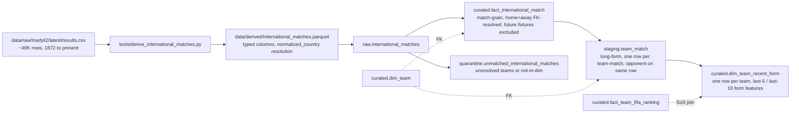

# feat: Add `fact_international_match` and recent-form context for WC2026 modeling

## Overview

`data/raw/martj42/latest/results.csv` already lands every Friday via `tools/weekly_pull.py` (~49,300 international match results, 1872-11-30 → present, all FIFA-recognized fixtures). The DuckDB build currently ignores it — there is no match-grain fact in `curated.*`. This plan wires it in.

Two layers, mirroring the existing `fact_team_economics` → `dim_team_current` shape:

1. **Match-grain truth.** `curated.fact_international_match` — one row per match with both teams FK-resolved to `dim_team` via FIFA 3-letter codes. Both team-name lookups go through `tools/lib/player_normalize.py::normalize_country()` (already used by `staging.team_name_resolution`); rows whose home OR away team fails to resolve land in `quarantine.unmatched_international_matches`.

2. **Modeling-ready context.** `staging.team_match` unpivots the fact to one row per team-match (so `team_code` is symmetric between home and away). `curated.dim_team_recent_form` projects that down to one row per team with pre-computed last-5 / last-10 form features (W/D/L, GF/GA, form points, competitive-only splits, last opponent date). Model code reads one view to get every recent-form feature.

The fact preserves the full 154-year history because friction-free row filtering is what DuckDB is for — modelers slice by date range, tournament tier, or competitive-only flag at query time. Schema design is identical for all rows; "recent" is a `WHERE` clause, not a load-time filter.

## Problem Frame

The user wants international match results queryable in DuckDB, with the explicit downstream use being WC2026 prediction modeling. The MEMORY layer notes `wc2026_live_pipeline_plan.md` will add live Sofascore / API-Football data around Jun 4; this plan covers everything up to that cutover. After Jun 4, the live-pipeline plan can extend `raw.international_matches` with a second source (or this fact can union from multiple raws). For now, martj42 is the single authoritative source.

The match-grain fact is also a foundation for later facts that depend on it — `fact_team_form`, `fact_h2h`, Elo rating computation, opponent-strength weighting. None of those are in scope here.

## Requirements Trace

- **R1.** A `curated.fact_international_match` table exists in `data/wc2026.duckdb`, with one row per completed international match (NA scores excluded). Schema: see Key Technical Decisions.
- **R2.** Both `home_team_code` and `away_team_code` on every fact row exist in `curated.dim_team` (foreign-key integrity, enforced at build time via LEFT-JOIN-then-filter on both joins).
- **R3.** Source rows whose home OR away team fails to resolve to FIFA3 — or whose resolved FIFA3 is not in `dim_team` — land in `quarantine.unmatched_international_matches` with a `reason` column distinguishing the failure mode.
- **R4.** A `staging.team_match` table exists with one row per `(team_code, match_date, opponent_team_code)` — the long-form unpivot of `fact_international_match`. This is the only place the home/away symmetry breaks; downstream queries that ask "what has team X done recently" read from this table.
- **R5.** A `curated.dim_team_recent_form` view exposes one row per `team_code` with pre-computed last-5 and last-10 form features, including competitive-only variants. Modelers read one view to get every recent-form feature.
- **R6.** `tools/build_duckdb.py` rebuilds the raw load, the fact, the quarantine, the staging unpivot, and the view idempotently as part of the existing pipeline.
- **R7.** `tools/verify_duckdb.py` reports row counts, FK orphan checks, and view coverage for the new artifacts.
- **R8.** `db/SCHEMA.md` is updated so the contract is documented.
- **R9.** All curated SQL uses the established CTE-first / LEFT-JOIN-then-`WHERE`-split style (matches `fact_team_economics.sql`, `fact_team_fifa_ranking.sql`). No inline subqueries, no `INNER JOIN` shortcuts.
- **R10. Uniqueness (no duplicate keys) enforced at build time:**
  - `curated.fact_international_match`: `(match_date, home_team_code, away_team_code)` is unique. The martj42 CSV has rare same-day double-headers between the same two teams in tournament play; the implementer must verify uniqueness on the chosen key against the actual data and surface any violation before adding the assertion as `FAIL`. If duplicates exist, treat as data-quality finding for triage (do not silently dedup).
  - `staging.team_match`: `(team_code, match_date, opponent_team_code)` is unique under the same caveat as above.
  - `curated.dim_team_recent_form`: `team_code` is unique (one row per team).
- **R11. Coverage rule:** for every WC2026 qualifier, `curated.dim_team_recent_form.matches_last_10 >= 5`. (Bar set low intentionally: some recently-qualified federations may have <10 matches in the database window. Bump to 10 once verified.) `last_match_date` is non-null for every qualifier.

## Scope Boundaries

- **In scope:** parquet derivation, raw load, the match-grain fact + quarantine, the team-match staging unpivot, the recent-form view, verification, schema doc, two example queries (recent results, form for modeling).
- **Out of scope:** historical FIFA ranking (still snapshot-only as of plan `2026-05-14-002`); strength-of-schedule using historical opponent ranks; Elo rating computation; live in-tournament data ingest.
- **Non-goal:** loading the future-fixture rows (where `home_score`/`away_score` are `NA`). Those are scheduled fixtures, not results. A separate `fact_international_fixture` table can land them when needed.
- **Non-goal:** denormalizing form features onto `curated.dim_team_current`. Two reasons: (1) `dim_team_current` is already the project's "team-context" view and adding 14+ form columns would bloat it; (2) recent-form features are a distinct concern with their own grain story (per-team-rolling-window) that deserves its own view.
- **Non-goal:** adding non-FIFA-member teams (e.g., Faroe Islands, Gibraltar, Réunion) to `dim_team` solely to absorb martj42 quarantine. Quarantine is the correct outcome for non-tracked teams — they don't play WC2026.

### Deferred to Separate Tasks

- **Live in-tournament results.** Once `pull_wc2026_live.py` lands (Jun 4 cutover per `wc2026_live_pipeline_plan.md`), this fact gains a second raw source. Add as a `UNION ALL` in the fact SQL at that time, or introduce a `source` column.
- **Historical FIFA ranking time series.** Needed for accurate strength-of-schedule. Tracked separately.
- **`fact_international_fixture`** for future-dated rows.
- **Elo / Glicko rating fact** computed from this fact's outcomes. Modeler's call when they're ready.

## Context & Research

### Relevant Code and Patterns

- `tools/weekly_pull.py:55` — `NAME_TO_FIFA3` dict (the canonical display-name → FIFA3 mapping).
- `tools/lib/player_normalize.py:109` — `normalize_country(value)` — the function the rest of the build uses for name → FIFA3 resolution. Handles diacritics, case, and a small set of historical aliases. Already imported by `build_team_name_resolution()` in `tools/build_duckdb.py`.
- `tools/build_duckdb.py` — carries `RAW_TABLES`, `FACT_SQL_FILES`, `QUARANTINE_SQL_FILES`, `VIEW_SQL_FILES`, `STAGING_*` (none yet — see Unit 3). New artifacts plug in by extending these lists.
- `db/sql/curated/fact_team_economics.sql` — closest precedent. CTE-first, LEFT-JOIN-then-filter, `TRY_CAST` for tolerance.
- `db/sql/quarantine/unmatched_team_economics.sql` — quarantine inverse pattern.
- `db/sql/curated/dim_team_current.sql` — view precedent (the modeling-facing read path).
- `db/sql/curated/dim_team.sql` — dim being matched against. `team_code` is the natural primary key.
- `tools/verify_duckdb.py` — verification harness; new assertions append to `ASSERTIONS` list.
- `db/SCHEMA.md` — the contract doc; gets a new section for each new artifact.

### Institutional Learnings

- **Master-data-management** (`docs/solutions/best-practices/master-data-management-pattern-for-multi-source-stats-2026-05-14.md`): facts reference dims via stable keys; matching happens at load-time, not query-time; unmatched rows surface in `quarantine.*`. This is the pattern here, applied to **two team-key columns per row** (home and away) instead of one.
- **`CREATE OR REPLACE` everywhere** (`db/SCHEMA.md`): every curated table rebuilt on each run. No migrations, no append-mode logic.
- **MEMORY → `wc2026_live_pipeline_plan.md`**: live Sofascore + API-Football pull is planned for ~Jun 4 to extend in-tournament xG. This fact is the home for those results too once the live pull lands.
- **MEMORY → `feedback_player_identity_registry.md`** (data modeling = MDM): dims sourced from authoritative masters; facts matched TO dims one-way; quarantine unmatched, never silently extend masters from facts. **Direct application here:** quarantine martj42 teams not in `dim_team` rather than auto-growing `dim_team` to absorb them.

### External References

None — purely internal plumbing on an already-pulled local CSV.

## Key Technical Decisions

- **One match-grain fact, not a per-team-event fact.** `fact_international_match` is shaped like the source: one row per match with `home_team_code` / `away_team_code` columns. The team-grain unpivot (`staging.team_match`) is derived from it. This keeps the fact small (~half the row count) and preserves the original match identity. Modelers who want team-grain read from staging.
- **Why staging, not curated, for the long-form unpivot.** `staging.team_match` is a derived intermediate — it adds zero new information beyond the fact, just reshapes. The schema doc already documents `staging.*` as "Intermediate per-source tables produced by the matching layer." This fits.
- **`team_code` resolution for BOTH teams via `normalize_country()`.** The martj42 CSV uses display names ("Netherlands", "Bosnia and Herzegovina"). The existing helper handles this. New rows for confederations / dissolved nations not in the dict will fail to resolve — that is the quarantine signal.
- **`tournament_tier` derived column on the fact.** Modelers care about weighting WC > continental > qualifier > friendly. Compute once at load time so every downstream query gets the same definition. Hand-curated CASE expression based on the `tournament` source column. Tier scheme:
  - `tier_1_world_cup` — `tournament IN ('FIFA World Cup')`
  - `tier_2_continental_final` — `tournament IN ('UEFA Euro', 'Copa América', 'African Cup of Nations', 'AFC Asian Cup', 'Gold Cup', 'OFC Nations Cup')`
  - `tier_3_qualifier_or_nations_league` — any `*qualification*` plus `'UEFA Nations League'`, `'CONCACAF Nations League'`
  - `tier_4_friendly_or_other` — `'Friendly'`, all minor cups, Olympic qualifiers, Confederations Cup, everything else
  The exact list is committed to the SQL as a literal CASE block; new tournaments that appear surface as `tier_4_friendly_or_other` until someone updates the case, and the verify script logs an `UNKNOWN_TOURNAMENT` count as `WARN`.
- **`is_competitive` boolean.** Convenience flag = `tournament_tier != 'tier_4_friendly_or_other'`. Most form queries filter on this.
- **Future fixtures excluded by `home_score IS NOT NULL AND away_score IS NOT NULL`** in Unit 2. The martj42 CSV embeds upcoming-but-scheduled fixtures (e.g., the 2026-06-14 Netherlands–Japan WC opener) with `NA` scores; those are not results. A future `fact_international_fixture` (out of scope here) can hold them. The fact SQL's `WHERE` clause documents this exclusion explicitly.
- **`neutral_site` boolean propagated from source.** Modeling the WC at neutral sites needs this — Netherlands has a strong home record but every WC2026 group game is at neutral US/MEX/CAN venues.
- **`tournament` column retained as `VARCHAR`.** Not tied to `dim_tournament` (the dim is a tiny curated enumeration of WC / continental finals only — 6-8 rows. The martj42 CSV has 200+ distinct tournament strings, most of which are minor regional cups). Linking would force quarantine on rows from `British Home Championship`, `CECAFA Cup`, etc. — fine matches with valid teams. Keeping `tournament` free-form preserves all rows; `tournament_tier` is the modeler-facing categorization.
- **Quarantine grain is per-source-row, not per-team-side.** A match where both teams fail to resolve emits **one** quarantine row, not two. The `reason` column distinguishes: `home_unresolved` / `away_unresolved` / `both_unresolved` / `home_not_in_dim` / `away_not_in_dim` / `both_not_in_dim`. The implementer can simplify to one combined `reason` if the distinction proves unused after the first build.
- **No `match_id` surrogate.** Natural key `(match_date, home_team_code, away_team_code)` is sufficient. Adding a surrogate would be ceremony — see the MDM solution doc's exception list (no surrogate when the natural key is unambiguous and stable).
- **`as_of_date` on `dim_team_recent_form`.** Build-date stamp so a modeler can tell whether the form snapshot is current. Form features are always computed relative to the latest `match_date` in the fact, not `CURRENT_DATE` — so a stale rebuild still produces self-consistent form (just with an older `as_of_date`).
- **Last-N windows: 5 and 10.** Two windows because they capture different model signals: last-5 is "current form" (post-WCQ tune-up), last-10 is "qualifying-cycle form." More windows would bloat the view; modelers who want last-3 / last-20 can compute from `staging.team_match`.
- **`avg_opponent_fifa_rank_last_10` joins `fact_team_fifa_ranking` (snapshot).** Acknowledged limitation: strength of schedule uses **current** opponent ranks, not the rank at the time of the match. The historical-ranking deferred work fixes this; for now, snapshot is "best available" and consistent with how `dim_team_current` uses FIFA data.

## Open Questions

### Resolved During Planning

- *Match-grain or team-grain for the fact?* → **Match-grain.** Mirrors source. Team-grain is staging.
- *Filter to "recent" matches at load time?* → **No.** Full history. Modelers filter at query time.
- *Include future fixtures with NA scores?* → **No.** This fact is results only.
- *Combine with `dim_team_current`?* → **No.** Separate view (`dim_team_recent_form`) to keep concerns clean.
- *Hand-roll FIFA3 mapping or reuse `normalize_country()`?* → **Reuse.** Already canonical.
- *Tie the `tournament` column to `dim_tournament`?* → **No.** martj42 has 200+ tournament strings; `dim_tournament` is a curated 6-8-row enumeration. Linkage would force quarantine on valid matches.
- *Drop or quarantine unresolved-team matches?* → **Quarantine.** Visible, queryable, reviewable.

### Deferred to Implementation

- *Exact duplicate-key cardinality in the source.* Whether `(match_date, home_team_code, away_team_code)` is truly unique in the martj42 CSV needs verification. If duplicates exist, surface them as quarantine `reason = 'duplicate_match_key'` so the implementer can triage. Most likely: zero or near-zero duplicates.
- *Final `tournament` → `tournament_tier` CASE block.* The Key Technical Decisions section lists the canonical buckets; the implementer should enumerate `SELECT DISTINCT tournament FROM raw.international_matches` and confirm no major event is missing. Olympic football fixtures, minor confederation cups, Pan-American Games, etc. — these need a tier assignment.
- *Whether the CSV → parquet derivation lives in `tools/weekly_pull.py` or a new `tools/derive_international_matches.py`.* The existing weekly pull just downloads the CSV. Deriving the parquet is a separate transform — likely cleaner as a new tool, but if `weekly_pull.py` already has derivation hooks, fold in. Decided at implementation.

## High-Level Technical Design

> *This illustrates the intended approach and is directional guidance for review, not implementation specification. The implementing agent should treat it as context, not code to reproduce.*



The shape mirrors the existing `fact_team_economics` → `dim_team_current` pipeline, with one extra hop (`staging.team_match`) because match data is naturally two-sided.

## Implementation Units

- [ ] **Unit 1: Derive `data/derived/international_matches.parquet` and register in `raw.*`**

**Goal:** The martj42 CSV becomes a typed parquet with one row per completed match, both teams pre-resolved to FIFA3 codes (or flagged as unresolved), and registered as `raw.international_matches`.

**Requirements:** R1, R2, R3

**Dependencies:** `data/raw/martj42/latest/results.csv` exists (pulled by `tools/weekly_pull.py`).

**Files:**
- Create: `tools/derive_international_matches.py`
- Create: `data/derived/international_matches.parquet` (produced by the script — committed to the repo per existing convention for derived parquets)
- Modify: `tools/build_duckdb.py` — append `("international_matches.parquet", "international_matches")` to `RAW_TABLES`.
- Modify: `tools/weekly_pull.py` *(optional)* — invoke the new derivation script after the CSV download so the parquet stays in sync. Implementer decides whether to wire it here or leave as a manual step.
- Test: `tests/tools/test_derive_international_matches.py`

**Approach:**
- The derivation script reads `data/raw/martj42/latest/results.csv`, applies `normalize_country()` to both `home_team` and `away_team` to produce `home_team_code` / `away_team_code` (NULL when unresolved), parses `date` as `DATE`, casts scores as nullable INTEGER, and writes a parquet with both source columns and resolved columns preserved.
- Output columns: `match_date`, `home_team_name` (source), `home_team_code` (resolved, nullable), `away_team_name` (source), `away_team_code` (resolved, nullable), `home_score` (INT, nullable), `away_score` (INT, nullable), `tournament`, `city`, `country`, `neutral_site` (BOOLEAN).
- The script logs unresolved-team-name counts to stderr so the implementer can see what's falling through (expected: a long tail of micro-nations and dissolved states; non-trivial total but not catastrophic).
- Idempotent: re-running on the same CSV produces a byte-stable parquet (sort by `(match_date, home_team_name, away_team_name)` before write).

**Patterns to follow:**
- `tools/build_duckdb.py:158` — `build_team_name_resolution()` already calls `normalize_country()` over distinct nation names; mirror that pattern.
- Existing `data/derived/*.parquet` derivation scripts in `tools/` (any *_derive*.py or *_build_*.py file shows the convention).

**Test scenarios:**
- *Happy path:* Given a fixture CSV with 3 matches involving teams in `NAME_TO_FIFA3`, the parquet has 3 rows with `home_team_code` and `away_team_code` populated correctly.
- *Edge case (unresolved):* A row with `home_team = 'Pacific Islands XI'` (not in the dict) writes with `home_team_code IS NULL` but is **not dropped** — quarantine happens in Unit 2.
- *Edge case (future fixture):* A row with `home_score = 'NA'` and `away_score = 'NA'` reads through; the score columns are NULL in the parquet. (Unit 2's fact SQL filters these out.)
- *Edge case (Türkiye alias):* A row with `home_team = 'Türkiye'` resolves to `TUR` (the `_NAME_TO_FIFA3_NORM["turkiye"] = "TUR"` override is in place).
- *Idempotency:* Running the derivation twice with no source change produces a byte-stable parquet (sorted output).
- *Integration:* After running the script and building the DB, `SELECT COUNT(*) FROM raw.international_matches` returns ~49,000 rows.

**Verification:**
- The parquet file exists at `data/derived/international_matches.parquet`.
- `raw.international_matches` row count > 45,000 (lower bound for the lifetime martj42 corpus).
- `SELECT COUNT(*) FROM raw.international_matches WHERE home_team_code IS NULL OR away_team_code IS NULL` is reported (informational; the value flows into Unit 2's quarantine).

---

- [ ] **Unit 2: `curated.fact_international_match` + `quarantine.unmatched_international_matches`**

**Goal:** Build a curated fact with one row per completed match, both teams FK-resolved to `dim_team`. Source rows that fail resolution land in quarantine.

**Requirements:** R1, R2, R3, R9, R10

**Dependencies:** Unit 1.

**Files:**
- Create: `db/sql/curated/fact_international_match.sql`
- Create: `db/sql/quarantine/unmatched_international_matches.sql`
- Modify: `tools/build_duckdb.py` — append both filenames to `FACT_SQL_FILES` and `QUARANTINE_SQL_FILES`.
- Test: `tests/db/test_fact_international_match.py`

**Approach:**
- **SQL style: CTEs declared top-to-bottom in data-flow order; LEFT JOIN `dim_team` twice (once per team side); split via `WHERE` clause at the end.** Mirrors `db/sql/curated/fact_team_economics.sql`.
- The fact SQL projects from `raw.international_matches`, applies the future-fixture filter, derives `tournament_tier` and `is_competitive`, and FK-resolves both teams:
  ```sql
  CREATE OR REPLACE TABLE curated.fact_international_match AS
  WITH
  source AS (
      SELECT
          match_date,
          home_team_code,
          away_team_code,
          CAST(home_score AS INTEGER) AS home_score,
          CAST(away_score AS INTEGER) AS away_score,
          tournament,
          city,
          country AS host_country,
          neutral_site,
          CASE
              WHEN tournament = 'FIFA World Cup' THEN 'tier_1_world_cup'
              WHEN tournament IN ('UEFA Euro', 'Copa América',
                                  'African Cup of Nations', 'AFC Asian Cup',
                                  'Gold Cup', 'OFC Nations Cup')
                  THEN 'tier_2_continental_final'
              WHEN tournament LIKE '%qualification%'
                   OR tournament IN ('UEFA Nations League',
                                     'CONCACAF Nations League')
                  THEN 'tier_3_qualifier_or_nations_league'
              ELSE 'tier_4_friendly_or_other'
          END AS tournament_tier
      FROM raw.international_matches
      WHERE home_score IS NOT NULL AND away_score IS NOT NULL  -- exclude future fixtures
  ),
  resolved AS (
      SELECT
          s.*,
          dh.team_code AS dim_home_code,
          da.team_code AS dim_away_code
      FROM source s
      LEFT JOIN curated.dim_team dh ON dh.team_code = s.home_team_code
      LEFT JOIN curated.dim_team da ON da.team_code = s.away_team_code
  )
  SELECT
      match_date,
      home_team_code,
      away_team_code,
      home_score,
      away_score,
      home_score - away_score                                        AS goal_diff,
      CASE
          WHEN home_score > away_score THEN 'H'
          WHEN home_score < away_score THEN 'A'
          ELSE 'D'
      END                                                            AS result,
      tournament,
      tournament_tier,
      (tournament_tier != 'tier_4_friendly_or_other')                AS is_competitive,
      city,
      host_country,
      neutral_site
  FROM resolved
  WHERE dim_home_code IS NOT NULL
    AND dim_away_code IS NOT NULL;
  ```
  *(Directional sketch — directional guidance for review, not implementation specification. Match the header docstring conventions in `db/sql/curated/fact_team_economics.sql`.)*
- The quarantine SQL inverts the filter and adds a `reason` column distinguishing failure modes:
  ```sql
  CREATE OR REPLACE TABLE quarantine.unmatched_international_matches AS
  WITH
  source AS (
      SELECT match_date, home_team_name, home_team_code, away_team_name, away_team_code,
             home_score, away_score, tournament
      FROM raw.international_matches
      WHERE home_score IS NOT NULL AND away_score IS NOT NULL
  ),
  resolved AS (
      SELECT s.*, dh.team_code AS dim_home_code, da.team_code AS dim_away_code
      FROM source s
      LEFT JOIN curated.dim_team dh ON dh.team_code = s.home_team_code
      LEFT JOIN curated.dim_team da ON da.team_code = s.away_team_code
  )
  SELECT
      match_date, home_team_name, home_team_code, away_team_name, away_team_code,
      home_score, away_score, tournament,
      CASE
          WHEN home_team_code IS NULL AND away_team_code IS NULL THEN 'both_unresolved'
          WHEN home_team_code IS NULL                            THEN 'home_unresolved'
          WHEN away_team_code IS NULL                            THEN 'away_unresolved'
          WHEN dim_home_code IS NULL AND dim_away_code IS NULL   THEN 'both_not_in_dim'
          WHEN dim_home_code IS NULL                             THEN 'home_not_in_dim'
          WHEN dim_away_code IS NULL                             THEN 'away_not_in_dim'
      END AS reason
  FROM resolved
  WHERE dim_home_code IS NULL OR dim_away_code IS NULL;
  ```

**Patterns to follow:**
- `db/sql/curated/fact_team_economics.sql` — CTE pipeline, LEFT-JOIN-then-filter, explicit CASTs.
- `db/sql/quarantine/unmatched_team_economics.sql` — inverse filter, `reason` column.

**Test scenarios:**
- *Happy path:* Given a fixture `raw.international_matches` with 5 matches between dim_team-resolvable teams, the fact has 5 rows; `result`, `goal_diff`, `tournament_tier`, and `is_competitive` are populated correctly for each.
- *Happy path (tier classification):* A WCQ match gets `tournament_tier = 'tier_3_qualifier_or_nations_league'`, `is_competitive = true`. A friendly gets `tier_4_friendly_or_other`, `is_competitive = false`. A WC final gets `tier_1_world_cup`. A Euro final gets `tier_2_continental_final`.
- *Edge case (future fixture):* A fixture with `home_score = NULL` is **not** in the fact (excluded by the WHERE filter). It's also not in quarantine (intentional — fixtures aren't unmatched results).
- *Edge case (Netherlands' 2026-03-31 friendly):* The known fixture `('2026-03-31', 'NED', 'ECU', 1, 1, 'Friendly', neutral=FALSE)` is in the fact with `result = 'D'`, `goal_diff = 0`, `tournament_tier = 'tier_4_friendly_or_other'`, `is_competitive = false`.
- *Error path (both teams unresolved):* A match between two teams not in `NAME_TO_FIFA3` (e.g., a pre-1900 friendly between dissolved nations) lands in quarantine with `reason = 'both_unresolved'`, **not** in the fact.
- *Error path (one team unresolved):* A match where home resolves but away doesn't lands in quarantine with `reason = 'away_unresolved'`, not in the fact.
- *Error path (resolved but not in dim_team):* A match where both `normalize_country()` returns a FIFA3 but the FIFA3 is missing from `dim_team` (e.g., `JAM` is in NAME_TO_FIFA3 but suppose `dim_team` doesn't carry it) lands in quarantine with `reason = 'home_not_in_dim'` or `away_not_in_dim` or `both_not_in_dim`. **Note:** for known WC2026 qualifier opponents, this should never trigger — the verify step catches it as a build failure.
- *Uniqueness (R10):* `SELECT match_date, home_team_code, away_team_code, COUNT(*) AS n FROM curated.fact_international_match GROUP BY 1,2,3 HAVING n > 1` returns zero rows. **If non-zero on first build, the implementer must investigate the offending rows and either (a) dedup at the parquet derivation step (Unit 1) with a documented rule, or (b) re-grain the fact.**
- *Integration:* `SELECT COUNT(*) FROM curated.fact_international_match WHERE home_team_code = 'NED' OR away_team_code = 'NED' ORDER BY match_date DESC LIMIT 15` returns the last 15 Netherlands match results — matching the manual `awk`-from-CSV result this plan replaces.

**Verification:**
- `SELECT COUNT(*) FROM curated.fact_international_match` is in the range `[20000, 50000]` (rough bound — quarantine surface drains some).
- `SELECT COUNT(*) FROM curated.fact_international_match WHERE home_team_code = 'NED' AND match_date >= '2024-10-01'` is 15 (the last-15 Netherlands matches range from this plan's authoring date).
- `SELECT COUNT(DISTINCT tournament_tier) FROM curated.fact_international_match` is exactly 4 (the four declared tiers).
- For every WC2026 qualifier `t`: `SELECT COUNT(*) FROM curated.fact_international_match WHERE home_team_code = t OR away_team_code = t` is `>= 5` (R11 prep).

---

- [ ] **Unit 3: `staging.team_match` long-form + `curated.dim_team_recent_form` view**

**Goal:** Unpivot the match-grain fact to one row per team-match, then aggregate to one row per team with pre-computed last-5 / last-10 form features.

**Requirements:** R4, R5, R9, R10, R11

**Dependencies:** Unit 2 (and existing `curated.fact_team_fifa_ranking` from plan 2026-05-14-002 for the SoS join).

**Files:**
- Create: `db/sql/staging/team_match.sql` *(introduces a new `staging/` subdir under `db/sql/` — first staging SQL file in the project; see Approach for `STAGING_SQL_FILES` list addition to `tools/build_duckdb.py`)*
- Create: `db/sql/curated/dim_team_recent_form.sql` (a `VIEW`)
- Modify: `tools/build_duckdb.py` — introduce `STAGING_SQL_FILES` list (parallel to `FACT_SQL_FILES`); add a `load_staging()` function that runs after `load_facts()`. Append `dim_team_recent_form.sql` to `VIEW_SQL_FILES`.
- Test: `tests/db/test_team_match_and_recent_form.py`

**Approach:**
- **Staging step: unpivot via `UNION ALL`.** One half from the home perspective, one half from the away perspective:
  ```sql
  CREATE OR REPLACE TABLE staging.team_match AS
  WITH
  home_side AS (
      SELECT
          home_team_code AS team_code,
          away_team_code AS opponent_team_code,
          match_date,
          home_score    AS team_score,
          away_score    AS opponent_score,
          home_score - away_score                              AS goal_diff,
          CASE
              WHEN home_score > away_score THEN 'W'
              WHEN home_score < away_score THEN 'L'
              ELSE 'D'
          END                                                  AS outcome,
          CASE WHEN neutral_site THEN 'N' ELSE 'H' END         AS venue,
          tournament,
          tournament_tier,
          is_competitive
      FROM curated.fact_international_match
  ),
  away_side AS (
      SELECT
          away_team_code AS team_code,
          home_team_code AS opponent_team_code,
          match_date,
          away_score    AS team_score,
          home_score    AS opponent_score,
          away_score - home_score                              AS goal_diff,
          CASE
              WHEN away_score > home_score THEN 'W'
              WHEN away_score < home_score THEN 'L'
              ELSE 'D'
          END                                                  AS outcome,
          CASE WHEN neutral_site THEN 'N' ELSE 'A' END         AS venue,
          tournament,
          tournament_tier,
          is_competitive
      FROM curated.fact_international_match
  )
  SELECT * FROM home_side
  UNION ALL
  SELECT * FROM away_side;
  ```
  *(Directional sketch.)*
- **View step: rank matches per team, compute aggregates over windows.** Two windows × competitive-filter cross product = up to 4 column groups, but to keep the column count manageable, expose only:
  - `last_match_date`, `last_match_opponent_team_code`, `last_match_outcome`
  - `matches_last_10`, `wins_last_10`, `draws_last_10`, `losses_last_10`, `gf_last_10`, `ga_last_10`, `goal_diff_last_10`, `form_points_last_10`
  - `matches_last_5`, `wins_last_5`, `draws_last_5`, `losses_last_5`, `gf_last_5`, `ga_last_5`, `goal_diff_last_5`, `form_points_last_5`
  - `competitive_matches_last_10`, `competitive_form_points_last_10`, `competitive_goal_diff_last_10`
  - `avg_opponent_fifa_rank_last_10` (joins `fact_team_fifa_ranking`)
  - `as_of_date`
- The view SQL uses a ranked CTE and `FILTER` clauses for per-window aggregation:
  ```sql
  CREATE OR REPLACE VIEW curated.dim_team_recent_form AS
  WITH
  ranked AS (
      SELECT
          tm.*,
          ROW_NUMBER() OVER (
              PARTITION BY tm.team_code
              ORDER BY tm.match_date DESC
          ) AS recency_rank,
          ROW_NUMBER() OVER (
              PARTITION BY tm.team_code, tm.is_competitive
              ORDER BY tm.match_date DESC
          ) AS competitive_recency_rank
      FROM staging.team_match tm
  ),
  per_team AS (
      SELECT
          team_code,
          MAX(match_date)                                          AS last_match_date,
          COUNT(*)                  FILTER (WHERE recency_rank <= 10) AS matches_last_10,
          COUNT(*) FILTER (WHERE recency_rank <= 10 AND outcome = 'W') AS wins_last_10,
          COUNT(*) FILTER (WHERE recency_rank <= 10 AND outcome = 'D') AS draws_last_10,
          COUNT(*) FILTER (WHERE recency_rank <= 10 AND outcome = 'L') AS losses_last_10,
          SUM(team_score)     FILTER (WHERE recency_rank <= 10)     AS gf_last_10,
          SUM(opponent_score) FILTER (WHERE recency_rank <= 10)     AS ga_last_10,
          SUM(goal_diff)      FILTER (WHERE recency_rank <= 10)     AS goal_diff_last_10,
          SUM(CASE outcome WHEN 'W' THEN 3 WHEN 'D' THEN 1 ELSE 0 END)
              FILTER (WHERE recency_rank <= 10)                     AS form_points_last_10,
          -- last-5 columns (same shape with recency_rank <= 5)
          -- competitive-only columns (competitive_recency_rank <= 10 AND is_competitive)
          -- ...
          COUNT(*) FILTER (WHERE is_competitive AND competitive_recency_rank <= 10)
              AS competitive_matches_last_10
      FROM ranked
      GROUP BY team_code
  ),
  last_match AS (
      SELECT team_code, opponent_team_code AS last_match_opponent_team_code,
             outcome AS last_match_outcome
      FROM ranked
      WHERE recency_rank = 1
  ),
  sos AS (
      -- Average opponent FIFA rank over last 10 (using snapshot ranks; limitation documented).
      SELECT
          r.team_code,
          AVG(rk.rank) AS avg_opponent_fifa_rank_last_10
      FROM ranked r
      LEFT JOIN curated.fact_team_fifa_ranking rk ON rk.team_code = r.opponent_team_code
      WHERE r.recency_rank <= 10
      GROUP BY r.team_code
  )
  SELECT
      d.team_code,
      d.team_name,
      pt.last_match_date,
      lm.last_match_opponent_team_code,
      lm.last_match_outcome,
      pt.matches_last_10, pt.wins_last_10, pt.draws_last_10, pt.losses_last_10,
      pt.gf_last_10, pt.ga_last_10, pt.goal_diff_last_10, pt.form_points_last_10,
      -- last_5 columns ...
      pt.competitive_matches_last_10,
      -- competitive_form_points_last_10, competitive_goal_diff_last_10 ...
      sos.avg_opponent_fifa_rank_last_10,
      CURRENT_DATE AS as_of_date
  FROM curated.dim_team d
  LEFT JOIN per_team   pt USING (team_code)
  LEFT JOIN last_match lm USING (team_code)
  LEFT JOIN sos        sos USING (team_code);
  ```
  *(Directional sketch. The implementer fills in the last-5 and competitive-only columns following the same `FILTER` pattern. Keep the view readable — break per-team into multiple CTEs if needed.)*

**Patterns to follow:**
- `db/sql/curated/dim_team_current.sql` — view shape, LEFT-JOIN-from-dim pattern, `QUALIFY` / `ROW_NUMBER` usage.
- Existing `staging.team_name_resolution` (built in Python at `tools/build_duckdb.py:158`) — staging convention precedent. **This unit introduces the first SQL-defined staging table; the implementer should mirror the schema-creation idiom from `staging.team_name_resolution` and document the choice in the SQL header.**

**Test scenarios:**
- *Happy path (staging):* Given a fixture fact with 1 match `(NED home, ECU away, NED 1, ECU 1)`, `staging.team_match` has 2 rows: one with `team_code = NED, outcome = D, venue = H, goal_diff = 0` and one with `team_code = ECU, outcome = D, venue = A, goal_diff = 0`.
- *Happy path (staging, neutral site):* A match with `neutral_site = TRUE` produces both rows with `venue = N`.
- *Happy path (view, last_match):* Given staging rows for team NED with the most-recent match being `2026-03-31 vs ECU, D`, `dim_team_recent_form.last_match_date = '2026-03-31'`, `last_match_opponent_team_code = 'ECU'`, `last_match_outcome = 'D'`.
- *Happy path (view, aggregates):* Given the actual NED row in this plan's authoring data (8W-6D-1L over last 15), the view row for NED has `form_points_last_10 >= 16` (>= 5 wins × 3 + 1 draws × 1 = 16 minimum from the recent split) and `goal_diff_last_10 >= 0`.
- *Edge case (fewer than 10 matches):* A team with only 4 matches in the fact has `matches_last_10 = 4`, `matches_last_5 = 4` — aggregates are computed over what's available, not extrapolated. R11 floor is 5, so any qualifier with < 5 fails the verify.
- *Edge case (competitive vs total split):* A team whose last 10 matches are 6 competitive + 4 friendlies has `matches_last_10 = 10` AND `competitive_matches_last_10 = 6` (counts use independent rank windows — the competitive 6 are the **last 6 competitive matches**, which may extend further back in time than `match_date >= last_10_match_date`).
- *Edge case (SoS snapshot):* `avg_opponent_fifa_rank_last_10` for a team whose last-10 opponents include 2 teams not in `fact_team_fifa_ranking` averages over the 8 that are (LEFT JOIN preserves missing ranks as NULL, AVG skips NULL).
- *Edge case (team in dim but never played a match):* If a `dim_team` row exists with zero matches in the fact (unlikely for WC2026 qualifiers but possible for tracked non-qualifiers), the view row has `last_match_date IS NULL`, `matches_last_10 = 0`, all aggregates NULL.
- *Uniqueness (R10) — staging:* `SELECT team_code, match_date, opponent_team_code, COUNT(*) FROM staging.team_match GROUP BY 1,2,3 HAVING COUNT(*) > 1` is zero.
- *Uniqueness (R10) — view:* `SELECT team_code, COUNT(*) FROM curated.dim_team_recent_form GROUP BY 1 HAVING COUNT(*) > 1` is zero.
- *Integration:* `SELECT team_code, matches_last_10, wins_last_10, form_points_last_10 FROM curated.dim_team_recent_form WHERE team_code = 'NED'` returns one row with `matches_last_10 = 10`, `wins_last_10 >= 5`, `form_points_last_10 >= 16`.

**Verification:**
- `SELECT COUNT(*) FROM staging.team_match` equals `2 * (SELECT COUNT(*) FROM curated.fact_international_match)`.
- `SELECT COUNT(*) FROM curated.dim_team_recent_form` equals `SELECT COUNT(*) FROM curated.dim_team` (one row per team, LEFT-JOIN-preserved).
- For every WC2026 qualifier: `last_match_date IS NOT NULL AND matches_last_10 >= 5` (R11 floor).

---

- [ ] **Unit 4: Verification, schema doc, example queries**

**Goal:** Add new assertions to `verify_duckdb.py`, document the new artifacts in `db/SCHEMA.md`, and ship two example queries.

**Requirements:** R7, R8

**Dependencies:** Units 1–3.

**Files:**
- Modify: `tools/verify_duckdb.py` — add assertions to the `ASSERTIONS` list (see Approach).
- Modify: `db/SCHEMA.md` — add `fact_international_match`, `staging.team_match`, and `dim_team_recent_form` sections under the appropriate headings; document grain, columns, source tables, FK guarantee, tier scheme. Remove the "Match-level facts (`fact_match` from FIFA fixture list). Requires fixture pull script." line from the "Out-of-scope for v1" section and replace with a note pointing to this plan.
- Create: `db/queries/examples/team_recent_results.sql` — last-N matches for a parameterized team, joined to opponent names.
- Create: `db/queries/examples/team_form_for_modeling.sql` — single-table read from `dim_team_recent_form` for all WC2026 qualifiers, ordered by `form_points_last_10`.

**Approach:**
- **`verify_duckdb.py` additions** (mirror the existing structure):
  - `fact_international_match non-empty` — `SELECT COUNT(*)` > 20000.
  - `fact_international_match has exactly 4 tournament tiers` — `SELECT COUNT(DISTINCT tournament_tier)` = 4.
  - `fact_international_match excludes future fixtures` — `SELECT COUNT(*) WHERE home_score IS NULL OR away_score IS NULL` = 0.
  - `every fact_international_match.home_team_code exists in dim_team` — LEFT JOIN orphan check.
  - `every fact_international_match.away_team_code exists in dim_team` — symmetric.
  - `fact_international_match (match_date, home_team_code, away_team_code) is unique` — `GROUP BY 1,2,3 HAVING COUNT(*) > 1` is zero. **Severity: WARN on first build until source duplicate count is confirmed; flip to FAIL after the implementer verifies the source is duplicate-free or the parquet derivation dedups with a documented rule.**
  - `staging.team_match row count = 2 * fact_international_match row count`.
  - `staging.team_match (team_code, match_date, opponent_team_code) is unique`.
  - `dim_team_recent_form row count equals dim_team row count`.
  - `dim_team_recent_form team_code is unique`.
  - `every WC2026 qualifier in dim_team_recent_form has matches_last_10 >= 5` (R11; FAIL).
  - `every WC2026 qualifier in dim_team_recent_form has last_match_date IS NOT NULL` (FAIL).
  - `quarantine.unmatched_international_matches has zero rows where both teams resolve to WC2026 qualifiers` — FK breakage early warning (FAIL).
  - `quarantine.unmatched_international_matches row count` — WARN with reported count (informational; large numbers are expected for non-tracked teams across 154 years of history).
  - `fact_international_match has no rows with tournament not classified by the tier CASE` — `SELECT COUNT(*) WHERE tournament_tier IS NULL`. WARN with `tournament` list when non-zero, so a new tournament type that lands in the CSV gets noticed.
- **`db/SCHEMA.md` additions** follow the existing fact/view documentation shape. Each new entry includes: grain, primary key, source SQL path, FK constraints, column table, cardinality bound.
- **Example queries** are runnable as-is via `duckdb data/wc2026.duckdb < db/queries/examples/...`:
  - `team_recent_results.sql`: parameterized team (use `:team_code` if DuckDB supports it, or just hardcode `'NED'` with a comment pointing to the param) joined to opponent team names. Returns the same shape as the manual `awk` output that motivated this plan.
  - `team_form_for_modeling.sql`: `SELECT * FROM curated.dim_team_recent_form WHERE team_code IN (SELECT team_code FROM curated.dim_team WHERE is_wc2026_qualifier) ORDER BY form_points_last_10 DESC NULLS LAST`.

**Patterns to follow:**
- `tools/verify_duckdb.py` — append `Assertion(...)` entries to the existing list with the same severity / explain conventions.
- `db/queries/examples/team_features_for_modeling.sql` (created by plan 2026-05-14-002) — terse top-of-file comment, single statement, runnable as-is.

**Test scenarios:**
- *Happy path:* `python3 tools/verify_duckdb.py` exits 0 against a freshly built DB containing the new artifacts.
- *Error path (orphan):* In-test mutation drops the `'NED'` row from `dim_team`; assert the home-team-FK orphan check fires with non-zero count.
- *Error path (uniqueness):* Insert a duplicate `(match_date, home_team_code, away_team_code)` row into the fact; assert the uniqueness check trips (severity per source-investigation outcome).
- *Error path (coverage):* Delete the staging unpivot rows for one WC2026 qualifier so `dim_team_recent_form.last_match_date IS NULL` for that team; assert the WC2026-qualifier coverage check fails.
- *Smoke (query 1):* Execute `team_recent_results.sql` against the built DB; assert 15 rows for NED matching the historical results in this plan.
- *Smoke (query 2):* Execute `team_form_for_modeling.sql`; assert 48 rows (one per qualifier), `form_points_last_10` populated for every row.
- *Smoke (SCHEMA.md):* The new sections are syntactically valid markdown and visible in the table of contents.

**Verification:**
- `python3 tools/verify_duckdb.py` exits 0 against a healthy build.
- `db/SCHEMA.md` documents the three new artifacts and removes the obsolete "fact_match deferred" note.
- The two example queries return the documented row counts.

## System-Wide Impact

- **Interaction graph:** `tools/build_duckdb.py` gains one raw table, one fact, one quarantine table, one staging table, one view. New phase: `raw → curated.dim_* → curated.fact_*` (existing) → `staging.team_match` (new) → `curated.dim_team_recent_form` (new view, runs in the existing `load_views` pass). This unit introduces `STAGING_SQL_FILES` to `tools/build_duckdb.py` and a parallel `load_staging()` function — small refactor.
- **Error propagation:** Missing parquet fails fast in `load_raw`. Unresolved team names quarantine the row. WC2026-qualifier teams in quarantine, or `matches_last_10 < 5` for any qualifier, fails `verify_duckdb.py`.
- **State lifecycle risks:** `CREATE OR REPLACE` everywhere. No accumulation. Future-fixture exclusion is a `WHERE` clause; when a 2026-06-14 match becomes a result (post-tournament), the next build picks it up. No migration needed.
- **API surface parity:** Modeling SQL standardizes on `curated.dim_team_recent_form` for form features and `staging.team_match` for ad-hoc rolling-window analysis. The underlying fact remains available for any caller needing match-grain data.
- **Integration coverage:** Unit 4's example queries are the integration probe. They read from both the view and the fact, indirectly touching all new artifacts plus `dim_team` and `fact_team_fifa_ranking`.
- **Unchanged invariants:** `curated.dim_team`, `curated.dim_team_current`, `curated.fact_team_economics`, `curated.fact_team_fifa_ranking`, `curated.fact_player_xg`, `curated.fact_team_rating` are all unchanged. `db/masters/teams.csv` is unchanged. Existing build phases (`load_raw`, `load_dims`, `load_facts`, `load_views`) get new entries but no logic changes beyond introducing `STAGING_SQL_FILES` + `load_staging()`.

## Risks & Dependencies

| Risk | Mitigation |
|------|------------|
| The martj42 CSV contains duplicate `(match_date, home_team_code, away_team_code)` keys we haven't checked for. | R10 acknowledges this; uniqueness assertion ships as `WARN` until first build confirms; implementer triages any duplicates before promoting to `FAIL`. |
| Tournament tier CASE statement misses a major tournament class. | Verify script reports `UNKNOWN_TOURNAMENT` count as `WARN`; misclassified rows fall to `tier_4_friendly_or_other` (safe default — the modeler will simply not over-weight them). |
| `normalize_country()` covers a small set of countries (~70-80); large quarantine volume on first build. | Expected behavior, not a bug — quarantine is the MDM-correct outcome for teams not in `dim_team`. WARN-level assertion logs the count; FAIL only when a WC2026 qualifier lands in quarantine. |
| SoS column uses snapshot FIFA ranks, not historical — features are biased toward current opponent strength. | Documented in the SQL header and `db/SCHEMA.md`. Historical FIFA ranking is deferred to a separate plan. |
| `staging.team_match` doubles the row count of the fact, potentially ~80K-100K rows. | DuckDB handles this trivially. Tested at scale during the build. |
| Future cutover to live Sofascore data (Jun 4 per memory) needs to extend `raw.international_matches`. | The fact SQL can `UNION ALL` a second raw source; the staging unpivot and view are downstream of the fact and pick up the additional rows automatically. Plan documents this as deferred work. |

## Documentation / Operational Notes

- `db/SCHEMA.md` gets sections for the new fact, staging table, and view; the "fact_match deferred" note is updated to point at this plan.
- The example queries in `db/queries/examples/` make the read path discoverable.
- No new env vars, no new dependencies, no external services.
- The build remains a single command: `python3 tools/build_duckdb.py`. If Unit 1's derivation script isn't wired into `tools/weekly_pull.py`, the operator runs `python3 tools/derive_international_matches.py` before each build — document this in `db/README.md`.

## Sources & References

- **No origin requirements document.** Feature description supplied directly. Planning bootstrap inline.
- Related plans:
  - [docs/plans/2026-05-13-001-feat-build-duckdb-database-curated-models-plan.md](2026-05-13-001-feat-build-duckdb-database-curated-models-plan.md) — the v1 DuckDB build plan (MDM origin).
  - [docs/plans/2026-05-14-002-feat-fact-team-economics-and-fifa-ranking-plan.md](2026-05-14-002-feat-fact-team-economics-and-fifa-ranking-plan.md) — closest precedent for fact + view shape.
- Related code:
  - `tools/build_duckdb.py` — build entry point.
  - `tools/lib/player_normalize.py` — `normalize_country()` helper.
  - `tools/weekly_pull.py` — martj42 CSV fetcher; `NAME_TO_FIFA3` source.
  - `db/sql/curated/dim_team.sql` — dim being matched against.
  - `db/sql/curated/fact_team_economics.sql`, `db/sql/quarantine/unmatched_team_economics.sql`, `db/sql/curated/dim_team_current.sql` — direct templates.
  - `tools/verify_duckdb.py` — verification harness.
- Related solutions:
  - [docs/solutions/best-practices/master-data-management-pattern-for-multi-source-stats-2026-05-14.md](../solutions/best-practices/master-data-management-pattern-for-multi-source-stats-2026-05-14.md) — MDM pattern. Direct application: facts matched TO dims one-way; quarantine unmatched; never silently extend masters from facts.
- Data:
  - `data/raw/martj42/latest/results.csv` — 49,329 rows, 1872-11-30 → 2026-06-27, 336 distinct team display names, 200+ distinct tournaments.
- Memory:
  - `wc2026_live_pipeline_plan.md` — future live data extension point.
  - `feedback_player_identity_registry.md` — MDM auto-memory; direct application here.
