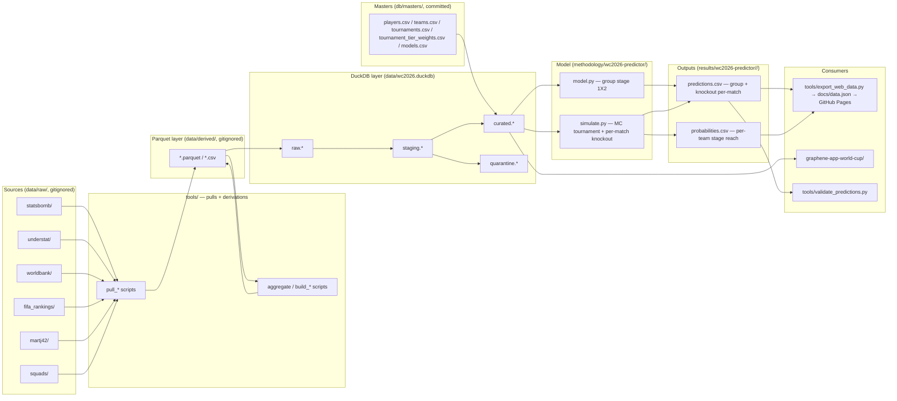

# refactor: Consolidate to a single WC2026 game predictor and document the as-is project

## Overview

The project has accreted four parallel realities:

1. The original "multi-model contributor workbench" (Elo / Form / Poisson / ensemble-e3 / ensemble-v2 / poisson-xg, scattered across `ensemble_model.py`, `wc2022_xg_backtest.py`, `tools/simulate_wc2026.py`, and 7 `results/<model>/` folders).
2. The new DuckDB-MDM data layer (`data/wc2026.duckdb`, `db/`, `tools/build_duckdb.py`, `tools/verify_duckdb.py`).
3. A single DuckDB-native model (`methodology/curated-poisson-luck/`) that reads only from `curated.*` and is the only fully reproducible current model.
4. An 8-role functional org chart in `docs/agents/` with ~30 spec docs, where roles 04, 07, 08 (market normalization / edge comparison / orchestration) are aspirational and roles 05 (modeling) still describe the now-superseded ensemble models.

The request collapses these into one shape:

- **One model** — DuckDB-native — that predicts every WC2026 game (group stage + every knockout fixture).
- **Keep DuckDB + Graphene.** Everything else gets reassessed against "does this serve the one-model objective?".
- **Delete fluff and contradictions.** Stale model code, broken pulls (FBref Cloudflare-blocked, Sofascore inactive), orphan databases, duplicated docs.
- **Document the as-is.** A single `ARCHITECTURE.md` that names every directory, every script, every parquet, every DuckDB table, and the actual data flow — no role-catalog aspirations, no model-table fiction.

This plan does not invent a new model. `methodology/curated-poisson-luck/` is renamed to `methodology/wc2026-predictor/` and extended to emit per-match predictions for the knockout bracket (it currently emits only per-team stage-reach probabilities for the MC tournament). Group-stage match predictions already work.

## Problem Frame

The repo's docs and code disagree in several specific ways:

| Doc claim | Reality |
|---|---|
| `README.md` model table lists 6 "current" models | Only `elo-baseline`, `form-last-10`, `poisson-goals`, `ensemble-e3` have 2026-04-28 snapshots. `ensemble-v2` is backtest-only. `compound-model` is aspirational. `curated-poisson-luck` (the actual production-grade model) is missing from the table. |
| `AGENTS.md` lists Role 08 (Orchestration): "Daily 09:00 UTC cron" | No cron exists. `tools/weekly_pull.py` is manual. Market snapshots are 17 days stale (2026-04-28). |
| `AGENTS.md` lists Roles 04, 07 (Market Normalization, Edge Comparison) | Not implemented. `DEVELOPMENT.md § Priority Stack` confirms these are Phase 1 work-in-progress. |
| `docs/agents/modeling-ensemble.md` says "consolidate from `ensemble_model.py`" | `ensemble_model.py` is now research-only and superseded by curated-poisson-luck. The "consolidate" was never done. |
| `DEVELOPMENT.md` describes "pandas-based methodology scripts" as the modeling surface | `curated-poisson-luck` is DuckDB-only at runtime; no parquet/HTTP reads. The pandas era is over for new models. |
| `AGENTS.md` and `CLAUDE.md` are explicitly documented as "Identical in substance — kept aligned by convention" | True today, but they drift the moment one is edited. |
| `tools/simulate_wc2026.py` (used by `tools/export_web_data.py` to feed the public report) | Reads parquets directly, hardcodes 14 `None`-alias teams, bypasses DuckDB entirely. The newer `methodology/curated-poisson-luck/simulate.py` does the same job from the curated layer. |
| `db/wc.duckdb` exists | Orphaned development scratch DB. Zero references in `tools/`, `methodology/`, or `graphene-app-world-cup/`. |
| `tools/pull_fbref*.py` exist (2 files, ~370 LoC) | `DEVELOPMENT.md § Key Constraints` explicitly says: "FBref is hard-blocked by Cloudflare... Do not attempt." The scripts are bait. |
| `tools/pull_sofascore_*.py` + `resolve_sofascore_ids.py` (3 files, ~600 LoC) | Sofascore integration was never wired in. No outputs in `data/raw/sofascore/` reach `data/derived/` or DuckDB. |

The objective is not to make every role real or every model live — it's to be honest about what the project is now (a DuckDB-backed single-model predictor with a Graphene viz layer) and shed the rest.

## Requirements Trace

- **R1.** A single canonical model — renamed to `wc2026-predictor` — produces probabilities for every WC2026 match: 72 group-stage fixtures (`match_1x2`) and 32 knockout fixtures (R32 / R16 / QF / SF / 3rd-place / final, conditional on bracket-occupancy).
- **R2.** That model is the only one with reproducible code in `methodology/` and the only one in the `results/` table after this PR.
- **R3.** All dead model code, dead data pulls, orphan databases, and stale snapshots are removed (not just moved to an `archive/` folder unless explicitly noted).
- **R4.** DuckDB (`data/wc2026.duckdb`, `db/`, `tools/build_duckdb.py`, `tools/verify_duckdb.py`) and the Graphene app (`graphene-app-world-cup/`) are untouched in behavior; their schemas / queries continue to work.
- **R5.** A single `ARCHITECTURE.md` at the repo root documents the as-is structure, tech stack, data flow, and lists every active directory + script + DuckDB table. New contributors should be able to read it once and understand the project without reading any other doc.
- **R6.** `README.md`, `DEVELOPMENT.md`, `AGENTS.md` are rewritten to reflect post-cleanup reality. `CLAUDE.md` is replaced with a stub that points to `AGENTS.md`.
- **R7.** `docs/agents/` is trimmed to roles that match active code; aspirational role specs are deleted or moved to `docs/ideation/`.
- **R8.** `docs/plans/` carries explicit status (`completed` / `superseded` / `active`) in frontmatter so reviewers can see at a glance what's history vs. what's live work.
- **R9.** The web report (`docs/data.json`, GitHub Pages) keeps working. The export script (`tools/export_web_data.py`) is updated to source from the canonical model and from `data/wc2026.duckdb` — never from the deleted root scripts or `tools/simulate_wc2026.py`.

## Scope Boundaries

- **Not a model rewrite.** The math of `curated-poisson-luck` is kept exactly as-is. Only its name, output coverage (knockout per-match), and home in the repo change.
- **Not a backtest update.** WC2022 validation for the renamed model remains tracked separately (the curated-poisson-luck plan's deferred backtest unit is not promoted into this plan).
- **Not a market-normalization implementation.** Roles 04 and 07 (devig, edge comparison) remain deferred. This plan deletes their aspirational role specs from `docs/agents/` rather than implementing them — `actionable.md` / Kalshi / Polymarket / Pinnacle edge logic is explicitly out of scope.
- **Not an orchestration build.** Role 08 / "Daily 09:00 UTC cron" stays aspirational. The role spec is deleted.
- **Graphene viz is not modified.** Existing `*.gsql`, `*.md` files in `graphene-app-world-cup/` keep working against `data/wc2026.duckdb`. The app's dormancy is documented in `ARCHITECTURE.md`, not "fixed."

### Deferred to Separate Tasks

- **WC2022 backtest of the renamed model** — already tracked in `docs/plans/2026-05-15-002-feat-curated-poisson-luck-model-plan.md` (the `pending_backtest` line in its MODEL.md). Rename the model card's references; do not run the backtest here.
- **Per-match betting edge** — the model emits probabilities only. Joining vs. devigged market prices for edge stays in a future Role-04/07 plan.
- **Live tournament updates (Sofascore, API-Football)** — there's a separate user memory note about a live-pipeline plan around 2026-06-04. Not part of this cleanup.
- **Final WC2026 squad ingestion** — `tools/pull_wc2026_final_squads.py` is kept (post-announcement use), but no squad integration into the predictor happens here.

## Context & Research

### Relevant Code and Patterns

- `methodology/curated-poisson-luck/model.py` — closed-form 1X2 for the 72 group-stage fixtures; reads `curated.*` only. The pattern to keep.
- `methodology/curated-poisson-luck/simulate.py` — 10k-iter Monte Carlo tournament simulation. Currently emits per-team stage-reach probabilities, **not** per-match knockout probabilities. Extending it to record per-match knockout outcomes is Unit 5.
- `methodology/curated-poisson-luck/queries/` — SQL templates against `curated.*`. The read pattern future models should mirror.
- `db/SCHEMA.md` Quick Reference table — canonical list of `curated.*` tables. Already correctly inventoried; this plan does not modify it.
- `db/queries/examples/` — 15 example queries. Some are model-feature reads (`team_features_for_modeling.sql`, `team_form_for_modeling.sql`), some are analysis (`model_agreement_matrix.sql`, `squad_coverage_gaps.sql`). Keep both groups.
- `tools/build_duckdb.py` / `tools/verify_duckdb.py` — the build + verify contract. Untouched.
- `tools/export_web_data.py` — currently imports from `tools/simulate_wc2026.py`'s structure. Migrating it to read `results/wc2026-predictor/<date>/probabilities.csv` instead of re-running a simulator inline is part of Unit 6.
- `graphene-app-world-cup/package.json` — points at `../data/wc2026.duckdb`. No changes needed.

### Institutional Learnings

- `docs/solutions/best-practices/master-data-management-pattern-for-multi-source-stats-2026-05-14.md` — MDM is the project's design discipline. The "dims sourced from authoritative masters; facts matched to dims one-way; quarantine unmatched" rule continues to apply post-cleanup. (See user memory `feedback_player_identity_registry.md`.)
- `docs/solutions/best-practices/wc2022-backtest-ensemble-disagreement-betting-strategy-2026-04-28.md` — The "Golden Zone" / model-agreement betting rule was a multi-model construct. Once we collapse to one model, the betting rule from this doc is moot. **Action:** the doc is preserved (it has historical value) but `ARCHITECTURE.md` will explicitly mark it as "applies to the multi-model era; superseded by the single-model design."
- `docs/solutions/best-practices/model-roles-and-best-use-2026-04-28.md` — Comparison matrix of Elo / Form / Poisson / Ensemble. Same disposition: keep as history, mark as superseded.
- User memory `feedback_no_hardcoded_modeling_weights.md` — tier weights and priors live in `db/masters/*.csv` → `curated.dim_*`, never as CASE literals. The renamed predictor already complies; this plan does not regress it.
- User memory `reference_curated_schema.md` — `db/SCHEMA.md` Quick Reference is the canonical contract for `curated.*` reads. Unchanged.

### External References

None needed. This is a repo-internal cleanup. No new framework choices, no external API changes.

## Key Technical Decisions

- **The single model is `wc2026-predictor`** (renamed from `curated-poisson-luck`).
  - **Rationale:** the existing name describes the math, not the role. After cleanup, this is *the* model, and its name should communicate that. The math, inputs, and outputs are untouched.
  - **Migration:** `methodology/curated-poisson-luck/` → `methodology/wc2026-predictor/`. `results/curated-poisson-luck/` → `results/wc2026-predictor/`. Update internal path references. Old folders are deleted, not symlinked — there is no external consumer that would need backwards compatibility.

- **Knockout per-match probabilities come from the MC simulator's per-iteration bracket trace.**
  - **Rationale:** the simulator already runs 10k tournament iterations. It currently aggregates to per-team stage-reach. Recording per-pair-per-stage wins during the same loop is bookkeeping, not new modeling. Counting `wins[(team_a, team_b, stage)] / appearances[(team_a, team_b, stage)]` gives a conditional knockout probability emitted as a `match_1x2`-shaped row for each potential R32/R16/QF/SF/F/3rd-place pairing that actually occurred in the iterations.
  - **Trade-off:** unlike group-stage closed-form, knockout match-level probabilities are *conditional on both teams reaching that stage*. The output CSV will include an `appearance_share` column so consumers know how often the pairing actually materialized in the 10k runs. Pairings below a `MIN_APPEARANCES` threshold (proposed: 100 out of 10k = 1%) are dropped to avoid emitting noise.

- **`tools/export_web_data.py` becomes a pure reader** of `results/wc2026-predictor/<date>/predictions.csv` and `probabilities.csv`.
  - **Rationale:** the export currently re-runs ratings/sim logic inline and depends on `tools/simulate_wc2026.py`. After cleanup, the canonical model writes its own outputs and the exporter just transcodes them to JSON. This eliminates the duplicate simulator and the 14-team `None`-alias hardcode.

- **`AGENTS.md` becomes the only contributor entry point.** `CLAUDE.md` is replaced with a one-line redirect to `AGENTS.md`.
  - **Rationale:** they are byte-level duplicates today by convention. Keeping both is a drift trap with no upside — both Claude Code and Codex/Cursor/Gemini read `AGENTS.md` natively.

- **`ARCHITECTURE.md` is added at the repo root** as the single canonical structural reference.
  - **Rationale:** R5 calls for "document everything as it is right now." Today this information is split across `README.md` (model table + structure), `DEVELOPMENT.md` (architecture + data flow + guardrails + priority stack), `db/SCHEMA.md` (DuckDB schema), and ~30 files in `docs/agents/`. A single `ARCHITECTURE.md` is the right new home for the *current* structural snapshot; the others get trimmed to their non-overlapping responsibilities (README = elevator pitch + how to run; DEVELOPMENT = contribution workflow + model guardrails; SCHEMA = DuckDB contract; agents = active roles only).

- **Doc plan status frontmatter is the lightest possible mechanism.**
  - **Rationale:** R8 wants reviewers to see at a glance which plans are history vs. active. Adding a single `status:` field to existing frontmatter (or adding frontmatter where missing) is cheaper than a separate index. Values: `completed` / `superseded` / `active`. No new tooling needed.

## Open Questions

### Resolved During Planning

- **Should we rename `curated-poisson-luck` or keep the name?** Resolved: rename to `wc2026-predictor`. The current name describes the math; post-cleanup it's THE model and should be named for that role.
- **Should deleted models be archived or fully deleted?** Resolved: fully deleted, with one exception — `results/comparisons/` (if it contains WC2022 backtest tables for multiple models) is preserved as historical validation artifact, since the WC2022 backtest itself remains a valid out-of-sample test of the renamed model and the old comparison tables establish baselines. The `results/<model>/wc2022-backtest/` subfolders for deleted models are kept *only* if they contain ground-truth comparisons; otherwise deleted.
- **Should `tools/simulate_wc2026.py` be deleted or refactored?** Resolved: deleted, after `tools/export_web_data.py` is migrated to read the canonical model's output files (Unit 6 sequencing).
- **Should `compound-model/` be deleted or kept as the model card?** Resolved: deleted. Its `MODEL.md` describes a never-implemented model. Its `docs/plans/2026-04-28-001-feat-wc26-prediction-edge-finder-plan.md` is the original vision doc; we preserve that plan in `docs/plans/` (with `status: superseded`) so the history is searchable, then delete the `compound-model/` directory.
- **Should we keep `wc2022_xg_backtest.py` at the repo root?** Resolved: keep, but mark in `ARCHITECTURE.md` as "historical backtest harness (multi-model era); the renamed model's WC2022 backtest will live in `methodology/wc2026-predictor/backtest.py`." The file itself is untouched here.

### Deferred to Implementation

- **Exact name of the renamed knockout-fixture identifier scheme.** The group-stage uses `WC26-MEX-RSA-2026-06-11`. Knockouts are usually `WC26-R16-08` style (per `DEVELOPMENT.md`'s schema notes). The implementer should mirror the existing convention by reading `data/raw/martj42/latest/results.csv` or the WC2026 fixture file used by the current simulator; this plan doesn't specify the regex.
- **Exact set of `docs/agents/` files to delete vs. update.** Unit 8 names the cutoff rule ("describes active code today" stays; "describes aspirational role 04/07/08" goes), but the implementer should walk the directory file-by-file with that rule and may discover edge cases (e.g., role 02's `data-gaps-roadmap.md` is partly executed, partly aspirational — judgment call at edit time).
- **Whether `team_defense_ratings.parquet` vs. `team_defensive_ratings.parquet` is a genuine duplicate or two different signals.** Both exist in `data/derived/`. The DuckDB build script reads one of them. Unit 4's data-cleanup pass should grep `tools/` and `methodology/` for both names, identify which is consumed, and delete the other. Same disposition for `sb_player_stats.parquet` vs. `sb_player_summary.parquet`, `understat_player_xg.parquet` vs. `understat_player_xg_raw.parquet`.
- **Whether `aggregate_statsbomb_pedigree.py` is reachable from any active workflow.** Its output `sb_player_stats_pedigree.parquet` is in `data/derived/` but no current model reads it. Unit 4 should confirm by grep before deleting.

## High-Level Technical Design

> *This illustrates the intended after-shape and is directional guidance for review, not implementation specification. The implementer should treat it as context, not code to reproduce.*

After cleanup, the repo collapses to this dependency graph:



What this diagram makes explicit:

- `data/derived/` is the bridge between pulls and DuckDB. After this PR, nothing reads `data/derived/` *for modeling* — only DuckDB does, then the model reads only `curated.*`.
- Every red-team script in the current repo (`ensemble_model.py`, `tools/simulate_wc2026.py`, root-level model logic) is gone. The arrow from "Outputs" back to "Consumers" replaces it.
- Graphene reads `data/wc2026.duckdb` directly. It is not on the modeling path; it's a parallel viz consumer.

## Implementation Units

This plan is grouped into four phases. Each unit is a single PR-sized atomic commit.

### Phase 1 — Document current state (so deletions are auditable)

- [ ] **Unit 1: Add `ARCHITECTURE.md` as the as-is structural reference**

**Goal:** Produce a single canonical doc that describes the repo *as it exists today, post-cleanup*. It is written assuming Units 2–10 land in the same PR set; reviewers should be able to read `ARCHITECTURE.md` alone and understand every file in the tree.

**Requirements:** R5, R6

**Dependencies:** None — written first as the contract for what the rest of the plan converges toward.

**Files:**
- Create: `ARCHITECTURE.md` (repo root)

**Approach:**
- Top section: project purpose in 2-3 sentences (single-model WC2026 predictor + Graphene viz).
- Section "Directory map": every active top-level directory with one line on its purpose.
- Section "Tech stack": Python 3.12, DuckDB, pandas, numpy, scipy; Node + Graphene CLI for the viz app. Lockfile / version anchors where they exist (`graphene-app-world-cup/package.json`).
- Section "Data flow": narrative + the mermaid diagram from the High-Level Technical Design above (or a simplified prose form).
- Section "DuckDB schema": single-paragraph pointer to `db/SCHEMA.md` with the Quick Reference table embedded by reference.
- Section "How to run": `python3 tools/build_duckdb.py` → `python3 tools/verify_duckdb.py` → `python3 methodology/wc2026-predictor/model.py` → `python3 methodology/wc2026-predictor/simulate.py`.
- Section "How to contribute a new model" (renamed from `README.md`'s contributor track): drop into `methodology/<your-model>/`, read from `curated.*`, write to `results/<your-model>/<date>/predictions.csv`. The "everyone submits a CSV" framing from `README.md` is preserved here.
- Section "What lives where (canonical)": one row per artifact type → home.

| Artifact type | Canonical home |
|---|---|
| Project elevator pitch + how to run | `README.md` |
| As-is structure + tech stack | `ARCHITECTURE.md` (this file) |
| Contribution workflow + model guardrails | `DEVELOPMENT.md` |
| Active functional roles | `AGENTS.md` (the entry-point) + `docs/agents/0X-*.md` (per-role detail) |
| DuckDB schema contract | `db/SCHEMA.md` |
| SQL naming convention | `db/NAMING.md` |
| Per-model card | `results/<model>/MODEL.md` |
| Past decisions / failed experiments | `docs/solutions/best-practices/` (read-only history) |
| Active work / open plans | `docs/plans/` with `status: active` frontmatter |
| Completed work | `docs/plans/` with `status: completed` frontmatter |
| Ideation / not-yet-scoped | `docs/ideation/` |

**Patterns to follow:**
- `db/SCHEMA.md` — concise reference style with a Quick Reference table at the top.
- `DEVELOPMENT.md § Architecture` — narrative + data-flow ASCII; this section gets superseded by `ARCHITECTURE.md` and trimmed (see Unit 9).

**Test scenarios:**
- *Happy path:* a reader who has not seen this repo before can answer "where does the model read from?", "what produces `results/<model>/<date>/predictions.csv`?", and "what is in `data/wc2026.duckdb`?" using only `ARCHITECTURE.md`.
- *Integration:* every directory mentioned in `ARCHITECTURE.md` exists in the tree after Units 2–10 land. (Validate by `ls`-ing each named path.)

**Verification:**
- Document committed at `ARCHITECTURE.md` and linked from the top of `README.md`.
- All structural claims are testable by `ls` or by reading the file referenced.

---

- [ ] **Unit 2: Add `status:` frontmatter to every `docs/plans/*.md`**

**Goal:** Make the docs/plans/ directory readable as state, not as archaeology. Each plan gets a one-word `status` field.

**Requirements:** R8

**Dependencies:** None.

**Files:**
- Modify: every `docs/plans/*.md` (~14 files)

**Approach:**
- For each plan file, add (or update) `status:` in the frontmatter. If the file lacks frontmatter (e.g., `2026-05-06-player-data-gap-plan.md`, `2026-05-06-world-cup-player-data-acquisition-strategy.md`), add a minimal block: `---\ntitle: ...\ntype: ...\nstatus: ...\ndate: ...\n---`.
- Status determination rule:
  - **`completed`** — the deliverable exists in the repo and the plan's implementation units are largely satisfied. Per the inventory: `2026-04-28-001-feat-wc2026-prediction-dashboard-csv-plan.md` (schema exists), `2026-05-05-001-feat-wc2022-player-xg-backtest-plan.md` (backtest outputs exist), `2026-05-05-002-feat-wc2026-prediction-report-plan.md` (web report published), `2026-05-09-001-feat-multi-agent-org-chart-and-collaboration-plan.md` (AGENTS.md + docs/agents/), `2026-05-13-001-feat-build-duckdb-database-curated-models-plan.md` (DuckDB exists), `2026-05-14-001-feat-country-context-features-plan.md`, `2026-05-14-002-feat-fact-team-economics-and-fifa-ranking-plan.md`, `2026-05-15-001-feat-fact-international-match-plan.md`, `2026-05-15-002-feat-curated-poisson-luck-model-plan.md` (`results/curated-poisson-luck/2026-05-15/` exists).
  - **`superseded`** — the plan describes a now-irrelevant direction. Per the inventory: `2026-04-28-001-feat-wc26-prediction-edge-finder-plan.md` (the compound-model vision; superseded by single-model design — but this file is in `compound-model/docs/plans/`, see Unit 7), `2026-05-04-004-feat-fresh-player-data-pipeline-plan.md` (if its details point at refresh scripts being deleted in Unit 3).
  - **`active`** — `2026-05-15-003-feat-sql-nomenclature-standard-plan.md`, `2026-05-15-004-refactor-project-cleanup-plan.md` (this plan).
- The implementer is expected to spot-check each plan and use judgment when the inventory above is ambiguous.

**Patterns to follow:**
- YAML frontmatter format already used by `2026-05-15-002-feat-curated-poisson-luck-model-plan.md` (`title:`, `type:`, `status:`, `date:`).

**Test scenarios:**
- *Happy path:* every file in `docs/plans/` has a `status:` field after the change. (Validate by `grep -L '^status:' docs/plans/*.md` returning zero files.)
- *Edge case:* plans without frontmatter get a complete minimal block, not a partial one.

**Verification:**
- `grep -L '^status:' docs/plans/*.md` returns nothing.
- A reader can `grep "^status: active" docs/plans/*.md` and see only the truly live plans.

---

### Phase 2 — Delete dead weight

- [ ] **Unit 3: Delete dead model code and root-level redundant scripts**

**Goal:** Remove the multi-model-era code that is no longer reachable from any current pipeline and is contradicted by the current direction.

**Requirements:** R3, R4

**Dependencies:** Unit 6 must be done first for `tools/simulate_wc2026.py` (the web exporter depends on it; the exporter must be migrated before the script is deleted). The rest of the files in this unit have no live callers.

**Files (delete):**
- `ensemble_model.py` — root-level Elo+DC+Form blender; superseded by `methodology/curated-poisson-luck/model.py`. Only references are in historical plans and the now-stale `docs/agents/modeling-ensemble.md`.
- `tools/pull_fbref.py` — FBref hard-blocked by Cloudflare (`DEVELOPMENT.md § Key Constraints`).
- `tools/pull_fbref_national.py` — same disposition.
- `tools/pull_sofascore_2026_stats.py` — Sofascore integration never wired into derived data or DuckDB.
- `tools/resolve_sofascore_ids.py` — companion to the inactive Sofascore script.
- `db/wc.duckdb` — orphan dev/scratch DB. Zero references in any `.py`, `.md`, `.json`, `.sql` file in the repo.
- `tools/build_wc2022_player_xg.py` — legacy retrospective WC2022 build; outputs (`squad_wc2022_proxy.parquet`, `team_attack_ratings_wc2022.parquet`) are read only by the same-era `wc2022_xg_backtest.py`, which is kept as a historical harness. Keep this script too — it's reproducibility for the kept backtest. **Reclassification: keep, document in `ARCHITECTURE.md` as "WC2022 backtest support."**
- `tools/build_wc2022_ratings.py` — same disposition as above. **Keep.**
- `tools/backtest_wc2022.py` — confirmed by file inspection to be a near-duplicate of root `wc2022_xg_backtest.py`. **Delete** the tools/ version; keep the root version.
- `tools/refresh_model_master.py` — `db/masters/models.csv` is small and hand-maintained; auto-refresh has no current consumer. **Delete.**
- `tools/aggregate_statsbomb_pedigree.py` — produces `sb_player_stats_pedigree.parquet` with no current downstream reader. **Delete after grep confirms zero references.**

**Files (modify):**
- `data/derived/sb_player_stats_pedigree.parquet` — delete if Unit 4 confirms zero readers.
- `data/derived/squad_wc2022_proxy.parquet`, `team_attack_ratings_wc2022.parquet`, `team_defense_ratings_wc2022.parquet` — **keep** as they back the kept WC2022 backtest harness. Document in `ARCHITECTURE.md`.

**Approach:**
- Each deletion is a separate small commit within the same PR, with the commit message naming the dead caller path and what verified the unreachability (e.g., `grep -rn ensemble_model | head` showing no current `tools/` or `methodology/` references).
- Run `python3 tools/build_duckdb.py` and `python3 tools/verify_duckdb.py` after the deletions to confirm DuckDB build still succeeds (the script reads `data/derived/*.parquet`; missing pedigree parquet should be a clean no-op if Unit 4's confirm step passes).

**Patterns to follow:**
- User preference (from memory): "investigate before deleting or overwriting." Each file's unreachability is confirmed by grep before the commit.

**Test scenarios:**
- *Integration:* `python3 tools/build_duckdb.py` exits 0 after the deletions.
- *Integration:* `python3 tools/verify_duckdb.py` exits 0 after the deletions.
- *Edge case:* `grep -rn "ensemble_model\|pull_fbref\|pull_sofascore\|resolve_sofascore\|refresh_model_master\|aggregate_statsbomb_pedigree\|backtest_wc2022" --include="*.py" .` returns zero hits from active code (hits in `docs/plans/` historical text are OK).
- *Error path:* if any deletion causes a downstream break that `verify_duckdb.py` doesn't catch, the implementer revisits the inventory before reverting.

**Verification:**
- DuckDB build + verify still pass.
- `docs/agents/modeling-ensemble.md` is updated or deleted in Unit 8 to remove the "consolidate from `ensemble_model.py`" reference.

---

- [ ] **Unit 4: Reconcile redundant parquets in `data/derived/`**

**Goal:** For each pair of similar-looking parquets identified in the inventory, confirm which is current and delete the other.

**Requirements:** R3

**Dependencies:** Unit 3 (clears callers that referenced `_wc2022` files which are now confirmed kept; reduces grep noise).

**Files (investigate then act):**
- `data/derived/sb_player_stats.parquet` vs. `sb_player_summary.parquet` — likely duplicate. Grep `tools/`, `methodology/`, `db/sql/` for both names; keep the one referenced by active code, delete the other. (Hypothesis from inventory: `sb_player_summary.parquet` is the one read by `build_squad_xg_ratings.py`.)
- `data/derived/understat_player_xg.parquet` vs. `understat_player_xg_raw.parquet` — likely raw + post-processed pair. Confirm and decide whether the `_raw` is still needed (sometimes raw is kept for auditability, sometimes it's deletable).
- `data/derived/team_defense_ratings.parquet` vs. `team_defensive_ratings.parquet` — name collision. One of these is the typo or rename leftover. Grep and resolve.
- `data/derived/understat_2122_players.parquet` — 2021-22 season; stale. Confirm no current model reads it (only `understat_2526_players.parquet` is active per the curated layer). Delete if confirmed unused.
- `data/derived/statsbomb_team_xg.parquet` — produced by `pull_statsbomb.py` but consumer unclear. Confirm reachable from `curated.fact_team_xg` build or delete.
- `data/derived/team_xga_pedigree.parquet`, `defensive_ratings_tournament.parquet`, `defensive_ratings_club_2526.parquet`, `team_ratings_all_models.parquet` — grep all four for consumers; keep what `build_duckdb.py` actually loads, delete the rest.

**Approach:**
- For each candidate parquet, run `grep -rn "<filename without extension>" --include="*.py" --include="*.sql" .` and note the readers.
- File is `keep` if any `tools/`, `methodology/`, or `db/sql/` file references it.
- File is `delete` otherwise.
- Single commit per parquet (or grouped if obviously paired) — easy to revert if a downstream surprise surfaces.
- After deletions, rerun `tools/build_duckdb.py` and `tools/verify_duckdb.py`.

**Patterns to follow:**
- `data/derived/` is gitignored, so deletions are local-state-only — but the build scripts that produce them are not, and any script that produces an output we then delete should be deleted in the same commit. (Verify: `python3 tools/build_duckdb.py` should not silently re-create a parquet we just decided we don't need.)

**Test scenarios:**
- *Integration:* `python3 tools/build_duckdb.py` finishes cleanly; `python3 tools/verify_duckdb.py` exits 0.
- *Integration:* `python3 methodology/wc2026-predictor/model.py` runs (after Unit 5's rename) and writes a `predictions.csv` matching the schema in `db/SCHEMA.md`.
- *Edge case:* if a parquet looks unreferenced but is read by a script that itself is unreferenced (transitive dead code), both go.

**Verification:**
- Reduced count of files in `data/derived/` (inventory baseline: ~31 files; target: only the ones reachable from `tools/build_duckdb.py` + the kept WC2022 backtest harness).
- `tools/inspect_parquets.py` (kept utility) lists exactly the kept files when pointed at `data/derived/`.

---

### Phase 3 — Consolidate to a single model

- [ ] **Unit 5: Rename `curated-poisson-luck` → `wc2026-predictor` and emit per-match knockout predictions**

**Goal:** Make this *the* model. New name communicates the role; extended output emits per-match probabilities for every WC2026 fixture (group + knockout), satisfying R1.

**Requirements:** R1, R2

**Dependencies:** Unit 4 (parquet cleanup so the model's reads from `curated.*` aren't load-bearing on now-deleted files; in practice `curated-poisson-luck` already reads only from `curated.*` so this is a soft dependency).

**Files:**
- Modify (rename directory): `methodology/curated-poisson-luck/` → `methodology/wc2026-predictor/`
- Modify (rename directory): `results/curated-poisson-luck/` → `results/wc2026-predictor/`
- Modify: `methodology/wc2026-predictor/README.md` — update name and reference paths.
- Modify: `methodology/wc2026-predictor/model.py` — update any path references (e.g., output dir if hardcoded).
- Modify: `methodology/wc2026-predictor/simulate.py` — (a) update paths; (b) extend the per-iteration loop to record per-pair-per-stage wins, then aggregate into `match_1x2`-shaped knockout rows and append to `predictions.csv`.
- Modify: `results/wc2026-predictor/MODEL.md` — update model name, output paths, and add a section on the knockout output's `appearance_share` semantics.
- Modify: `db/masters/models.csv` — update row for `curated-poisson-luck` to `wc2026-predictor`.
- Modify: `db/queries/examples/curated_poisson_luck_per_team_features.sql` → rename to `wc2026_predictor_per_team_features.sql` (or keep the SQL filename as a feature-name reference and just update internal comments — implementer judgment).
- Modify: `tests/test_curated_poisson_luck_model.py` → rename to `tests/test_wc2026_predictor_model.py`; update imports.
- Test: same file, post-rename.

**Approach:**
- Step 1 — pure rename (no behavior change): `git mv methodology/curated-poisson-luck methodology/wc2026-predictor` and same for `results/`. Update internal path references. Confirm `python3 methodology/wc2026-predictor/model.py` still produces identical numeric output as the pre-rename run (cross-check by re-running and diffing the new vs. old `predictions.csv`).
- Step 2 — extend `simulate.py` for per-match knockouts:
  - Inside the 10k-iteration MC loop, when a knockout match is simulated, increment two counters: `pair_appearances[(team_a, team_b, stage)] += 1` and `pair_wins[(team_a, team_b, stage)] += home_wins ? 1 : 0` (plus draw-handling per the closed-form 1X2 logic).
  - After the loop, emit one row per `(team_a, team_b, stage)` with `appearance_share >= MIN_APPEARANCES / N_ITERATIONS` (proposed threshold: 0.01 = 100 of 10k).
  - Append these rows to `predictions.csv` using the existing 8-column schema with `match_id = WC26-<STAGE>-<HOMETEAMCODE>-<AWAYTEAMCODE>` and `notes` carrying the appearance share.
  - The group-stage rows in `predictions.csv` remain unchanged.

**Execution note:** Step 1 (pure rename) should be a strictly-reversible commit. Step 2 (knockout extension) is the only place this plan asks for new logic and should land in its own commit so a reviewer can isolate it.

**Technical design:** *(directional sketch, not implementation specification)*

```
# simulate.py — additions inside the existing iteration loop
for iteration in range(N_ITERATIONS):
    bracket = simulate_groups(...)              # existing
    while bracket.has_next_round():
        for match in bracket.next_round():       # R32, R16, QF, SF, F, 3rd
            (a, b) = match.teams
            stage  = match.stage
            home_wins, draw, away_wins = sample_outcome(a, b, ...)  # existing per-match
            pair_appearances[(a, b, stage)] += 1
            pair_wins[(a, b, stage)] += {"home": home_wins, "draw": draw, "away": away_wins}
            bracket.advance(match)               # existing

# Post-loop aggregation
for (a, b, stage), appearances in pair_appearances.items():
    share = appearances / N_ITERATIONS
    if share < MIN_APPEARANCE_SHARE:  # default 0.01
        continue
    p_home = pair_wins[(a, b, stage)]["home"] / appearances
    p_draw = pair_wins[(a, b, stage)]["draw"] / appearances
    p_away = pair_wins[(a, b, stage)]["away"] / appearances
    emit_rows(match_id=f"WC26-{stage}-{a}-{b}", probs=(p_home, p_draw, p_away), notes=f"appearance_share={share:.3f}")
```

**Patterns to follow:**
- `methodology/curated-poisson-luck/model.py` for the closed-form group-stage shape — preserve unchanged.
- `tools/validate_predictions.py` — the renamed model's outputs must still pass schema validation after the knockout rows are appended.

**Test scenarios:**
- *Happy path (rename only):* `python3 methodology/wc2026-predictor/model.py` produces a `predictions.csv` whose group-stage rows are byte-identical to the pre-rename output (modulo timestamp / `as_of_date`).
- *Happy path (knockout extension):* `python3 methodology/wc2026-predictor/simulate.py` produces a `predictions.csv` containing the 72 group-stage rows *plus* one row per `(team_pair, stage)` exceeding `MIN_APPEARANCE_SHARE`.
- *Edge case:* a pairing that occurred fewer than `MIN_APPEARANCE_SHARE × N_ITERATIONS` times in 10k iterations is omitted (not emitted with `notes` showing a low share).
- *Edge case:* the final match emits a row even if its appearance share is below threshold *if* both teams have non-trivial win shares — implementer decision whether to apply a final-stage exemption; defaulting to "apply the threshold uniformly" is acceptable.
- *Edge case:* host nations (USA, MEX, CAN) get the existing `+0.25` home boost (documented in current MODEL.md) only on group-stage matches; knockout matches at WC2026 are all at neutral US/MEX/CAN venues per FIFA's actual fixture list. The implementer should preserve the current model's behavior (which already encodes this).
- *Integration:* `python3 tools/validate_predictions.py results/wc2026-predictor/<today>/predictions.csv` exits 0.
- *Integration:* The renamed test `tests/test_wc2026_predictor_model.py` passes.

**Verification:**
- `results/wc2026-predictor/<today>/predictions.csv` contains rows for every WC2026 fixture that has both teams confirmed by group-stage simulation, including knockouts.
- `methodology/wc2026-predictor/` is the only non-`_template/` folder under `methodology/`.

---

- [ ] **Unit 6: Migrate `tools/export_web_data.py` to read from `results/wc2026-predictor/<date>/` and delete `tools/simulate_wc2026.py`**

**Goal:** The web export becomes a pure transcoder of the canonical model's outputs. The orphan simulator (`tools/simulate_wc2026.py`) is deleted in the same commit.

**Requirements:** R3, R9

**Dependencies:** Unit 5 (must produce the per-match knockout rows the web report consumes).

**Files:**
- Modify: `tools/export_web_data.py` — replace any inline rating/sim logic with reads from `results/wc2026-predictor/<latest-date>/predictions.csv` and `probabilities.csv`. Delete the hardcoded 14-team `None`-alias list (the alias resolution is now `dim_team`'s job, and unresolved teams should propagate through the model rather than be hardcoded).
- Delete: `tools/simulate_wc2026.py`
- Delete: `results/wc2026-sim/` (probabilities files from 2026-05-07; orphan output of the deleted simulator).
- Modify: `docs/data.json` — regenerate by re-running the updated `tools/export_web_data.py` (gitignored intermediate; the actual web report regenerates from this).

**Approach:**
- The updated exporter discovers the latest `results/wc2026-predictor/<YYYY-MM-DD>/` by `max()` over the date-folder names.
- It reads `predictions.csv` (per-match) and `probabilities.csv` (per-team stage reach), pivots into the JSON shape the static site expects, and writes `docs/data.json`.
- It uses `data/wc2026.duckdb` only for read-only metadata lookups (team display names, confederations) — no model logic.

**Patterns to follow:**
- The existing `tools/export_web_data.py` structure for JSON shape — the published GitHub Pages site expects specific keys, do not break them.

**Test scenarios:**
- *Happy path:* `python3 tools/export_web_data.py` produces a `docs/data.json` that the existing `docs/index.html` renders correctly when served (`python3 -m http.server` from `docs/`).
- *Edge case:* if `results/wc2026-predictor/<latest-date>/` is empty or missing, the exporter exits with a clear error pointing the user at `python3 methodology/wc2026-predictor/model.py`.
- *Integration:* the published report at `https://lnoguera171.github.io/fulbol-mundial-26/` (link from `README.md`) still shows 48-team probabilities and the bracket after a fresh push.

**Verification:**
- `tools/simulate_wc2026.py` is gone.
- `results/wc2026-sim/` is gone.
- `grep -rn "simulate_wc2026" --include="*.py"` returns zero hits from active code.

---

- [ ] **Unit 7: Delete obsolete model folders and `compound-model/`**

**Goal:** After Unit 5, `methodology/wc2026-predictor/` is the only methodology. Delete the historical model folders (`elo-baseline`, `form-last-10`, `poisson-goals`, `ensemble-e3`, `ensemble-v2`, `poisson-xg`) and the never-implemented `compound-model/`. Keep the `results/comparisons/` folder if it holds true comparison artifacts (WC2022 backtest comparisons across the multi-model era have historical validation value).

**Requirements:** R2, R3

**Dependencies:** Unit 5 (the rename), Unit 6 (so the web exporter no longer depends on the old folders).

**Files:**
- Delete: `results/elo-baseline/` (entire tree — 2026-04-28 snapshot + MODEL.md).
- Delete: `results/form-last-10/`.
- Delete: `results/poisson-goals/`.
- Delete: `results/ensemble-e3/`.
- Delete: `results/ensemble-v2/`.
- Delete: `results/poisson-xg/`.
- Delete: `compound-model/` (entire directory — README.md, MODEL.md, docs/).
- Move (preserve history): `compound-model/docs/plans/2026-04-28-001-feat-wc26-prediction-edge-finder-plan.md` → `docs/plans/2026-04-28-001-feat-wc26-prediction-edge-finder-plan.md` with `status: superseded` frontmatter added (per Unit 2's rule).
- Modify: `db/masters/models.csv` — remove rows for `elo-baseline`, `form-last-10`, `poisson-goals`, `ensemble-e3`, `ensemble-v2`, `poisson-xg`, `compound-model`. Keep only `wc2026-predictor`.

**Approach:**
- Verify before deleting each `results/<model>/` that:
  - No active code in `tools/`, `methodology/`, or `tests/` reads it.
  - No `docs/plans/` with `status: active` references it (historical plan references are OK).
- `results/comparisons/` disposition: inspect contents. If it's WC2022 backtest cross-model tables, **keep** it as a historical validation snapshot and add a top-level `README.md` noting it predates the single-model cleanup. If it's per-snapshot comparison-against-market tables, **keep** structure but the future single-model era won't populate it the same way — note this in `ARCHITECTURE.md`.
- `results/_template/` — **keep**. Other contributors may still submit alternate models; the template enables that. `ARCHITECTURE.md` notes that the project's *canonical* model is `wc2026-predictor`, but the contribution path is open.

**Patterns to follow:**
- Each model folder is a separate small commit so any single deletion can be reverted independently if a downstream surprise surfaces.

**Test scenarios:**
- *Happy path:* `ls methodology/` returns only `_template/` and `wc2026-predictor/`.
- *Happy path:* `ls results/` returns `_template/`, `wc2026-predictor/`, and `comparisons/` (if retained).
- *Edge case:* `grep -rn "elo-baseline\|form-last-10\|poisson-goals\|ensemble-e3\|ensemble-v2\|poisson-xg\|compound-model" --include="*.py" .` returns zero hits from active code.
- *Edge case:* `db/masters/models.csv` has exactly one row after the cleanup.
- *Integration:* `python3 tools/build_duckdb.py` rebuilds `curated.dim_model` from the trimmed master and exits 0.

**Verification:**
- The README model table (Unit 9) will list exactly one model row.
- Historical context for the deleted models survives in `docs/plans/` (with `status: superseded`) and in `docs/solutions/best-practices/model-roles-and-best-use-2026-04-28.md` (which is preserved as history).

---

### Phase 4 — Document the as-is

- [ ] **Unit 8: Trim `docs/agents/` to active reality**

**Goal:** `docs/agents/` should describe roles a human/AI can actually pick up today, not aspirational ones. Specs that describe deleted code are deleted; specs that describe unimplemented roles are moved to `docs/ideation/`.

**Requirements:** R7

**Dependencies:** Unit 7 (so the modeling specs match the trimmed model list).

**Files:**

| File | Disposition |
|---|---|
| `docs/agents/README.md` | Modify — index of the trimmed catalog. |
| `docs/agents/_role-template.md` | Keep. |
| `docs/agents/01-data-engineering.md` | Keep — describes `tools/pull_*.py` (active). |
| `docs/agents/02-data-coverage.md` | Keep — describes `audit_player_coverage.py` (active). |
| `docs/agents/03-data-cleaning.md` | Keep — describes the `data/raw/ → data/derived/` pipeline (active). |
| `docs/agents/04-market-normalization.md` | Move to `docs/ideation/2026-05-15-role-04-market-normalization.md` — role is aspirational; no code implements devig. |
| `docs/agents/05-modeling.md` | Modify — drop references to Elo/Form/Poisson/ensemble; describe the single-model contribution path against `curated.*`. |
| `docs/agents/06-validation.md` | Keep — `validate_predictions.py` (active). |
| `docs/agents/07-edge-comparison.md` | Move to `docs/ideation/2026-05-15-role-07-edge-comparison.md` — aspirational. |
| `docs/agents/08-orchestration.md` | Move to `docs/ideation/2026-05-15-role-08-orchestration.md` — no cron exists; `weekly_pull.py` is manual. |
| `docs/agents/acquisition-elite-club-form.md` | Keep if a current pull script implements it; delete otherwise (likely keep — covered by `pull_understat_players.py`). |
| `docs/agents/acquisition-international-results.md` | Keep — martj42 pull is active. |
| `docs/agents/acquisition-markets.md` | Modify — strip references to deleted Sofascore work; keep Kalshi / Polymarket descriptions but mark the pipeline as "snapshots only; not currently scheduled." |
| `docs/agents/acquisition-national-lineups.md` | Delete unless current code implements it (likely delete — no `pull_lineups.py` exists). |
| `docs/agents/acquisition-statsbomb.md` | Keep — `pull_statsbomb.py` active. |
| `docs/agents/acquisition-understat.md` | Keep — `pull_understat_players.py` active. |
| `docs/agents/acquisition-wc2026-squads.md` | Keep — `pull_wc2026_squads.py` + `pull_wc2026_final_squads.py` active. |
| `docs/agents/data-gaps-roadmap.md` | Keep — references the player-data coverage gap, which remains relevant. |
| `docs/agents/modeling-compound-model.md` | Delete — compound-model is gone (Unit 7). |
| `docs/agents/modeling-elo-baseline.md` | Delete. |
| `docs/agents/modeling-ensemble.md` | Delete. |
| `docs/agents/modeling-form-last-10.md` | Delete. |
| `docs/agents/modeling-poisson-goals.md` | Delete. |
| `docs/agents/modeling-poisson-xg.md` | Delete. |
| `docs/agents/quality-coverage-audit.md` | Keep — describes `audit_player_coverage.py`. |
| `docs/agents/quality-review.md` | Keep if it describes the PR review checklist; delete if it describes a now-defunct workflow. |
| `docs/agents/quality-validation-backtest.md` | Keep — describes the backtest gate. |
| `docs/agents/refinement-loop.md` | Keep — describes how a model can be tuned without violating the no-post-hoc-fitting rule; still relevant for the single model. |
| `docs/agents/synthesis-comparison-edge.md` | Move to `docs/ideation/` (Role 07 sibling). |
| `docs/agents/synthesis-documentation-learnings.md` | Keep — describes the `docs/solutions/` workflow. |
| `docs/agents/synthesis-orchestrator.md` | Move to `docs/ideation/` (Role 08 sibling). |

**Approach:**
- For each file flagged `Modify`, edit in place to remove dead references and add a one-line "current as of YYYY-MM-DD" header.
- For each file flagged `Move`, prefix with the date (so it sorts chronologically in `docs/ideation/`) and add a frontmatter note: `status: aspirational`.
- For each file flagged `Delete`, delete with a commit message naming the deleted code it described.
- After all moves/deletes, rewrite `docs/agents/README.md` to be the index of the trimmed catalog.

**Patterns to follow:**
- `docs/ideation/2026-04-29-ucl-event-data-pipeline.md` is the existing pattern for aspirational specs in `docs/ideation/`.

**Test scenarios:**
- *Happy path:* `ls docs/agents/*.md` returns only files that describe live code or active processes.
- *Integration:* `docs/agents/README.md`'s table contains a row for every remaining file, no broken links.
- *Edge case:* a file that's "half active, half aspirational" (e.g., `acquisition-markets.md`) is split: active half stays, aspirational half goes to `docs/ideation/`.

**Verification:**
- A new contributor reading `docs/agents/README.md` can pick a role and find live code that implements it.
- No `docs/agents/` file references a deleted script or model.

---

- [ ] **Unit 9: Rewrite `README.md` and trim `DEVELOPMENT.md`; collapse `CLAUDE.md` into `AGENTS.md`**

**Goal:** The four top-level docs become non-overlapping. `README.md` is the elevator pitch + how to run. `ARCHITECTURE.md` (from Unit 1) is the as-is structural reference. `DEVELOPMENT.md` is contribution workflow + model guardrails. `AGENTS.md` is the role entry-point. `CLAUDE.md` becomes a one-line redirect.

**Requirements:** R6

**Dependencies:** Unit 1 (`ARCHITECTURE.md` exists), Unit 7 (model table reduces to one row), Unit 8 (roles list trimmed).

**Files:**
- Modify: `README.md` — rewrite. Sections to keep: project name + live-report link, "Current Status" updated to post-cleanup state, "Tech stack at a glance" (one paragraph pointing at `ARCHITECTURE.md`), "How to run", "Contributing models" (pointing at `methodology/_template/` + `db/SCHEMA.md`), "Models currently in the repo" (one row: `wc2026-predictor`), license/ground rules. Remove the multi-model table, the data-flow ASCII (lives in `ARCHITECTURE.md`), and the Player Data Gap Plan (moves to `docs/agents/data-gaps-roadmap.md`).
- Modify: `DEVELOPMENT.md` — trim. Sections to keep: Contribution Workflow, Model Guardrails (still apply to the single model and any future model), Prediction Output Schema (still the contract), Key Constraints (still relevant: FBref blocked, etc.), Environment Variables. Sections to remove or trim: "Architecture" (moves to `ARCHITECTURE.md`), "Ways to Contribute" tracks A-D (collapse to one summary paragraph), "Running the Pipeline" (moves to `ARCHITECTURE.md`), the long "Player Data Gap Plan" (moves to `docs/agents/data-gaps-roadmap.md`).
- Modify: `AGENTS.md` — update the role table to match Unit 8's trimmed list. Add a one-line "this file is read by Claude Code, Cursor, Codex, and Gemini; `CLAUDE.md` is a redirect for legacy clients."
- Modify: `CLAUDE.md` — replace contents with a single-line redirect: "See [AGENTS.md](./AGENTS.md). Kept as a stub for AI clients that look for this specific filename."

**Approach:**
- Treat `README.md` as the answer to "I just found this repo, what is it and how do I run it?" — should fit on a single screen for a developer who knows the domain.
- Treat `ARCHITECTURE.md` as the answer to "I'm contributing — what's in this tree, where does data go?" — read once when you join, refer back as needed.
- Treat `DEVELOPMENT.md` as the answer to "I want to submit a PR — what are the rules?" — open every PR.
- Treat `AGENTS.md` as the answer to "I'm an AI agent or a contributor picking a role — what jobs exist?" — open when starting work.

**Patterns to follow:**
- `DEVELOPMENT.md § Model Guardrails` is well-written and stays. Only trim what `ARCHITECTURE.md` now owns.
- The "Subjectivity and bias policy" sub-section in `DEVELOPMENT.md` is gold and should remain. So is the "Prediction integrity checks" section.

**Test scenarios:**
- *Happy path:* `README.md` has no model table with >1 row.
- *Happy path:* `README.md` has no inline data-flow diagram (it lives in `ARCHITECTURE.md`).
- *Happy path:* `DEVELOPMENT.md` has no "Architecture" section.
- *Happy path:* `AGENTS.md`'s role table has the same row count as `ls docs/agents/0*-*.md`.
- *Edge case:* `CLAUDE.md` is ~5 lines, not 100.
- *Integration:* a reader following each doc's "see X" pointers can navigate end-to-end without circling.

**Verification:**
- `wc -l README.md DEVELOPMENT.md AGENTS.md CLAUDE.md ARCHITECTURE.md` shows a roughly even distribution (the old README/DEV/AGENTS were 50/300/50 lines; the new ones should be approximately 80/180/60/3/200).
- `grep -l "ensemble-v2\|elo-baseline\|form-last-10\|poisson-goals\|ensemble-e3\|poisson-xg\|compound-model" README.md DEVELOPMENT.md AGENTS.md` returns zero matches (except where explicitly referencing historical context).

---

- [ ] **Unit 10: Update memory references and final cross-link sweep**

**Goal:** After the rename + cleanup, references in user-memory and in `docs/solutions/` should point at the right paths.

**Requirements:** R5, R6, R7

**Dependencies:** All prior units.

**Files:**
- Modify (memory; user's auto-memory directory at `~/.claude-personal/projects/-Users-lnoguera-Documents-dev-vibes-fulbol-mundial-26/memory/`): update `reference_curated_schema.md` if it points at `curated-poisson-luck` paths; update `wc2026_live_pipeline_plan.md` if it references files now deleted. (This is outside the repo — implementer should ask the user whether to update these.)
- Modify: `docs/solutions/best-practices/model-roles-and-best-use-2026-04-28.md` — add a header note: "Applies to the multi-model era; superseded by the 2026-05-15 cleanup. Preserved for historical reference."
- Modify: `docs/solutions/best-practices/wc2022-backtest-ensemble-disagreement-betting-strategy-2026-04-28.md` — same header note.
- Modify: any remaining cross-link in the repo that points at deleted paths (run a final `grep -rn "curated-poisson-luck\|ensemble_model.py\|simulate_wc2026" --include="*.md" .` and update each hit).

**Approach:**
- This unit is a janitorial sweep. The implementer should:
  1. `grep -rn "curated-poisson-luck" --include="*.md" --include="*.py" --include="*.sql" .` and update each hit to `wc2026-predictor` (paths) or keep the historical name (when explicitly historical).
  2. `grep -rn "ensemble_model" --include="*.md" .` — every hit should be in `docs/plans/<dated>` historical text. If any are in active docs (`README.md`, `ARCHITECTURE.md`, `DEVELOPMENT.md`), remove them.
  3. `grep -rn "simulate_wc2026" --include="*.md" --include="*.py" .` — should return zero hits from active code.

**Patterns to follow:**
- Distinguish "historical reference" (e.g., a plan document discussing the original multi-model era) from "broken pointer" (e.g., `README.md` saying "run `python3 ensemble_model.py`"). The first stays; the second goes.

**Test scenarios:**
- *Integration:* `grep -rn "curated-poisson-luck" --include="*.md" .` returns only historical-context hits.
- *Integration:* the live web report's links continue to resolve.
- *Edge case:* user-memory updates require user confirmation (memory files live outside the repo).

**Verification:**
- No "broken pointer" cross-links remain in active docs.
- Historical documents are preserved with a clear "applies to the pre-cleanup era" marker.

---

## System-Wide Impact

- **Interaction graph:**
  - `tools/build_duckdb.py` reads `data/derived/*.parquet`. Unit 4 deletes some of those parquets. If `build_duckdb.py` references a deleted parquet name (e.g., `team_defensive_ratings.parquet`), the build breaks until the script is also updated. Unit 4's verification step (running build + verify) catches this.
  - `tools/export_web_data.py` is the only consumer of `tools/simulate_wc2026.py`'s output structure. Unit 6 migrates the dependency before Unit 3 deletes the script.
  - `tests/test_curated_poisson_luck_model.py` imports from `methodology/curated-poisson-luck/`. Unit 5 renames both in lockstep.
  - `db/masters/models.csv` is read by `tools/build_duckdb.py` to populate `curated.dim_model`. After Unit 7, `dim_model` has one row.
  - The published GitHub Pages report depends on `docs/data.json` which depends on `tools/export_web_data.py` which depends on `results/wc2026-predictor/<latest>/`. Breaking any link in this chain breaks the public report.

- **Error propagation:**
  - DuckDB builds with `CREATE OR REPLACE TABLE` — if a source parquet is missing, the table's CREATE clause errors out. Unit 4 and Unit 3 deletions are validated against `tools/verify_duckdb.py` immediately after each commit.
  - Test failures from `tests/test_wc2026_predictor_model.py` after the rename surface as direct CI signal — keep them strict; do not auto-skip.

- **State lifecycle risks:**
  - `data/derived/` is gitignored; deletions there are local-state-only. On a fresh clone, `tools/build_duckdb.py` regenerates from `data/raw/` (also gitignored) — so anyone running this plan needs the original pulls. The implementer should confirm they have `data/raw/` populated before running deletion-and-rebuild verifications.
  - `data/wc2026.duckdb` is the committed analytics DB; deletions to its source parquets cause inconsistency until rebuild. Always rebuild after Unit 4.
  - User-memory files live outside the repo; Unit 10's memory updates require explicit user confirmation.

- **API surface parity:**
  - The 8-column `predictions.csv` schema (`as_of_date`, `match_id`, `market_type`, `outcome`, `p_model`, `confidence`, `model_version`, `notes`) is preserved everywhere. Unit 5's knockout extension appends rows in this same schema; no new columns.
  - `tools/validate_predictions.py` continues to be the schema enforcer.

- **Integration coverage:**
  - End-to-end smoke test (`tools/build_duckdb.py` → `tools/verify_duckdb.py` → `methodology/wc2026-predictor/model.py` → `methodology/wc2026-predictor/simulate.py` → `tools/validate_predictions.py results/wc2026-predictor/<today>/predictions.csv` → `tools/export_web_data.py`) should pass at the end of each phase, not just at the end of the PR.

- **Unchanged invariants:**
  - `db/SCHEMA.md` and the `curated.*` schema are not modified. Models continue to read the same dim/fact tables.
  - `db/masters/players.csv`, `db/masters/teams.csv`, `db/masters/tournaments.csv`, `db/masters/tournament_tier_weights.csv` are not modified.
  - The MDM discipline (dims from masters; facts matched one-way; quarantine unmatched) is unchanged.
  - The Graphene app's reads against `data/wc2026.duckdb` are unaffected.
  - The 8-column prediction schema is unchanged.
  - WC2022 backtest harness (`wc2022_xg_backtest.py`, `build_wc2022_player_xg.py`, `build_wc2022_ratings.py`, `data/derived/*_wc2022*.parquet`) is kept as a historical validation artifact.

## Risks & Dependencies

| Risk | Mitigation |
|---|---|
| Deleting a parquet that some unobvious downstream consumes — e.g., a `db/sql/*.sql` references a `raw.*` table that mirrors a deleted parquet. | Every Phase 2 unit ends with `tools/build_duckdb.py` + `tools/verify_duckdb.py` and a smoke run of `methodology/wc2026-predictor/model.py`. Failures revert at the commit boundary. |
| The web report breaks during the migration window between Unit 6 (export rewrite) and Unit 5 (knockout extension). | Unit 5 ships first; Unit 6 ships second. If they land in separate PRs, the export rewrite waits until the knockout extension is merged. |
| User-memory files get out of date and a future session re-introduces deleted paths. | Unit 10 includes a memory-update step; the implementer should surface the proposed updates to the user before applying. |
| `docs/agents/` cleanup deletes a spec the user still finds useful for history. | Aspirational specs are *moved* to `docs/ideation/`, not deleted. Specs describing deleted code are *deleted* — but the originating code's history survives in git. |
| `compound-model/` deletion loses long-form planning context. | The vision plan (`compound-model/docs/plans/2026-04-28-001-feat-wc26-prediction-edge-finder-plan.md`) is preserved in `docs/plans/` with `status: superseded` per Unit 7. |
| Renaming the model breaks a historical snapshot URL or RSS feed someone subscribed to. | Highly unlikely (this is a research repo, no external RSS), but the live-report URL in `README.md` is unaffected — it's a GitHub Pages root, not a per-model deep link. |
| A future Role 04 / 07 / 08 plan needs the deleted role specs as starting points. | They are preserved in `docs/ideation/` (not git-deleted), so any future implementation can resume from them. |
| WC2022 backtest harness becomes the only path that still exercises the multi-model code, increasing its cost to maintain. | `wc2022_xg_backtest.py` is kept as a historical artifact and intentionally not modernized. If it breaks in CI later, it gets deleted at that point — but cleanup of a stable read-only script today provides no value. |

## Documentation / Operational Notes

- The published GitHub Pages report (`https://lnoguera171.github.io/fulbol-mundial-26/`) is the highest-value external artifact. After Unit 6, do a manual smoke check that the live page still renders before merging the PR.
- The PR description should call out: (a) the one-model consolidation, (b) the rename, (c) the doc reorganization (new `ARCHITECTURE.md`, trimmed `docs/agents/`), (d) the list of deleted files with one-line justifications each.
- This plan touches `data/wc2026.duckdb` indirectly (rebuilds it) but does not modify the schema. Anyone who has unfinished DuckDB work on a branch should rebase after merge.
- Consider tagging the pre-cleanup HEAD as `v0-multi-model-era` so historical context has a single immutable git ref to point at.

## Sources & References

- Related plans:
  - `docs/plans/2026-05-13-001-feat-build-duckdb-database-curated-models-plan.md` (DuckDB build — completed; the foundation this cleanup builds on)
  - `docs/plans/2026-05-15-002-feat-curated-poisson-luck-model-plan.md` (the renamed model's original plan — completed; rename it after Unit 5)
  - `docs/plans/2026-05-15-003-feat-sql-nomenclature-standard-plan.md` (SQL naming — active; do not block on, do not regress)
  - `compound-model/docs/plans/2026-04-28-001-feat-wc26-prediction-edge-finder-plan.md` (the original compound-model vision — to be moved into `docs/plans/` with `status: superseded` by Unit 7)
- Related code:
  - `methodology/curated-poisson-luck/` (→ renamed to `methodology/wc2026-predictor/` in Unit 5)
  - `tools/build_duckdb.py`, `tools/verify_duckdb.py`
  - `tools/export_web_data.py`
  - `db/SCHEMA.md`, `db/NAMING.md`
- Institutional learnings:
  - `docs/solutions/best-practices/master-data-management-pattern-for-multi-source-stats-2026-05-14.md`
  - `docs/solutions/best-practices/model-roles-and-best-use-2026-04-28.md` (historical; gets a "superseded" header in Unit 10)
  - `docs/solutions/best-practices/wc2022-backtest-ensemble-disagreement-betting-strategy-2026-04-28.md` (historical; gets a "superseded" header in Unit 10)
- User memory anchors:
  - `feedback_player_identity_registry.md` — MDM discipline (unchanged)
  - `feedback_no_hardcoded_modeling_weights.md` — weights live in masters (unchanged)
  - `reference_curated_schema.md` — `db/SCHEMA.md` is canonical (unchanged)
