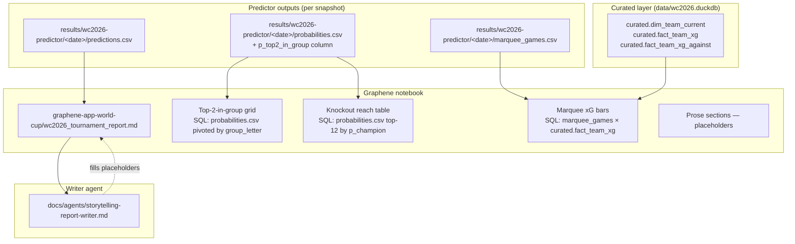

# feat: Tournament storyteller — a Graphene-rendered narrative report of the WC2026 predictor

## Overview

The `wc2026-predictor` already emits probabilities for every group-stage fixture and per-team stage-reach probabilities through the knockout bracket. What it does not emit is a *human reading experience* — something a person opens, scrolls, and walks away from with: (a) which teams the model favors, (b) which games look juicy, (c) how the bracket might tilt, and (d) appropriate humility that the model is a model and the future is the future.

This plan adds a single new "agent" (a writer-persona role spec, not a Python class) called **`storytelling-report-writer`** plus the supporting data and Graphene scaffold it needs. The role reads the latest predictor outputs, computes a handful of derived numbers the predictor doesn't yet expose (top-2-in-group, marquee-game shortlist), and produces a Graphene notebook at `graphene-app-world-cup/wc2026_tournament_report.md`. The notebook renders charts from `data/wc2026.duckdb` via Graphene's existing SQL-block notebook pattern; the writer-agent fills the prose around them.

The deliverable is one short, punchy, < 2-page report that mixes data visualizations and a narrative voice — funny, smart, humble. It reads like a sports column written by someone who knows their model is just a guess wearing a tie.

## Problem Frame

Today, the predictor's outputs are CSV/JSON files (`predictions.csv`, `probabilities.csv`). The published GitHub Pages dashboard (`docs/data.json` → `docs/index.html`) is dense and bracket-focused; it answers "what are the numbers?" but not "what's the story?"

A reader who is not the model-builder wants:

1. A table they can scan in 10 seconds that shows **which teams clear group stage** (the Figure 1 image the user shared: 12 groups, 4 teams per group, with a top-2 percentage next to each name).
2. A short prose tour of the tournament — group-by-group highlights, the knockout favorites, the dark horses, the wide-open zones.
3. A few **marquee-game visualizations** showing the expected goals story for high-stakes group matchups, so the reader can see *why* the model thinks what it thinks for the games that matter.
4. A footnote at the end that explains, in two paragraphs, what the model uses (variables, data sources at the conceptual level — not the pull-script-level), so a skeptical reader can decide how seriously to take the numbers.

The hard constraint: the prose stays under two pages. Anything longer drifts into "yet another bracket explainer" and competes with the dashboard instead of complementing it.

The other hard constraint: the writer-agent must be **chronically and visibly humble**. The 2022 World Cup proved that international football is the bayonet that punctures every predictive model. The voice should never say "Brazil will win Group C." It should say "the model gives Brazil a 99% shot at top-2 in Group C, which is the kind of certainty that has historically aged like warm milk."

## Requirements Trace

- **R1.** A new role spec is added at `docs/agents/storytelling-report-writer.md` describing what the writer reads, what it writes, the tone rules, the length cap, and the humility contract.
- **R2.** The model's outputs are extended with a per-team **`p_top2_in_group`** column (added to `results/wc2026-predictor/<date>/probabilities.csv` and `probabilities.json`). This column is the data behind the Figure-1-style grid.
- **R3.** A deterministic, reproducible **marquee-game shortlist** is computed alongside the per-match predictions. The list is small (proposed: 6–8 group-stage matches) and emitted as `results/wc2026-predictor/<date>/marquee_games.csv`.
- **R4.** A Graphene notebook is created at `graphene-app-world-cup/wc2026_tournament_report.md`. It contains: the top-2-in-group grid (mirrors the user's reference image), an xG-comparison chart per marquee game, a knockout-reach table for the top-12 contenders, and the prose sections the writer-agent fills.
- **R5.** The prose is **< 2 printed pages** (target: 700–900 words across all narrative sections combined, not counting tables/figures/methodology).
- **R6.** Every probability is framed as an estimate. The writer never asserts an outcome. The voice carries clear, repeated humility — by structure, not just by a single disclaimer at the end.
- **R7.** A short **methodology footnote** at the end of the report names the variables and data sources at the conceptual level (e.g., "team form since 2022, FIFA-ranking prior, country-level GDP and population, host-country boost") — explicitly not the pull-script-level details (no mention of Understat URLs, no StatsBomb endpoint names).
- **R8.** The report is reproducible: re-running the same pipeline against the same DuckDB snapshot produces the same numbers; the writer's prose is regenerated by re-invoking the agent against the same input set.

## Scope Boundaries

- **Not a model change.** No new features, no new training data, no recalibration. The agent and its supporting steps are pure read-from-outputs work.
- **Not a UI redesign.** The existing GitHub Pages dashboard (`docs/index.html`, `docs/data.json`) is left alone. The Graphene notebook is a parallel output, served via `npm run serve` from `graphene-app-world-cup/`.
- **Not a betting product.** The report says nothing about edge, devig, market prices, or actionable bets. Roles 04 (Market Normalization) and 07 (Edge / Comparison) were removed from the agent catalog; this report respects that scope.
- **Not a live-tournament agent.** The writer is invoked manually against the latest snapshot. The separate live-tournament pipeline (user memory `wc2026_live_pipeline_plan.md`) is out of scope here.
- **Not a multi-language deliverable.** English only.

### Deferred to Separate Tasks

- **Per-match knockout predictions.** The cleanup plan (`docs/plans/2026-05-15-004-refactor-project-cleanup-plan.md` Unit 5) extends `simulate.py` to emit per-pair-per-stage probabilities. This report uses *per-team stage reach* (already in `probabilities.csv`) for the knockout section, plus per-pair probabilities once Unit 5 lands. If Unit 5 has not landed at the time the writer runs, the report falls back to per-team reach only and the writer-agent acknowledges the gap in one line.
- **A "live recap" agent that re-runs after each match.** Future work; the present agent is a *pre-tournament* / *snapshot-at-time-T* storyteller.

## Context & Research

### Relevant Code and Patterns

- `methodology/curated-poisson-luck/model.py` and `methodology/curated-poisson-luck/simulate.py` — current predictor outputs. The MC iteration loop in `simulate.py` is where `p_top2_in_group` and the marquee-game features get computed (one extra counter per iteration).
- `results/curated-poisson-luck/2026-05-15/predictions.csv` and `probabilities.csv` — the exact output shape this report consumes. Schema for `probabilities.csv` today: `team, team_code, p_r32, p_r16, p_qf, p_semi, p_final, p_champion`. R2 adds `p_top2_in_group` between `team_code` and `p_r32`.
- `graphene-app-world-cup/top6_contenders.md`, `top_contenders.md`, `cumulative_goal_diff.md` — established Graphene notebook patterns: YAML frontmatter (`layout: notebook`), narrative markdown with embedded ```sql blocks that Graphene executes against the ATTACHed DuckDB.
- `graphene-app-world-cup/tables.gsql` — the semantic layer declaration. New views needed for the report (e.g., a marquee-games view) get added here, not invented inline in the notebook.
- `graphene-app-world-cup/AGENTS.md` — Graphene's own contribution guidance; the writer-agent role spec respects it.
- `db/SCHEMA.md` Quick Reference table — the canonical list of `curated.*` tables. The marquee-game chart logic reads `curated.dim_team_current` and `curated.fact_team_xg` / `fact_team_xg_against`.

### Institutional Learnings

- User memory `wc2022_backtest_learnings.md` — model disagreement, golden zone, calibration findings. The writer-agent's humility voice should be informed by this memory: the project has receipts for "the model was wrong about X." The agent never claims to know better than 2022 did.
- User memory `reference_curated_schema.md` — `db/SCHEMA.md` is canonical. All notebook SQL reads from `curated.*` (not `raw.*`, not parquets).
- `docs/solutions/best-practices/model-roles-and-best-use-2026-04-28.md` (historical context, multi-model era) — the "no single model is right; use them in concert" framing has aged better than the specific math it described. The writer can borrow that disposition.

### External References

None needed. Graphene's notebook format and the existing notebooks in `graphene-app-world-cup/` are sufficient pattern material.

## Key Technical Decisions

- **The writer-agent is a role spec, not a Python script.** It's a markdown file under `docs/agents/` that defines a persona, inputs, outputs, tone rules, and the humility contract. A human or AI agent (Claude / Cursor / Codex / Gemini) reads it before producing the report.
  - **Rationale:** the project's pattern for agents is role specs that any contributor can pick up. Hardcoding an LLM call inside `tools/` would couple us to a specific model and remove the human-in-the-loop. The data pieces are scripted; the *writing* is the role.

- **`p_top2_in_group` is computed in the existing MC simulator.** During each of the 10k tournament iterations, the simulator already determines each team's group-stage final standing to seed the knockout. Adding a counter `top2_count[team] += 1 if final_position <= 2 else 0` is one line of bookkeeping per match group.
  - **Rationale:** the simulator owns the random-draws shape; recomputing top-2 outside it would mean duplicating the draws or relying on closed-form approximations that diverge from the simulator's results. Adding the counter in-place keeps one source of truth.
  - **Output shape:** new column `p_top2_in_group` in `probabilities.csv` and the corresponding key in `probabilities.json`. Value is `top2_count[team] / n_iterations`.

- **Marquee-game shortlist is rule-based, not handpicked.** A match qualifies if **both** teams have `p_top2_in_group >= 0.50` (i.e., the model considers both teams genuine contenders for advancement in their group). Ties broken by higher *combined* `p_top2_in_group`. Cap at 8 games.
  - **Rationale:** reproducibility. Handpicking marquee games would make the report drift run-to-run. A simple rule produces ~6–8 games per snapshot — enough variety, deterministic.
  - **Trade-off:** the rule will miss "marquee" games where one giant plays one minnow (Brazil vs. Haiti in Group C, for instance, may have storyline value the rule excludes). The writer is allowed to mention one such game in prose without it being a charted "marquee" — but charts only render for rule-selected games.

- **Charts in the notebook are simple by design.** Two chart types only: (a) the **top-2 grid** styled like Figure 1 from the reference image — 12 group cards, 4 teams each, with percentages; (b) per-marquee-game **xG-comparison bars** showing the model's `λ_home` vs `λ_away` plus the closed-form `p_home / p_draw / p_away` stack underneath.
  - **Rationale:** Graphene renders SQL → table → chart. Two chart shapes is enough to carry the story. Adding more (per-team-radar, knockout-bracket-tree, etc.) would push the report past two pages and dilute the voice.

- **Prose is generated by invoking the agent; not stored in a template.** The Graphene notebook ships with prose-section headings and explicit `<!-- agent prose: section X -->` placeholders. A human or AI agent reads the role spec, looks at the data, and fills the placeholders. Subsequent regenerations replace the placeholders cleanly.
  - **Rationale:** the writing *is* the deliverable. Pre-canning paragraphs would defeat the agent. The placeholder convention makes each section regeneratable independently — you can re-run the agent on just the "Knockout favorites" section without rewriting the whole report.

- **The humility contract is enforced through structural rules, not vibes.** The role spec contains a short list of forbidden constructions ("X will win", "the bracket is", "a lock") and a short list of required constructions ("the model gives", "estimates", "about a [X]% chance", "if the model is right, which it routinely isn't"). The writer agent self-audits against this list before declaring a section complete.
  - **Rationale:** "be humble" as instruction has been shown to produce humble-sounding-but-actually-confident prose. Explicit forbidden phrases force a real structural shift in the writing.

## Open Questions

### Resolved During Planning

- **Where does the report live — `docs/`, `results/`, `graphene-app-world-cup/`?** Resolved: `graphene-app-world-cup/wc2026_tournament_report.md`. Graphene is the rendering layer; this is a notebook, so it belongs in that app.
- **Should the report be a static page or live-queryable?** Resolved: it's a Graphene notebook (live-queryable against `data/wc2026.duckdb`). Static HTML export is a downstream concern; Graphene already supports `npm run compile`.
- **Should marquee-game selection be model-driven or curated?** Resolved: rule-based (`min(p_top2_in_group) >= 0.50` between the two teams) for reproducibility. Hand-curation belongs in the prose, not the chart manifest.
- **What does "less than two pages" mean concretely?** Resolved: ≤900 words of narrative prose excluding tables, figure captions, and the methodology footnote. The notebook itself can be longer (because of charts and tables); the *reading* is what stays short.
- **Should the report be regenerated on every predictor run, or on demand?** Resolved: on demand. The agent is invoked manually. The data steps (R2, R3) run every time `simulate.py` runs, so the inputs are always fresh — but the prose only updates when someone invokes the writer-agent.

### Deferred to Implementation

- **Exact column order and naming for the new `p_top2_in_group` field in `probabilities.csv`.** Implementer should mirror the convention of the existing `p_r32` … `p_champion` series and place it just before `p_r32` (i.e., chronologically earliest stage).
- **How Graphene renders a "12-card grid" specifically.** The reference image shows 4 cards across × 3 rows of 12 groups. Graphene's chart primitives include tables and standard charts; a 12-card grid may need either (a) CSS in the notebook frontmatter or (b) the table rendering with a `group_letter` facet column. Implementer should look at `graphene-app-world-cup/cumulative_goal_diff.md` for the closest existing pattern and adapt.
- **Whether the marquee-game xG visualization should be a single chart (bars side-by-side) or two (λ-bars + 1X2-stack).** Implementer's call based on what reads cleanly in the Graphene rendering.
- **The exact agent-invocation pattern.** The role spec describes the prompt and constraints; the actual invocation method (Claude Code in the terminal, agent-browser-mode, paste-into-chat) is operational and not a planning concern.

## High-Level Technical Design

> *This illustrates the intended after-shape and is directional guidance for review, not implementation specification. The implementing agent should treat it as context, not code to reproduce.*



What this makes explicit:

- The agent does not run code. It reads the notebook's data blocks (rendered by Graphene) and the CSVs, then writes prose into the placeholder sections.
- The data steps (R2, R3) are upstream of the notebook and run as part of `simulate.py`. The notebook is always rendered against fresh data.
- `marquee_games.csv` is the contract between the data layer and the chart layer. The xG-bar chart reads it directly; no inline matchup picking.

## Implementation Units

- [ ] **Unit 1: Compute `p_top2_in_group` and `marquee_games.csv` in `simulate.py`**

**Goal:** Extend the existing 10k-iter MC simulator to record per-team top-2-in-group counts and emit a deterministic marquee-game shortlist.

**Requirements:** R2, R3

**Dependencies:** None — this is an in-place extension of the simulator that already runs.

**Files:**
- Modify: `methodology/curated-poisson-luck/simulate.py` (or `methodology/wc2026-predictor/simulate.py` if the cleanup-plan rename has landed)
- Modify: `results/curated-poisson-luck/2026-05-15/probabilities.csv` (schema add)
- Modify: `results/curated-poisson-luck/2026-05-15/probabilities.json` (schema add)
- Create: `results/curated-poisson-luck/<latest-date>/marquee_games.csv`
- Test: `tests/test_curated_poisson_luck_model.py`

**Approach:**
- Inside the existing iteration loop, after each group's final standings are computed, increment `top2_count[team] += 1` for the two teams that finished top-2. After the loop, divide by `n_iterations` to get `p_top2_in_group`.
- After the loop, derive the marquee list: scan `predictions.csv` for `match_1x2` rows in the group stage; for each match, look up both teams' `p_top2_in_group`; emit the match to `marquee_games.csv` if `min(p_top2_home, p_top2_away) >= 0.50`. Sort by `(p_top2_home + p_top2_away) desc`. Cap at 8 rows.
- `marquee_games.csv` columns: `match_id`, `home_code`, `away_code`, `home_team`, `away_team`, `group_letter`, `kickoff_date`, `p_home`, `p_draw`, `p_away`, `lam_home`, `lam_away`, `p_top2_home`, `p_top2_away`.
- The `lam_home` / `lam_away` values come from the `notes` field of `predictions.csv` (currently encoded as `MEX lam=0.89 sig=1.18 def_mult=1.00 | RSA lam=1.01 sig=0.77 def_mult=1.01 | host_boost`). Parsing is fragile; the cleaner path is to emit `lam_home` / `lam_away` as their own columns when the simulator writes the marquee file, since those values are right there at the moment of computation.

**Patterns to follow:**
- The existing per-team aggregation in `simulate.py` (whatever counter logic produces `p_r32` ... `p_champion`). Add a sibling counter for `top2_count`.
- `tests/test_curated_poisson_luck_model.py` for the test-writing pattern.

**Test scenarios:**
- *Happy path:* after a 10k-iter run, every team in `probabilities.csv` has a `p_top2_in_group` value in [0, 1]; the per-group sum of `p_top2_in_group` is approximately 2.0 (since exactly two of four teams advance from each group in the model's simulation).
- *Happy path:* `marquee_games.csv` exists and has between 1 and 8 rows; every row has both teams with `p_top2 >= 0.50`.
- *Edge case:* if no group has two teams with `p_top2 >= 0.50` (extremely unlikely in a 48-team tournament), `marquee_games.csv` is created empty with a header row — the notebook handles the empty case with "no marquee group-stage matches met the threshold this run."
- *Edge case:* `p_top2_in_group` for a team in a 4-team group is at most 1.0 (always advances) and at least 0.0 (never advances); the per-group sum is exactly 2.0 because the simulator's group has a deterministic top-2.
- *Integration:* `python3 tools/validate_predictions.py results/<model>/<date>/` still exits 0 after the schema change to `probabilities.csv`.
- *Integration:* the existing predictor tests pass with the new column.

**Verification:**
- `head -3 results/<model>/<date>/probabilities.csv` shows `p_top2_in_group` as the column immediately before `p_r32`.
- `head -3 results/<model>/<date>/marquee_games.csv` shows a row with both `p_top2_home >= 0.50` and `p_top2_away >= 0.50`.

---

- [ ] **Unit 2: Add the writer-agent role spec at `docs/agents/storytelling-report-writer.md`**

**Goal:** A single markdown file that an agent (or human contributor in the writer seat) reads before producing the report. Defines the persona, the inputs, the structure, the tone rules, the length cap, and the humility contract.

**Requirements:** R1, R5, R6, R7

**Dependencies:** None — the spec is self-contained.

**Files:**
- Create: `docs/agents/storytelling-report-writer.md`

**Approach:**
- Follow the structure of `docs/agents/_role-template.md`: Purpose, Reads, Writes, Must not, When it runs, Done when.
- Sections specific to this role:
  - **Persona:** "You are a sports columnist with one statistical model and a sense of humor. You know your model is going to be wrong about some of this. You write like a person who has watched football and read Tetlock."
  - **Tone rules** (explicit list):
    - Forbidden phrases: "will win", "is a lock", "guaranteed", "the bracket is", "destiny", "no doubt", "certain to". Use of any of these is a failure to be fixed before declaring the section done.
    - Required framings (use at least 3 times across the report): "the model gives [team] about a [X]% chance of", "if the model is right — and history says it routinely isn't —", "an estimate, not a prophecy", "the model thinks", or close equivalents.
    - One self-aware paragraph required somewhere in the report that names a specific way the model is likely to be wrong (e.g., "it weights recent form heavily and is probably overrating teams on hot streaks").
  - **Structure** (with word budgets — total ≤ 900 words across all narrative sections):
    1. **Opening hook** (~80 words) — one paragraph. Sets the framing: this is a forecast, the forecast is a guess, here's what the guess looks like.
    2. **The favorites** (~150 words) — top 5 by `p_champion`, what each one's path looks like. Charts: knockout reach table.
    3. **The group stage in one breath** (~180 words) — group-by-group highlights (one line per group is plenty; let the top-2 grid carry the data; prose only highlights the tight groups and the foregone-conclusion groups). Charts: top-2-in-group grid.
    4. **The games to watch** (~180 words) — call out 3-4 of the marquee shortlist by name, say what the model sees, say why it might be wrong. Charts: marquee xG bars.
    5. **The dark horses and the cautionary tales** (~150 words) — one team the model loves that you'd be smart to doubt; one team the model dismisses that you'd be smart to watch.
    6. **A word from the model** (~60 words) — closing humility paragraph. Names the model's specific blind spots.
    7. **Methodology footnote** (~100 words, doesn't count against the 900-word budget) — variables used, data described at the concept level only.
  - **Inputs the writer must read before writing:**
    - `results/wc2026-predictor/<latest-date>/predictions.csv`
    - `results/wc2026-predictor/<latest-date>/probabilities.csv`
    - `results/wc2026-predictor/<latest-date>/marquee_games.csv`
    - `results/wc2026-predictor/MODEL.md` — for the methodology footnote.
  - **Output:** filled-in prose sections within `graphene-app-world-cup/wc2026_tournament_report.md` between the placeholder markers Unit 3 establishes.
  - **Must not:**
    - Cite a specific bet, market, or odds.
    - Quote a specific historical match outcome unless it's in the methodology footnote as context.
    - Pretend to know what the actual lineups, injuries, or weather will be.
    - Exceed 900 words across narrative sections (use `wc -w` on the prose-only excerpt; the agent self-audits).

**Patterns to follow:**
- `docs/agents/_role-template.md` structure.
- The voice of existing notebooks (`graphene-app-world-cup/top6_contenders.md`) is too workmanlike for this role; this role is intentionally a step *more* personable and a step *more* skeptical.

**Test scenarios:**
- *Happy path:* a new contributor reads the role spec and can produce a draft report end-to-end without asking clarifying questions about tone or length.
- *Edge case:* the spec is clear that the agent must run a forbidden-phrase check on its own draft before declaring it done; the spec lists at least 7 forbidden constructions.
- *Edge case:* the spec defines the per-section word budgets and the agent must check each section against its budget before declaring it done.

**Verification:**
- `docs/agents/storytelling-report-writer.md` exists and is linked from `docs/agents/README.md`.
- A test invocation produces prose that passes the forbidden-phrase audit and the word-budget audit.

---

- [ ] **Unit 3: Build the Graphene notebook scaffold at `graphene-app-world-cup/wc2026_tournament_report.md`**

**Goal:** The notebook ships with all chart blocks, all section headings, and explicit prose placeholders. Charts render against the latest predictor outputs and `data/wc2026.duckdb`. Prose is filled by the writer-agent in Unit 4.

**Requirements:** R4

**Dependencies:** Unit 1 (the new `p_top2_in_group` column and `marquee_games.csv` must exist for the SQL blocks to render).

**Files:**
- Create: `graphene-app-world-cup/wc2026_tournament_report.md`
- Modify: `graphene-app-world-cup/tables.gsql` — add a view or two for the report's reads (e.g., a `top2_grid` view that pivots `probabilities.csv`-equivalent data into the 12-group, 4-team layout).
- Modify: `graphene-app-world-cup/index.md` — add a link to the new notebook.

**Approach:**
- Frontmatter:
  ```
  ---
  title: WC2026 — The Story the Model Tells
  layout: notebook
  ---
  ```
- Section structure mirrors the writer-agent's structure (Opening hook → Favorites → Group stage → Games to watch → Dark horses → Closing → Methodology). Each prose section is bookended with HTML comment placeholders the agent fills:
  ```
  <!-- agent prose: opening_hook -->
  <!-- /agent prose: opening_hook -->
  ```
- Chart blocks:
  - **Top-2-in-group grid** — a Graphene SQL block that reads from the curated layer joined to the latest `probabilities.csv` snapshot. Visualization: a 12-card layout (4 cards across × 3 rows). Each card shows the group letter as title and 4 lines `team_name (XX%)` sorted descending. Match the reference image's green-banner styling if Graphene's CSS hooks support it; if not, render a clean tabular form with `group_letter` as a facet.
  - **Knockout reach table** — top 12 teams sorted by `p_champion`. Columns: `team`, `p_r16`, `p_qf`, `p_semi`, `p_final`, `p_champion`. Values shown as percentages.
  - **Marquee xG bars** — for each row in `marquee_games.csv`, a small chart: home/away `λ` side-by-side as bars, with a single text annotation showing `p_home / p_draw / p_away` as percentages. One chart per marquee game (so 6–8 charts in this section).
- The `probabilities.csv` and `marquee_games.csv` data flow into Graphene via the established notebook pattern. If Graphene cannot read result CSVs directly, Unit 3 adds a tiny load step in `tools/build_duckdb.py` (or a separate small script) that registers these files as additional `raw.*` tables on each build.

**Patterns to follow:**
- `graphene-app-world-cup/top6_contenders.md` for the embedded-SQL pattern.
- `graphene-app-world-cup/cumulative_goal_diff.md` for chart styling examples.
- `graphene-app-world-cup/tables.gsql` for the semantic-layer additions.

**Test scenarios:**
- *Happy path:* `npm run serve` from `graphene-app-world-cup/` renders the notebook. The top-2 grid shows 12 cards. The knockout table shows 12 rows. The marquee section shows 6–8 charts.
- *Happy path:* `npm run compile` produces a static export without errors.
- *Edge case:* if `marquee_games.csv` is empty, the marquee section renders with the explanatory message from Unit 1's edge case (and no chart cards).
- *Edge case:* if `p_top2_in_group` is missing from `probabilities.csv` (i.e., Unit 1 hasn't run), the top-2 grid block renders an error message naming the missing column rather than failing silently.
- *Integration:* the notebook renders consistently against `data/wc2026.duckdb` produced by `tools/build_duckdb.py`.

**Verification:**
- The notebook file exists, has frontmatter, has section headings matching Unit 2's structure, and has placeholder comment pairs for every prose section.
- All SQL blocks execute against the latest snapshot without errors.

---

- [ ] **Unit 4: Run the writer-agent and fill the notebook's prose placeholders**

**Goal:** Produce the report's first complete version. Verify the constraints (≤900 narrative words; forbidden-phrase audit clean; humility framings present; methodology footnote present).

**Requirements:** R5, R6, R7

**Dependencies:** Units 1, 2, 3.

**Files:**
- Modify: `graphene-app-world-cup/wc2026_tournament_report.md` — fill prose placeholders.

**Approach:**
- A contributor (human or AI) reads `docs/agents/storytelling-report-writer.md`, reads the inputs the role spec names, renders the notebook (`npm run serve`) to see the charts, and writes the prose section by section into the placeholder comment pairs.
- Each section is checked against its word budget before the writer moves to the next.
- Before declaring the full report done, the writer runs:
  - A `grep -i` for each forbidden phrase from Unit 2's tone rules.
  - A word count on the prose-only excerpt (everything between `<!-- agent prose: ... -->` markers, concatenated).
  - A visual rendering check: the 12-card grid matches the reference image's shape (4 across, 3 rows, group letter + team + percentage per card).

**Patterns to follow:**
- Unit 2's role spec is the authoritative guide. If anything in this unit drifts from Unit 2, fix Unit 2 first.

**Test scenarios:**
- *Happy path:* the rendered notebook reads clean end-to-end in under 5 minutes for a typical reader. Prose total ≤ 900 words. Forbidden-phrase audit returns zero hits.
- *Happy path:* every chart in the notebook has a one-line prose lead-in or call-out in an adjacent section (no "orphan" charts).
- *Edge case:* a section that runs over budget gets trimmed; the writer does not relax the budget.
- *Edge case:* if the data shows an outcome the writer disagrees with (e.g., a heavy favorite the writer considers obviously overrated), the writer says so *in the dark-horses section* with the appropriate humility framing — but does not editorialize the data.

**Verification:**
- `wc -w` on the prose excerpt is ≤ 900.
- The methodology footnote describes variables and data sources at the concept level (FIFA ranking, recent form, economics, host-country boost) without naming a single pull-script path or external API.
- The report's voice would be recognizable as a single author across all sections.

---

## System-Wide Impact

- **Interaction graph:**
  - `simulate.py` now emits an additional column and a new CSV. Anything that reads `probabilities.csv` by *column order* (rather than by header) will break. The existing test suite (`tests/test_curated_poisson_luck_model.py`) reads by header — verify.
  - `tools/export_web_data.py` (the GitHub Pages exporter) reads `probabilities.csv` today. Adding a column should not affect it as long as it reads by header. Confirm during Unit 1 verification.
  - Graphene's `tables.gsql` gains a view or two; existing notebooks that read the same tables continue to work.

- **Error propagation:**
  - If Unit 1's schema addition lands but the notebook (Unit 3) hasn't been updated, Graphene will surface a "column not found" error in the rendering step. Sequence Units 1 → 3 within the same PR to avoid a transient broken state.
  - If the writer-agent (Unit 4) produces prose that violates a tone rule, the self-audit catches it before merge. Reviewers do a second pass.

- **State lifecycle risks:**
  - `marquee_games.csv` is regenerated on every `simulate.py` run. Old snapshots in `results/<model>/<old-date>/` retain their own old `marquee_games.csv` — this is the correct behavior; old reports are reproducible against their own snapshot data.
  - The notebook reads "the latest snapshot." If a writer starts a draft against snapshot A and a new snapshot B lands mid-draft, the charts shift under them. Workflow note in the role spec: "freeze your snapshot date for the duration of a writing pass."

- **API surface parity:**
  - `probabilities.csv` schema change (new column) is the only external contract change. `predictions.csv` schema is unchanged.
  - The GitHub Pages dashboard (`docs/data.json`) does not get a `p_top2_in_group` field unless `tools/export_web_data.py` is updated to include it — that update is *not* in this plan's scope; the report is a separate output surface.

- **Integration coverage:**
  - End-to-end smoke: `python3 tools/build_duckdb.py` → `python3 tools/verify_duckdb.py` → `python3 methodology/wc2026-predictor/model.py` → `python3 methodology/wc2026-predictor/simulate.py` → `npm run serve` (from `graphene-app-world-cup/`) → render the notebook → eyeball the 12-card grid against the reference image shape.

- **Unchanged invariants:**
  - The 8-column `predictions.csv` schema.
  - `db/SCHEMA.md` and the `curated.*` schema.
  - `db/masters/*.csv`.
  - The model's math (no recalibration, no new features).
  - The GitHub Pages dashboard (`docs/index.html`, `docs/data.json`).

## Risks & Dependencies

| Risk | Mitigation |
|---|---|
| Graphene cannot easily render the 12-card grid in the exact Figure-1 styling. | Unit 3 falls back to a faceted table with one row per team and a `group_letter` facet column — visually different from the reference image but readable and reproducible. The CSS-styled grid becomes a stretch goal. |
| Writer-agent produces prose that *sounds* humble but is actually confident ("the model says X with overwhelming probability"). | Tone rules in Unit 2 are *structural* (forbidden phrases + required framings) so the audit is checkable, not vibes-based. |
| Prose blows past 900 words because the writer found something interesting. | The role spec is firm: budget exceeded is a failure to fix, not a victory to negotiate. Self-audit is required before declaring done. |
| `marquee_games.csv` shortlist is empty or oddly small in some snapshots. | Edge case is explicitly handled: empty file renders an explanatory message; rule is rule-based and predictable. |
| The cleanup plan (2026-05-15-004) renames `curated-poisson-luck` → `wc2026-predictor` between when this plan is written and when it's executed. | All file paths in this plan should be interpreted against whatever directory `methodology/<model>/` and `results/<model>/` resolve to at execution time. The implementer should grep for both names before editing. |
| `tools/export_web_data.py` breaks on the new `p_top2_in_group` column. | The exporter reads by header in current code — verify in Unit 1. If it reads positionally, add a defensive update. |
| Future writer drift: subsequent reports lose voice or get longer. | The role spec is the constraint; the audit checks are the enforcement. Reviewers reject reports that fail the audit, same as any other PR with a violated guardrail. |

## Documentation / Operational Notes

- The new role spec gets a row in the `docs/agents/README.md` catalog under a new "Storytelling" section (or under "Synthesis" alongside the kept synthesis specs — implementer's judgment based on where it sits alongside `synthesis-documentation-learnings.md`).
- The notebook URL (when served via Graphene) gets a link from `README.md`'s "Current Status" section once the first report is published.
- The methodology footnote in the report should be cross-linked back to the model's `MODEL.md` for the curious reader who wants the math.

## Sources & References

- Reference image: the user-shared screenshot of a 12-card "Likelihood of making it into the top 2 in each group" layout — this is the visual contract for the top-2 grid.
- Related plans:
  - `docs/plans/2026-05-15-002-feat-curated-poisson-luck-model-plan.md` — the model whose outputs this report consumes.
  - `docs/plans/2026-05-15-004-refactor-project-cleanup-plan.md` — the cleanup that renames `curated-poisson-luck` → `wc2026-predictor` and extends `simulate.py` with per-match knockout predictions. If both this plan and the cleanup land, sequence the cleanup first so the names are stable.
- Related code:
  - `methodology/curated-poisson-luck/simulate.py` — site of Unit 1's extension.
  - `graphene-app-world-cup/top6_contenders.md` — notebook pattern.
  - `graphene-app-world-cup/tables.gsql` — semantic-layer pattern.
- Institutional context:
  - User memory `wc2022_backtest_learnings.md` — informs the humility voice.
  - User memory `reference_curated_schema.md` — confirms reads stay against `curated.*`.
- The agent catalog:
  - `docs/agents/README.md` — gets a new entry.
  - `docs/agents/_role-template.md` — the structural template Unit 2 follows.
